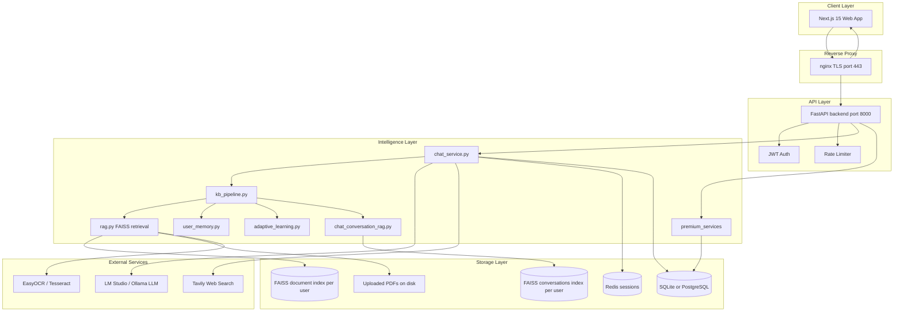
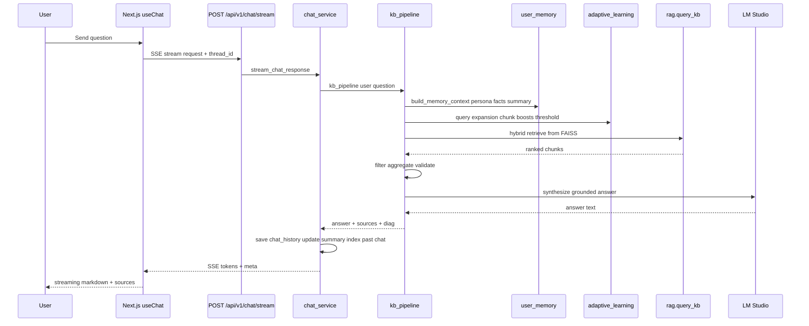
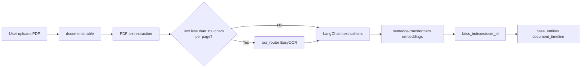
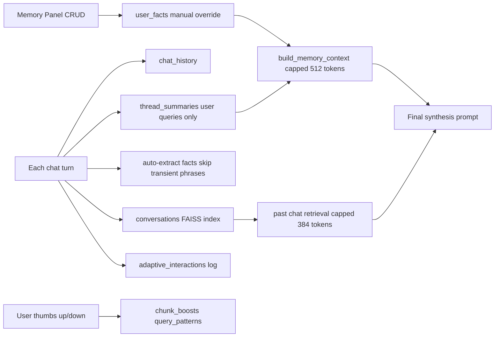

# LegalEase.AI — Complete System Report

This document summarizes the current state of the project at `Legal_AI_Final 3` for technical and non-technical readers.

---

## 1. Executive Summary

**LegalEase.AI** is an AI-powered legal intelligence platform for Indian law practice. It combines:

- **Document-grounded answers** (RAG over uploaded PDFs)
- **Web legal research** (Tavily / Open Law mode)
- **Long-term attorney memory** (persona, facts, thread summaries)
- **Self-improving retrieval** (feedback-driven, not neural fine-tuning)
- **Enterprise premium tools** (witness simulation, deal rooms, BNS audit, redlining, PII)
- **Production-grade stack** (FastAPI backend, Next.js 15 frontend, SQLite/PostgreSQL + FAISS + Redis, ~126 automated tests, CI on Windows)

The system is designed so a lawyer can upload case files, ask questions in natural language, get cited answers from their own documents, and have the assistant remember their practice style across sessions.

---

## 2. What Has Been Built (Phases)

### Phase A — Core Knowledge Base & Chat Reliability
- Fixed chat history not saving; persistent threads in SQLite (`backend/app/core/chat_persistence.py`)
- Refactored KB pipeline (`kb_pipeline.py`) with intent detection, comparison/summary modes, validation retry
- Hybrid retrieval in `rag.py`: dense + sparse + MMR + optional cross-encoder rerank
- Sidebar **Saved Chats**, URL restore via `/?thread=<uuid>`
- ~126 pytest tests + GitHub Actions CI (`.github/workflows/ci.yml`)

### Phase B — Premium Legal Suite (6 features)
Package `premium_services/` + API `backend/app/api/v1/endpoints/premium.py`:

| Feature | Purpose |
|---------|---------|
| Witness Simulator | Mock cross-examination with disposition modes |
| Precedent Tree | Citation graph + judge analytics from DB |
| BNS Auditor | IPC → BNS compliance line scan |
| Deal Rooms | Multi-document M&A diligence, contradiction detection |
| Redline Engine | AI document revision + diff (Drafting Studio) |
| PII Redactor | Regex + spaCy NER detection/redaction |

UI: `web/app/(app)/premium/page.tsx`, `web/app/(app)/drafting/page.tsx`

### Phase C — Adaptive Learning (GPT-style improvement without retraining)
`backend/app/core/adaptive_learning.py`:
- Logs every interaction; thumbs up/down adjust chunk boosts and query expansions
- Per-mode stats (hit rate, not-found rate)
- JSONL export for optional external LoRA fine-tuning
- UI: `web/components/chat/MessageFeedback.tsx`

### Phase D — Enterprise Persistence
- SQLAlchemy ORM (`backend/app/core/orm_models.py`) replacing in-memory dicts
- Tables: deal rooms, witness sessions, judgments (for live judicial analytics)
- OCR router (`backend/app/core/ocr_router.py`): 150 chars/page gate → EasyOCR / Tesseract
- Analytics page: `web/app/(app)/analytics/page.tsx`

### Phase E — Long-Term User Memory + Production Hardening
`backend/app/core/user_memory.py`:
- Profiles, facts (manual + auto-extracted), rolling thread summaries
- **Memory Management UI** in Settings (`web/components/settings/MemoryPanel.tsx`)
- **RAG over past chats** (`backend/app/core/chat_conversation_rag.py`)
- **Prompt token budgets** (`backend/app/core/prompt_budget.py`): 512 memory / 512 summary / 2048 RAG / 384 past-chat
- Trap mitigations: skip transient auto-facts, user facts override auto, summaries from user queries only (not assistant hallucinations)

### Phase F — Frontend Security (Internet-ready)
- Upgraded to **Next.js 15.5.18**, **React 19**, **0 npm audit vulnerabilities**
- Production config: disabled image optimizer API, `poweredByHeader: false`

### Phase G — Production Deploy Infrastructure
- **Docker Compose** stack: API, web, nginx, PostgreSQL, Redis (`docker-compose.yml`, `DEPLOY.md`)
- **Redis session store** for multi-worker Uvicorn (`backend/app/core/session_store.py`)
- **Centralized database config** (`backend/app/core/database.py`) with `DATABASE_URL` / `LEGALEASE_DB_PATH`
- **CI frontend build** job in GitHub Actions

---

## 3. Top-Tier Features (Flagship Capabilities)

### Tier 1 — Daily attorney workflow
1. **Knowledge Base Chat** — Answers grounded in uploaded PDFs with source filename/section, similar-case suggestions, NOT_FOUND when evidence is missing
2. **Multi-intent pipeline** — Section lookup, comparison (e.g. IPC 300 vs 307), full-document offence summaries, follow-up suggestions
3. **Open Law / Hybrid modes** — Web research + optional KB merge (Pro tier)
4. **Persistent threads** — History survives refresh; sidebar + URL deep-link
5. **Streaming SSE chat** — Token-by-token UX via `fetch` + ReadableStream

### Tier 2 — Intelligence that improves over time
6. **Adaptive learning** — Thumbs train retrieval weights and query expansions per user
7. **User memory** — Persona, practice area, remembered facts shape every answer
8. **Past conversation RAG** — “What did we conclude about limitation period three weeks ago?”
9. **Memory pruning UI** — Attorneys control what the system remembers

### Tier 3 — Enterprise / premium
10. **Deal room diligence** — Cross-document contradiction and indemnity analysis (SQL-backed)
11. **Witness sandbox** — Disposition-driven mock trial (SQL-backed sessions)
12. **BNS compliance auditor** — Statute migration risk flags
13. **Redline + Drafting Studio** — Instruction-based revision with visual diff
14. **PII redaction** — Hybrid regex + spaCy NER
15. **Judicial analytics** — Bail rates, disposition breakdown from seeded `judgments` table

### Tier 4 — Engineering quality
16. **~126 automated tests** across KB, RAG, memory, premium, OCR, enterprise DB
17. **CI pipeline** on every push/PR (Python tests + frontend production build)
18. **Operator runbook** (`RUNBOOK.md`) and deployment guide (`DEPLOY.md`)

---

## 4. How the System Works

### 4.1 High-level architecture



### 4.2 Knowledge Base query pipeline (most important path)



**Efficiency mechanisms in this path:**
- **KB cache** (`backend/app/core/kb_cache.py`) — TTL cache for repeated queries (`KB_CACHE_TTL_SEC=300`)
- **Cross-encoder off by default** (`RAG_ENABLE_CROSS_ENCODER=0`) — faster retrieval on Windows
- **Prompt budgets** — memory capped at 512 tokens so document RAG keeps ~2048 tokens
- **Incremental FAISS indexing** — new uploads append without full rebuild when possible
- **OCR gate** — only runs OCR when page text < 150 chars (scanned PDF detection)

### 4.3 Document ingest flow



### 4.4 Memory and learning loop



---

## 5. Technology Stack — What Does What

| Technology | Role in LegalEase |
|------------|-------------------|
| **Next.js 15.5** | Web UI, App Router, SSR/static pages, production build |
| **React 19** | Interactive chat, settings, premium tabs |
| **TypeScript** | Type-safe frontend |
| **Tailwind CSS** | Styling |
| **FastAPI** | REST + SSE API, OpenAPI docs at `/docs` |
| **Uvicorn** | ASGI server (port 8000) |
| **nginx** | TLS termination, reverse proxy to API and web |
| **SQLite / PostgreSQL** | Users, documents, chat history, memory, learning |
| **Redis** | Shared chat session state across API workers |
| **SQLAlchemy** | ORM for deal rooms, witness sessions, judgments |
| **FAISS (CPU)** | Vector search for documents + past conversations |
| **sentence-transformers** | Embeddings (`all-MiniLM-L6-v2`) |
| **LangChain** | Text splitting, retrieval helpers |
| **PyTorch** | Embedding/reranker models |
| **PyPDF2 / pdfplumber / PyMuPDF** | PDF text extraction |
| **EasyOCR / Tesseract** | Scanned PDF and image OCR |
| **spaCy** (`en_core_web_sm`) | NER for PII redaction |
| **LM Studio / Ollama** | Local LLM inference |
| **Tavily** | Legal web search (Open Law mode) |
| **bcrypt + JWT** | Authentication |
| **pytest + GitHub Actions** | Automated quality gate |
| **Docker Compose** | Production deployment orchestration |

### Key file map

| Area | Primary files |
|------|---------------|
| Backend entry | `backend/app/main.py` |
| Chat orchestration | `backend/app/services/chat_service.py` |
| KB pipeline | `kb_pipeline.py`, `answer_orchestrator.py` |
| RAG engine | `rag.py` |
| Memory | `backend/app/core/user_memory.py` |
| Learning | `backend/app/core/adaptive_learning.py` |
| Sessions | `backend/app/core/session_store.py` |
| Database config | `backend/app/core/database.py` |
| Frontend API | `web/lib/api.ts` |
| Chat UX | `web/hooks/useChat.ts` |
| Deploy | `docker-compose.yml`, `DEPLOY.md` |
| Tests | `tests/` (29 files) |

---

## 6. User-Facing Surface (Pages)

| Route | What users do |
|-------|----------------|
| `/login` | Register / sign in |
| `/` | AI Assistant — chat, modes, languages, feedback |
| `/documents` | Upload PDFs, index KB, view timelines/entities |
| `/dashboard` | Stats: documents, queries, KB health |
| `/tools` | IPC→BNS, court fee, contract review, case prediction, citations, ODR |
| `/premium` | Witness, precedent, BNS audit, deal rooms, PII |
| `/drafting` | Redline documents with diff view |
| `/analytics` | Learning stats, judicial analytics, tuning export |
| `/settings` | Memory panel, profile, LLM test, plan upgrade |

---

## 7. Efficiency and Reliability Design

| Concern | How it is handled |
|---------|-------------------|
| Slow KB responses | KB cache, cross-encoder disabled by default, configurable `RAG_RETRIEVAL_K` |
| Memory starving RAG | Strict char caps in `prompt_budget.py` |
| Wrong law retrieved | Intent engine + law filters + explicit IPC/BNS query typing |
| Hallucinated summaries | Thread summaries use user queries only, not assistant text |
| Fact clutter | Transient phrase filter + Memory Panel CRUD + confidence gate for auto-facts |
| Scanned PDFs | OCR router with page-level gate |
| NOT_FOUND false negatives | Full-document scan for summary queries; golden regression tests |
| Production security | Next 15.5 patched, rate limits, JWT auth, nginx TLS, `poweredByHeader` off |
| Data loss on refresh | SQLite `chat_history` + sessionStorage cache + thread URL |
| Multi-worker sessions | Redis-backed session store when `REDIS_URL` is set |

**Typical local performance:** KB answers often 3–15s depending on LLM (LM Studio), document count, and whether cache hits. Retrieval itself is sub-second when FAISS is warm.

---

## 8. What Is NOT Done Yet (Honest limits)

- **Neural fine-tuning** — System improves via retrieval/memory/feedback, not weight updates (JSONL export exists for external training)
- **Full PostgreSQL migration** — Enterprise ORM supports Postgres; core chat/auth tables still use SQLite by default (shared volume in Docker, or set `DATABASE_URL` for SQLAlchemy tables)
- **Streamlit UI** — Legacy `app.py` / `login_cinematic.py` still exist; active product is **Next.js + FastAPI**
- **Kubernetes / managed cloud** — Docker Compose provided; K8s manifests not included

---

## 9. Recommended Next Steps (Roadmap)

### Near-term
1. Point production DNS at nginx; place TLS certs in `deploy/nginx/ssl/`
2. Set secrets in `.env` (never commit): `JWT_SECRET`, `TAVILY_API_KEY`, `POSTGRES_PASSWORD`
3. Run `docker compose up -d` per `DEPLOY.md`
4. Migrate legacy SQLite tables to PostgreSQL when scaling beyond one API replica

### Medium-term (product depth)
5. **Persona presets in Settings UI** — Without API curl
6. **Interactive precedent graph** — Visual tree from precedent engine
7. **Scheduled chat reindex** — Background job on thread close
8. **Observability** — Structured logs + request tracing for KB pipeline debug

### Long-term (enterprise)
9. **Multi-tenant org workspaces** — Firm-level document isolation
10. **Audit log export** — Compliance trail for legal firms
11. **Optional LoRA pipeline** — Automated fine-tune from exported JSONL
12. **Hybrid cloud LLM** — Azure/OpenAI fallback when local LM Studio unavailable

---

## 10. How to Run (Quick Reference)

### Local development

```powershell
# Terminal 1 — Backend (port 8000)
.\run_backend.ps1

# Terminal 2 — Frontend (port 3000)
.\run_web.ps1

# Tests
.\run_tests.ps1
```

### Production (Docker)

```powershell
copy .env.docker.example .env
# Edit .env with secrets and LM_STUDIO_URL
docker compose up -d --build
```

See `DEPLOY.md` for TLS, PostgreSQL, and Redis configuration.

Prerequisites: Python 3.10+, Node.js 18+, `py -m pip install -r requirements.txt`, `cd web && npm install`, LM Studio or remote LLM, optional `TAVILY_API_KEY` for web search.

Health check: http://127.0.0.1:8000/api/v1/health/live

---

## 11. One-Paragraph Elevator Pitch

LegalEase.AI lets Indian lawyers upload case PDFs, ask questions in plain English or regional languages, and receive answers cited to their own documents—not generic internet text. The system remembers their practice style, learns from thumbs-up/down feedback, searches past conversations, and offers premium tools like mock trials, deal-room diligence, and BNS compliance audits. Under the hood, a FastAPI + FAISS + SQLite/PostgreSQL + Redis stack enforces strict prompt budgets and automated tests so retrieval stays fast, grounded, and deployable to the public internet.
