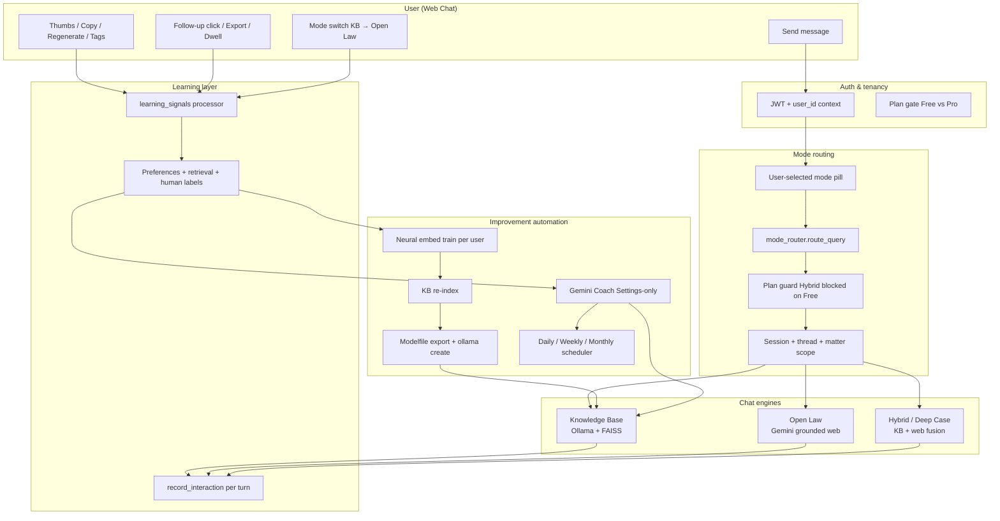
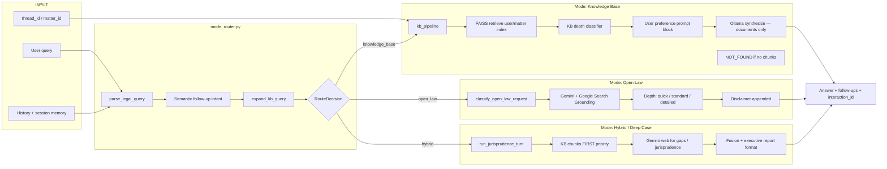
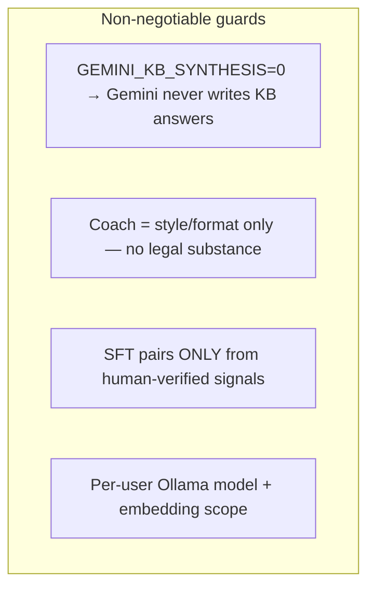
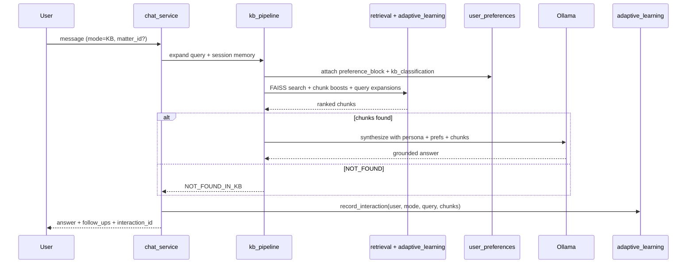
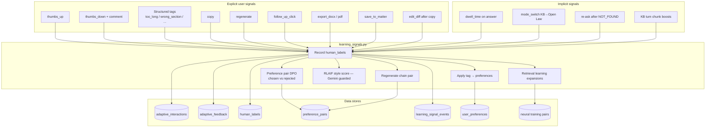
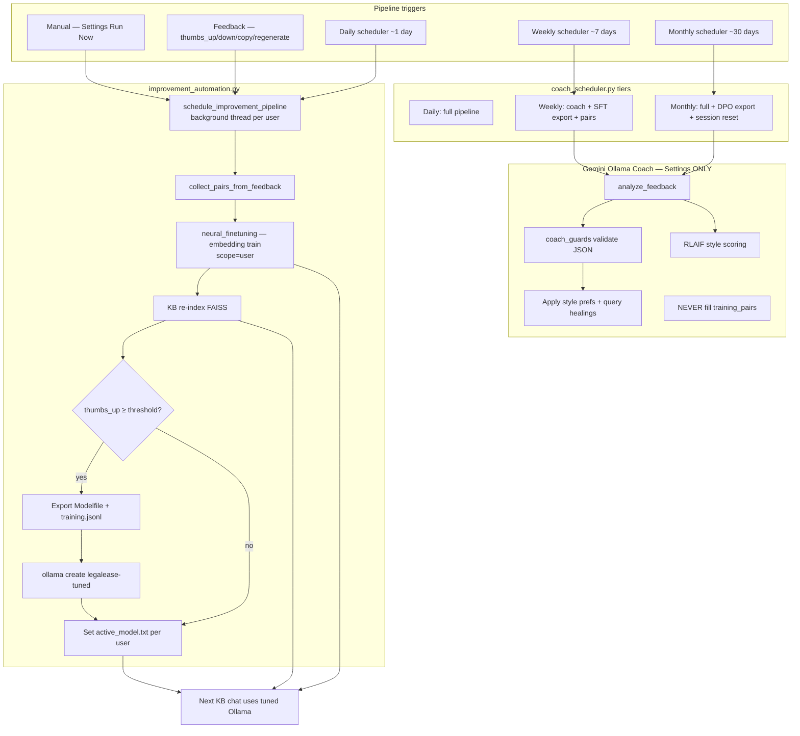
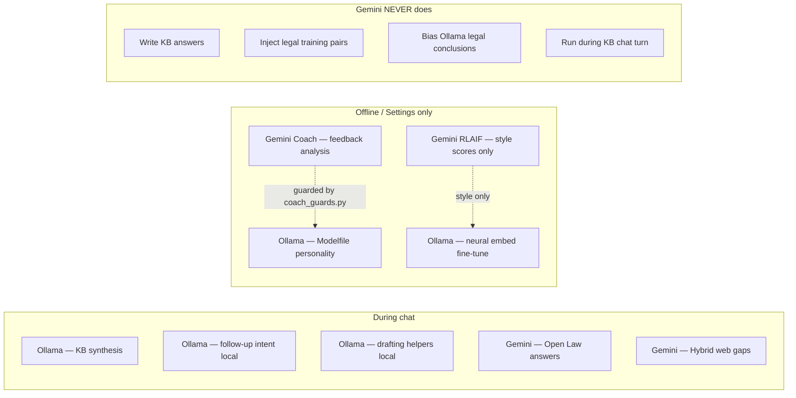
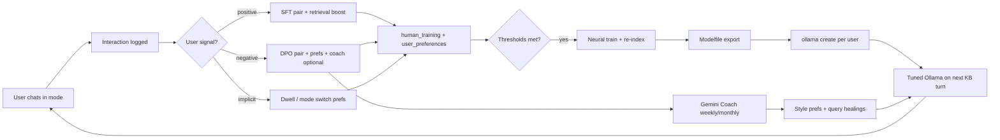

# LegalEase — AI Chat, Learning & Model Improvement Automation Workflow

This document maps the **end-to-end automation** for chat modes, human/implicit learning, and Ollama/Gemini improvement pipelines as implemented in the codebase.

---

## 1. Master overview (request → answer → learn → improve)

---

## 2. Chat mode routing & engines

### Mode rules (hard separation)

| Mode | LLM | Data source | When used |
|------|-----|-------------|-----------|
| **Knowledge Base** | Ollama (local) | User-uploaded FAISS index only | Default; document Q&A |
| **Open Law** | Gemini (cloud) | Grounded web search | Statutes, news, live law |
| **Hybrid / Deep Case** | Ollama + Gemini | KB first, then web | Pro; case strategy + docs |
| **Gemini Coach** | Gemini (Settings only) | Feedback meta — never chat | Tuning coach, not answers |

---

## 3. Knowledge Base turn (detailed automation)

---

## 4. Learning signals automation (all sources)

### Signal → training eligibility

| Signal | Reward | SFT pair? | DPO pair? | Preferences? | Retrieval? |
|--------|--------|-----------|-----------|--------------|------------|
| thumbs_up | +1.0 | Yes | — | Yes | Yes |
| copy | +0.85 | Yes | — | Yes | Yes |
| export_* | +0.95 | Yes | — | — | — |
| thumbs_down | -1.0 | No | Yes | Yes (tags) | Failure |
| regenerate | -0.55 | No | Yes (chain) | — | — |
| follow_up_click | +0.35 | No | — | Yes | — |
| dwell_time | ± | No | — | Yes | — |
| mode_switch | -0.45 | No | — | — | Failure |
| edit_diff | +0.75 | Style pair | Yes | — | — |

---

## 5. Model improvement pipeline (automation)

---

## 6. Gemini vs Ollama responsibility map

---

## 7. End-to-end feedback loop (closed automation)

---

## 8. API endpoints (learning & automation)

| Endpoint | Purpose |
|----------|---------|
| `POST /api/v1/chat` (stream) | All chat modes |
| `POST /api/v1/learning/feedback` | Explicit signals + tags |
| `POST /api/v1/learning/signals` | Implicit signals (dwell, mode_switch, edit_diff) |
| `GET /api/v1/learning/signals/stats` | Signal analytics |
| `GET /api/v1/learning/training/status` | SFT/DPO readiness |
| `POST /api/v1/learning/automation/run-now` | Force improvement pipeline |
| `GET /api/v1/learning/tuning/coach/status` | Coach + schedule status |
| `POST /api/v1/learning/tuning/coach/run` | Full manual cycle |

---

## 9. Environment knobs

| Variable | Effect |
|----------|--------|
| `LLM_BACKEND=ollama` | KB uses local Ollama |
| `GEMINI_KB_SYNTHESIS=0` | Block Gemini from KB answers |
| `GEMINI_OLLAMA_TUNING=1` | Enable Settings coach |
| `IMPROVEMENT_AUTO=1` | Background improvement jobs |
| `COACH_AUTO_INTERVAL_DAYS=1` | Daily coach tier |
| `COACH_WEEKLY_INTERVAL_DAYS=7` | Weekly tier |
| `COACH_MONTHLY_INTERVAL_DAYS=30` | Monthly tier |
| `GEMINI_RLAIF_STYLE=1` | Style-only AI feedback scores |

---

## 10. File map (quick reference)

| Area | Key files |
|------|-----------|
| Chat orchestration | `backend/app/services/chat_service.py` |
| Mode routing | `backend/app/services/mode_router.py` |
| KB pipeline | `kb_pipeline.py`, `rag.py` |
| Open Law | `backend/app/core/web_intelligence.py` |
| Hybrid | `backend/app/services/hybrid_orchestrator.py` |
| Learning signals | `backend/app/core/learning_signals.py` |
| Human training SFT/DPO | `backend/app/core/human_training.py` |
| Preferences | `backend/app/core/user_preferences.py` |
| Retrieval learning | `backend/app/core/retrieval_learning.py` |
| Neural fine-tune | `backend/app/core/neural_finetuning.py` |
| Improvement auto | `backend/app/core/improvement_automation.py` |
| Coach + guards | `backend/app/core/gemini_ollama_coach.py`, `coach_guards.py` |
| Schedules | `backend/app/core/coach_scheduler.py` |
| UI feedback | `web/components/chat/MessageFeedback.tsx` |

---

*Generated from the LegalEase codebase architecture. Restart backend after env changes for schedulers and pipelines to activate.*
