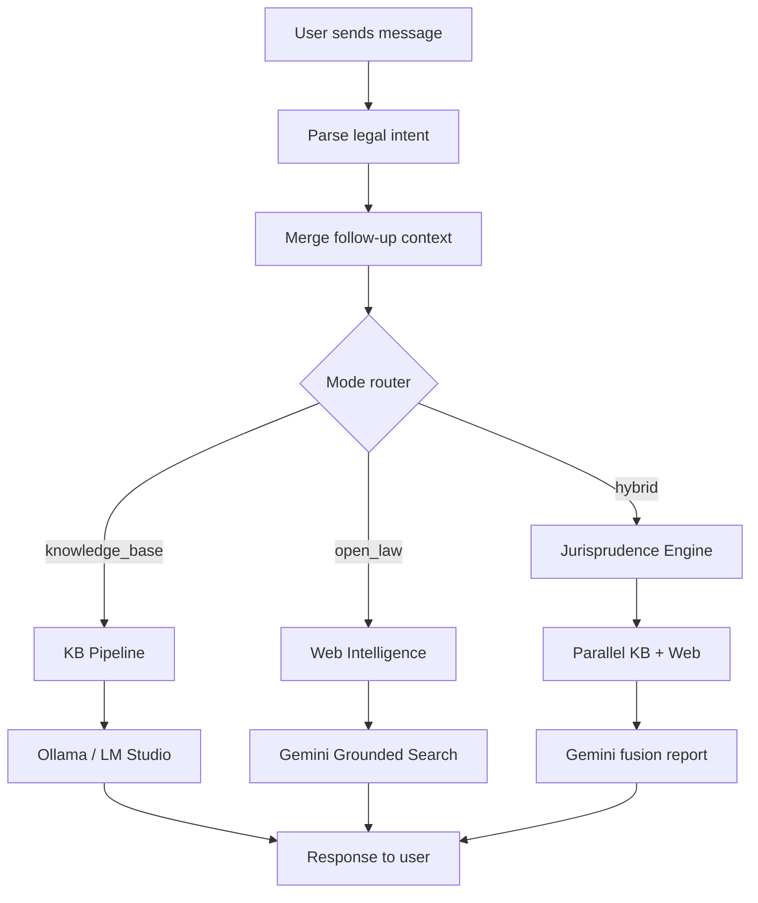
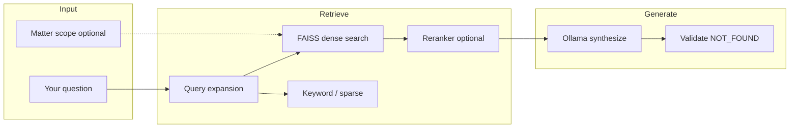
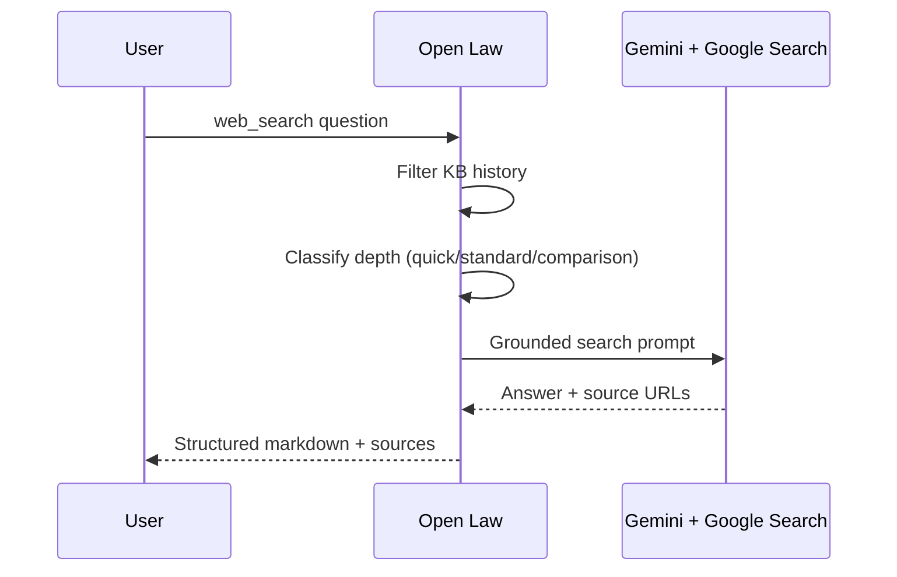
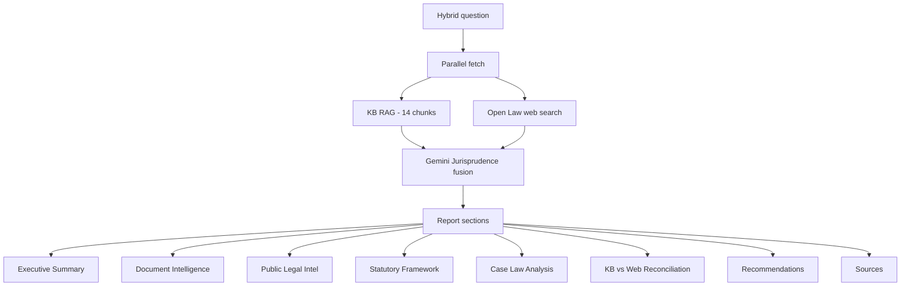
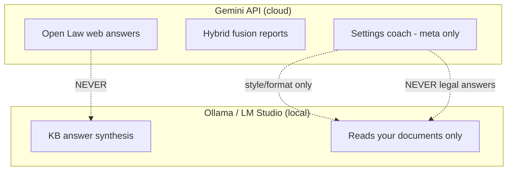
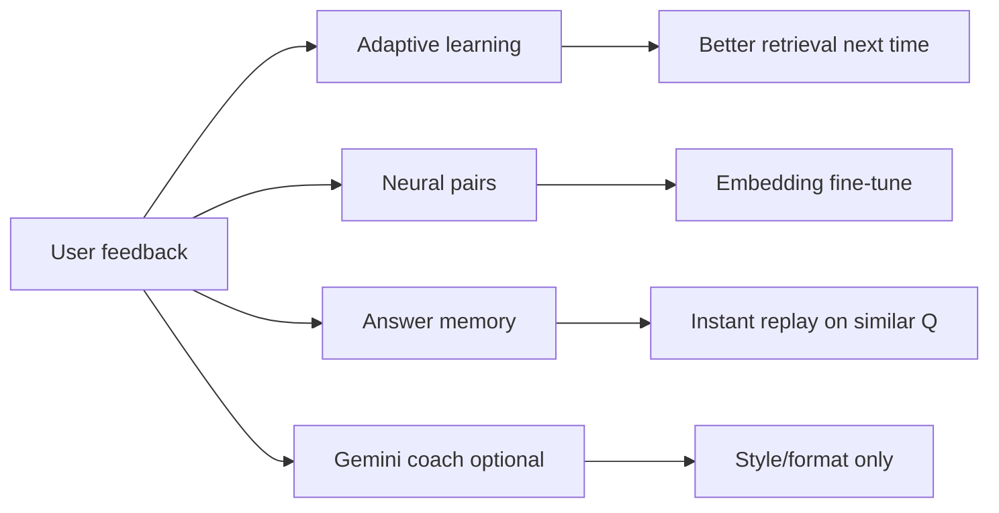
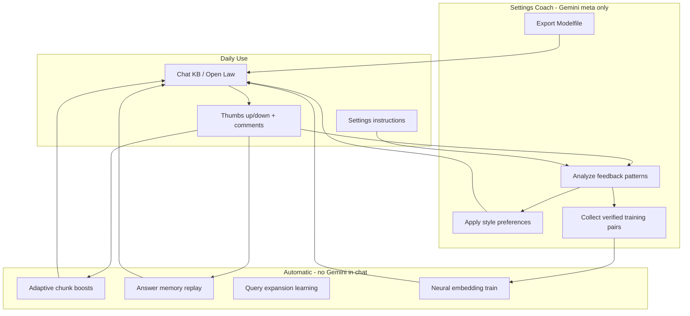

# LegalEase — Complete Feature & Architecture Guide

> **Version:** 3.0 · **Stack:** Next.js + FastAPI + Ollama/LM Studio + Gemini (web/coach only)  
> This document describes every major feature, workflow, and design rule in plain language.

---

## Table of Contents

1. [What LegalEase Is](#1-what-legalease-is)
2. [Three Chat Modes](#2-three-chat-modes)
3. [Knowledge Base Engine](#3-knowledge-base-engine)
4. [Open Law (Web Intel)](#4-open-law-web-intel)
5. [Hybrid / Jurisprudence Engine](#5-hybrid--jurisprudence-engine)
6. [Gemini vs Ollama — Separation of Duties](#6-gemini-vs-ollama--separation-of-duties)
7. [AI Memory & Persona](#7-ai-memory--persona)
8. [Learning & Feedback Loop](#8-learning--feedback-loop)
9. [Gemini Ollama Coach (Settings Only)](#9-gemini-ollama-coach-settings-only)
10. [Neural Training & Modelfile Export](#10-neural-training--modelfile-export)
11. [Documents & Knowledge Base Health](#11-documents--knowledge-base-health)
12. [Matters & Case Scoping](#12-matters--case-scoping)
13. [Practice SaaS Modules](#13-practice-saas-modules)
14. [Settings Page](#14-settings-page)
15. [Engine Status Bar](#15-engine-status-bar)
16. [Analytics & Export](#16-analytics--export)
17. [Frontend Pages Map](#17-frontend-pages-map)
18. [API Reference (Groups)](#18-api-reference-groups)
19. [Environment Variables](#19-environment-variables)
20. [Continuous Improvement Loop](#20-continuous-improvement-loop)
21. [Quick Start Checklist](#21-quick-start-checklist)

---

## 1. What LegalEase Is

LegalEase is an **Indian legal AI assistant** for law firms and practitioners. It combines:

- **Your uploaded documents** (PDFs, images) → searched locally with vector RAG
- **Live public legal web** → Google Gemini grounded search (Open Law)
- **Deep research reports** → KB + web fused (Hybrid / Jurisprudence)
- **Continuous self-improvement** → feedback, memory, neural embedding training, optional Ollama Modelfile export

**Core design rule:** KB answers come from **your documents + local Ollama/LM Studio only**. Gemini never writes KB answers.

---

## 2. Three Chat Modes

### Mode comparison

| Mode | UI name | Uses | Best for |
|------|---------|------|----------|
| `knowledge_base` | **Knowledge Base** | FAISS + Ollama/LM Studio | Questions about *your* uploaded files |
| `web_search` → `open_law` | **Open Law** | Gemini + Google Search | Live statutes, cases, CJI, news, web facts |
| `deep_case` → `hybrid` | **Hybrid** (Pro+) | KB + Gemini fusion | Full case research report |

### Routing workflow



**Key files:**
- `backend/app/services/mode_router.py` — routing decisions
- `backend/app/services/chat_service.py` — orchestrates each turn
- `web/components/chat/ModePills.tsx` — mode selector UI

**Smart overrides:**
- Empty KB + case question → may suggest Open Law
- KB mode + case explanation intent → may upgrade to Hybrid (Pro)

---

## 3. Knowledge Base Engine

### What happens when you ask a KB question



### Step-by-step

1. **Query understanding** — detects intent (section lookup, comparison, list, case, etc.)
2. **Memory injection** — persona, facts, coach style notes (never legal substance from Gemini)
3. **Retrieval** — hybrid dense + keyword from FAISS index
4. **Reranking** — cross-encoder optional (`RAG_ENABLE_CROSS_ENCODER=1`)
5. **Confidence gate** — low scores → NOT_FOUND instead of hallucination
6. **Synthesis** — local LLM (`LLM_BACKEND=ollama` or `lmstudio`) writes answer from chunks only
7. **Learning hook** — successful turn logged for feedback loop

**Key files:** `kb_pipeline.py`, `rag.py`, `answer_orchestrator.py`, `llms.py`

### Indexing documents

1. Upload PDF/image on **Documents** page
2. OCR if scanned (`OCR_ENABLED=1`)
3. Chunk → embed → store in FAISS per user/matter
4. Health panel shows vector count

**Per-matter isolation:** selecting a matter on chat page scopes retrieval to that case file only.

---

## 4. Open Law (Web Intel)

### Purpose

Instant **live legal search** — like a legal Google. Does **not** read your uploaded documents.

### Adaptive response sizing

| You ask… | System responds with… |
|----------|----------------------|
| "Who is CJI of India?" | 2–4 sentences |
| Normal legal question | Concise bullets (~260 words) |
| "Explain in detail…" | Structured sections (~480 words) |
| "Compare IPC 300 vs 307" | **Markdown comparison table** |

**Classifier:** `classify_open_law_request()` in `web_intelligence.py`

### Safety guards

- KB/hybrid history **filtered out** before Gemini call
- Self-contained queries (e.g. "explain RG Kar case") don't inherit wrong prior topic
- KB-leak detection retries without history if answer looks like document dump
- No "Gemini" branding in UI (`displayLabels.ts`)



---

## 5. Hybrid / Jurisprudence Engine

### Purpose

Full **research report** combining your documents + live web.



**Conflict rule:** uploaded documents win when KB and web disagree on sections/statutes.

**Export:** DOCX/PDF from chat (client-safe option strips sensitive metadata).

---

## 6. Gemini vs Ollama — Separation of Duties



| Task | Engine |
|------|--------|
| Answer from uploaded PDFs | **Ollama only** |
| Live web legal search | **Gemini only** |
| Hybrid research report | **Both** (KB local + Gemini web/fusion) |
| Tune Ollama style/retrieval | **Gemini coach** (Settings only) |
| Answer legal questions in coach | **Forbidden** |

**Env locks:**
- `GEMINI_KB_SYNTHESIS=0` — KB never uses Gemini
- `GEMINI_OLLAMA_TUNING=1` — coach enabled in Settings

---

## 7. AI Memory & Persona

**Settings → AI memory**

| Feature | What it stores | Used in |
|---------|----------------|---------|
| **Persona** | warm / professional / concise / detailed | KB + web prompts |
| **Practice area** | e.g. Criminal litigation | Context line |
| **Facts** | Key-value pairs you or system remember | Every chat turn |
| **Communication notes** | How you want answers formatted | Ollama system context |
| **Thread summaries** | Multi-turn topic continuity | Follow-up questions |
| **Past chat search** | "What did we conclude about…" | Retrieval from old threads |

**Auto-facts:** system may suggest facts from chat (marked amber); you can edit/delete wrong ones.

**Coach memories:** style-only lessons from feedback (not legal rules).

---

## 8. Learning & Feedback Loop

### Every chat turn is logged

- Mode, query, answer preview, chunks used, found/not found

### Feedback buttons (under each answer)

| Action | Effect |
|--------|--------|
| 👍 Thumbs up | Boosts chunks, adds neural training pair, answer memory |
| 👎 + comment box | Records complaint, triggers coach analysis if enabled |



### Adaptive learning details

- **Query expansions** — learns how you rephrase failed queries
- **Chunk boosts** — documents that worked get ranked higher
- **Mode stats** — hit rate, accuracy per KB/Open Law/Hybrid

---

## 9. Gemini Ollama Coach (Settings Only)

### When Gemini coach runs

- ✅ User clicks "Run full tuning cycle" in Settings
- ✅ User saves improvement instructions + analyze
- ✅ User submits 👎 with comment
- ✅ Daily auto-scheduler (if enabled + new feedback)
- ❌ **Never** during normal KB/Open Law/Hybrid chat

### What coach analyzes

- Thumbs up/down history
- Your written instructions ("keep answers short")
- Negative feedback comments ("missed section 302")
- Query rephrasing patterns

### What coach outputs (allowed)

- Persona suggestion (concise/detailed)
- Style facts (`answer_style`, `prefer_bullets`)
- Search phrasing improvements (how to find docs, not what law says)
- Neural pair collection from **your** thumbs-up answers only

### Anti-bias guards

| Guard | Purpose |
|-------|---------|
| `_LEGAL_SUBSTANCE_RE` | Blocks IPC/BNS/section/punishment text |
| Banned phrases | Blocks "the correct answer is", "you must say" |
| Empty `training_pairs` from Gemini | Gemini cannot inject Q→A training data |
| `collect_pairs_from_feedback()` only | Training from verified user answers |
| Style-only memory injection | Coach memories never contain legal holdings |

### Auto-coaching schedule (defaults)

| Setting | Default | Meaning |
|---------|---------|---------|
| `COACH_AUTO_INTERVAL_DAYS` | 1 | Once per day max |
| `COACH_AUTO_MIN_NEW_FEEDBACK` | 1 | Needs 1 new 👍/👎 |
| `COACH_AUTO_CHECK_INTERVAL_SEC` | 1800 | Checks every 30 min |

---

## 10. Neural Training & Modelfile Export

### Two levels of "training"

| Level | What changes | How |
|-------|--------------|-----|
| **Embedding fine-tune** | Better document retrieval | SentenceTransformer on your Q→passage pairs |
| **Modelfile export** | Custom Ollama model weights/prompt | `ollama create legalease-tuned -f Modelfile` |

### Neural embedding training

1. Collect pairs from thumbs-up + successful KB turns
2. Train MiniLM variant (`NEURAL_FINETUNE_*` env vars)
3. **Re-index documents** after training
4. Auto-trains when enough pairs (`NEURAL_FINETUNE_AUTO=1`)

### Modelfile export

**Output:** `Data/ollama_exports/{user_id}/{timestamp}/`

| File | Contents |
|------|----------|
| `Modelfile` | Base model + system prompt + few-shot examples |
| `training.jsonl` | Full chat dataset for LoRA/SFT |
| `README.txt` | Commands to create model |

```bash
cd Data/ollama_exports/your-id/latest
ollama create legalease-tuned -f Modelfile
# Set OLLAMA_MODEL=legalease-tuned in .env
```

---

## 11. Documents & Knowledge Base Health

**Page:** `/documents`

- Drag-drop upload (PDF, images)
- Assign to matter
- OCR toggle for scans
- Delete, timeline, entity extraction
- **KbHealthPanel** — shows embeddings online, FAISS chunk count, stale index warnings
- Auto-reindex button when index empty but docs exist

---

## 12. Matters & Case Scoping

**Page:** `/matters`

- Create case files (matters)
- Link documents to matters
- Notes, client portal links, e-sign mock
- **Matter selector on chat** — KB/Hybrid only searches that matter's documents
- Matter autopilot API for automated research suggestions

---

## 13. Practice SaaS Modules

| Module | Route | Purpose |
|--------|-------|---------|
| Dashboard | `/dashboard` | Practice overview |
| Billing | `/billing` | Time entries, invoices |
| Intake | `/intake` | CRM lead capture |
| Discovery | `/discovery` | E-discovery triage |
| Premium | `/premium` | Witness sim, precedent, BNS audit, deal rooms, PII |
| Tools | `/tools` | IPC lookup, fees, contract tools |
| Drafting | `/drafting` | Template drafting studio |
| Portal | `/portal/[token]` | Client-facing matter view |
| E-sign | `/esign/mock/...` | Mock signing flow |

---

## 14. Settings Page

**Route:** `/settings`

| Section | Controls |
|---------|----------|
| **AI memory** | Persona, facts, learning stats, neural train, Ollama coach |
| **Tell Ollama how to improve** | Free-text + Gemini analyze |
| **Daily auto-coaching** | Scheduler toggle |
| **Export Modelfile** | One-click bundle |
| **Profile** | Username, membership |
| **LLM** | Ollama/LM Studio status, test prompt |
| **Web & OCR** | Tavily fallback flag, OCR status |

---

## 15. Engine Status Bar

Live chips at top of chat:

| Chip | Shows |
|------|-------|
| **KB** | Documents indexed, index health |
| **Web** | Web Intel on/off (no model name shown) |
| **LLM** | Ollama/LM Studio online |
| **Memory** | Learning engine active |

Polls every 45 seconds. Shows Gemini daily quota usage.

---

## 16. Analytics & Export

**Analytics page** (`/analytics`):
- Learning stats per mode
- Learned query patterns
- Deal rooms, witness sessions, case clusters
- JSONL tuning export for external fine-tuning

**Chat export** (Hybrid reports):
- DOCX, PDF, Markdown
- Client-safe mode redacts internal metadata

---

## 17. Frontend Pages Map

```
/login          → Authentication
/               → Main AI chat (KB / Open Law / Hybrid)
/documents      → Upload & index KB
/matters        → Case files
/settings       → Memory, coach, LLM config
/analytics      → Learning & usage stats
/billing        → Time & billing
/premium        → Advanced tools
/tools          → Legal calculators & lookups
/discovery      → E-discovery
/intake         → CRM
/drafting       → Document drafting
/dashboard      → Practice dashboard
/portal/[token] → Client portal
```

---

## 18. API Reference (Groups)

Base: `/api/v1`

| Prefix | Purpose |
|--------|---------|
| `/chat` | Send message, stream, export report |
| `/learning` | Feedback, stats, neural, coach, modelfile |
| `/memory` | Profile, facts, reindex chats |
| `/documents` | Upload, list, KB health, reindex |
| `/engines` | Status bar, watchlist, autopilot |
| `/matters` | Case CRUD, notes, docs |
| `/sessions` | Thread history, attachments |
| `/premium` | Witness, BNS audit, deal rooms |
| `/billing`, `/crm`, `/trust` | Practice SaaS |
| `/ediscovery` | Review batches |
| `/research` | Research log |

---

## 19. Environment Variables

### Must-have for full experience

```env
# Local KB brain
LLM_BACKEND=ollama          # or lmstudio
OLLAMA_MODEL=llama3.1:8b
OLLAMA_BASE_URL=http://127.0.0.1:11434

# Web intel + coach
GEMINI_API_KEY=your_key
GEMINI_OLLAMA_TUNING=1
GEMINI_KB_SYNTHESIS=0       # MUST stay 0

# Learning
LEARNING_ENGINE_ENABLED=1
NEURAL_FINETUNE_ENABLED=1
NEURAL_FINETUNE_AUTO=1

# Daily coach
COACH_AUTO_SCHEDULE=1
COACH_AUTO_INTERVAL_DAYS=1
COACH_AUTO_MIN_NEW_FEEDBACK=1
```

See `.env.example` for full list (RAG thresholds, OCR, rate limits, etc.).

---

## 20. Continuous Improvement Loop



**Will Ollama keep improving?** Yes, through four layers that compound over time:

1. **Immediate** — answer memory + chunk boosts (next similar question)
2. **Short-term** — adaptive query expansions + persona/style notes
3. **Medium-term** — neural embedding fine-tune (better doc finding)
4. **Long-term** — Modelfile export → custom Ollama model with your examples

Gemini's role is **coach only** — it never answers KB questions and cannot inject legal substance into Ollama.

---

## 21. Quick Start Checklist

- [ ] Ollama or LM Studio running locally
- [ ] `GEMINI_API_KEY` in root `.env`
- [ ] `GEMINI_OLLAMA_TUNING=1` and `GEMINI_KB_SYNTHESIS=0`
- [ ] Upload documents on `/documents`
- [ ] Enable coach in Settings → AI memory
- [ ] Chat and use 👍/👎 with comments
- [ ] Run "Full tuning cycle" or wait for daily auto-coach
- [ ] Optional: export Modelfile and `ollama create legalease-tuned`
- [ ] Re-index after neural embedding training

---

*Generated for LegalEase v3.0 — internal architecture reference.*
