# LegalEase.AI — SaaS Product Thesis & Technical Whitepaper

**Document classification:** SaaS startup blueprint / investor memorandum / CTO architecture reference (comprehensive edition, ~120–180 pages)  
**Product version:** 3.0  
**Date:** June 2026  
**Primary market:** Indian legal practice (law firms, advocates, in-house counsel)  
**Codebase reference:** Legal_AI_Final 3  
**Authors:** LegalEase Engineering (derived from production code)

---

## Executive Summary

LegalEase.AI (LegalEase) is a **multi-tenant legal practice SaaS platform** that combines document-grounded retrieval-augmented generation (RAG), live public legal intelligence, and full practice-management workflows purpose-built for the Indian jurisdiction. The product addresses a structural gap in legal technology: generic AI assistants hallucinate on firm-specific facts, while legacy practice software lacks modern AI. LegalEase unifies **private knowledge bases**, **grounded web research**, **matter-centric case files**, **billing**, **intake CRM**, **e-discovery**, **document drafting**, **premium litigation tools**, and **continuous learning** in a single deployable stack.

The platform is architected for **SaaS production**: PostgreSQL multi-tenant data, Redis-backed job queues, Stripe subscriptions, organization RBAC, custom HMAC JWT authentication, audit logging, GDPR account export/deletion, CI/CD pipelines, and Docker Compose deployment. AI is deliberately **separated by duty**: local Ollama/LM Studio models answer only from uploaded documents; Google Gemini powers live web search and hybrid fusion reports; a settings-only "coach" may tune style and retrieval but is blocked from injecting legal substance into the knowledge base.

**Architectural headline:** Next.js 15 frontend → nginx reverse proxy → FastAPI 3.0 API → PostgreSQL + Redis + FAISS + Ollama/Gemini. Background workers handle e-discovery batch processing and neural embedding fine-tuning without blocking API threads.

**Key metrics framing (configurable via environment):**

| Tier | Document limit | Hybrid / Deep Case | Org seats (default) | Gemini daily quota |
|------|----------------|--------------------|---------------------|-------------------|
| Free | 2 | No | 1 | 15 |
| Pro | 500 | Yes | 3 | 200 |
| Legal Pro | 5,000 | Yes | 10 | 1,000 |

This thesis documents product vision, system architecture, component design, database schema, authentication flows, chat mode routing, RAG pipeline internals, LLM integration strategy, API reference, frontend architecture, all practice modules, security, deployment, scalability, business model, competitive positioning, and roadmap—**derived entirely from the production codebase** at Legal_AI_Final 3.

---

## Problem Statement & Market Analysis

### The problem

Indian legal practitioners face three overlapping pain points that no single incumbent product solves holistically:

1. **Information overload** — Statutes are transitioning (IPC to BNS, CrPC to BNSS), judgments proliferate online, and case files are large PDF corpora. Manual search is slow, error-prone, and does not scale with caseload growth.

2. **Confidentiality vs. intelligence** — Cloud LLMs can answer general legal questions but must not leak client documents or invent facts from firm files. Firms need answers **grounded in their own records** with citations, while still accessing live public law when needed.

3. **Fragmented tooling** — Research, drafting, intake, billing, discovery, and collaboration typically live in disconnected products, increasing cost, training burden, and context-switching during high-pressure litigation cycles.

### Market opportunity

- **India** has one of the world's largest advocate populations and growing corporate legal departments, with accelerating digitization of courts and filings (eCourts, e-filing mandates).
- **Legal tech SaaS** globally is expanding at double-digit CAGR; India-specific players are fewer in **unified AI + practice management**.
- **Regulatory tailwinds** (Bharatiya Nyaya Sanhita, Bharatiya Nagarik Suraksha Sanhita, digital courts) increase demand for tools that map legacy sections to new codes and surface current public law.
- **Deployment flexibility** — Firms may run Ollama locally (data residency) while using cloud Gemini only for public web intel—a hybrid model LegalEase implements by design via `LLM_BACKEND=ollama` and `GEMINI_KB_SYNTHESIS=0`.

### Target segments

| Segment | Pain point | LegalEase fit |
|---------|-----------|---------------|
| Solo advocates | Cost, research time | Free tier KB + Open Law |
| Small/mid firms | Collaboration, intake | Org RBAC, CRM 2.0, matters |
| Corporate legal | Audit, billing | Trust accounts, time entries, audit log |
| Law schools / pilots | Demo without cloud spend | Ollama local + zero-budget deploy docs |

---

## Product Overview & Vision

### Vision

Become the **default AI-native practice operating system** for Indian law: every matter has a scoped knowledge base, every research query is logged and improvable, and every firm tenant is isolated, billable, and auditable.

### Value proposition

| Stakeholder | Value |
|-------------|-------|
| Solo advocate | Free tier for light KB use; upgrade for hybrid research and higher document limits |
| Law firm | Org RBAC, shared matters, intake CRM, team billing, seat-based plans |
| Client (via portal) | Secure matter portal, e-sign mock/production hooks, reduced status inquiries |
| Operator / investor | Stripe revenue, Postgres scale path, ML worker queue, admin audit, Sentry metrics |

### Core design principle

**"KB answers from your documents + local LLM only."** Gemini never synthesizes knowledge-base responses (`GEMINI_KB_SYNTHESIS=0`). This is a trust and compliance differentiator versus undifferentiated ChatGPT-style wrappers. The enforcement is code-level: `kb_gemini_safety.py` raises `RuntimeError` if Gemini KB synthesis is attempted.

### Product surface map

| Surface | Route / entry | Technology |
|---------|---------------|------------|
| Production web | `web/` Next.js 15 | App Router, Tailwind, react-markdown |
| Production API | `backend/app/main.py` | FastAPI 3.0, `/api/v1/*` |
| Legacy demo | `app.py` Streamlit | ~3800 lines, port 8501 |
| Mobile-ready | Responsive `(app)` layout | MobileBottomNav, MobileTopBar |

---

## System Architecture

### High-level topology

The system follows a classic three-tier SaaS pattern with an AI inference layer and asynchronous worker tier.

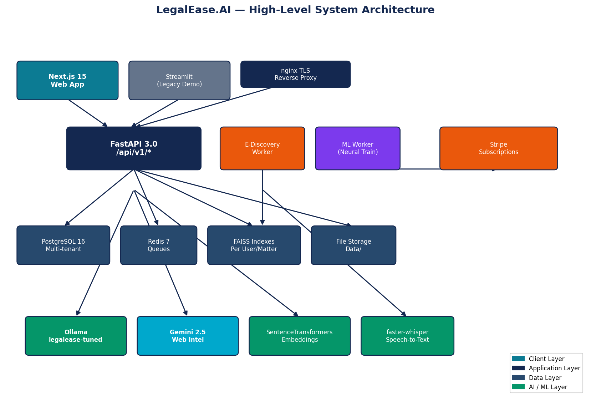

**Figure 1:** Production deployment connects clients through nginx to stateless API containers, with data persisted in PostgreSQL/Redis/FAISS and AI inference split between local Ollama and cloud Gemini.

### Repository layout (logical)

| Layer | Location | Role |
|-------|----------|------|
| API entry | `backend/app/main.py` | FastAPI app, middleware stack, health, Sentry, auth routes |
| REST routes | `backend/app/api/v1/` | 27 versioned endpoint modules under `/api/v1/*` |
| Domain services | `backend/app/services/`, `backend/app/core/` | Chat, KB, CRM, billing, security, matter repos |
| Shared LLM/RAG | `llms.py`, `rag.py`, `kb_pipeline.py` (root) | Embeddings, retrieval, synthesis |
| Frontend | `web/` | Next.js App Router, Tailwind, `lib/api.ts` client |
| Legacy UI | `app.py` (Streamlit), `legacy_saas/` | Alternate entry, auth tokens |
| Ops | `docker-compose.yml`, `deploy/`, `scripts/` | Postgres, Redis, workers, backups, nginx |

### Middleware stack (request ingress order)

Applied in `main.py` in this order:

1. **MemoryEfficiencyMiddleware** — Sets `X-Memory-Pressure`, `X-Embed-Batch-Hint` headers for adaptive batching
2. **RateLimitMiddleware** — Default 180 req/min; chat 80/min; Redis or in-memory; keyed by Bearer hash or IP
3. **RequestGuardMiddleware** — Blocks TRACE/TRACK/CONNECT; HTTPS redirect when `FORCE_HTTPS=1`
4. **IPFirewallMiddleware** — Optional allowlist (`FIREWALL_ENABLED`); CRM/health exempt
5. **SecurityHeadersMiddleware** — HSTS, CSP, X-Frame-Options, COOP
6. **CORSMiddleware** — Configurable origins + localhost regex

### Request path (chat turn)

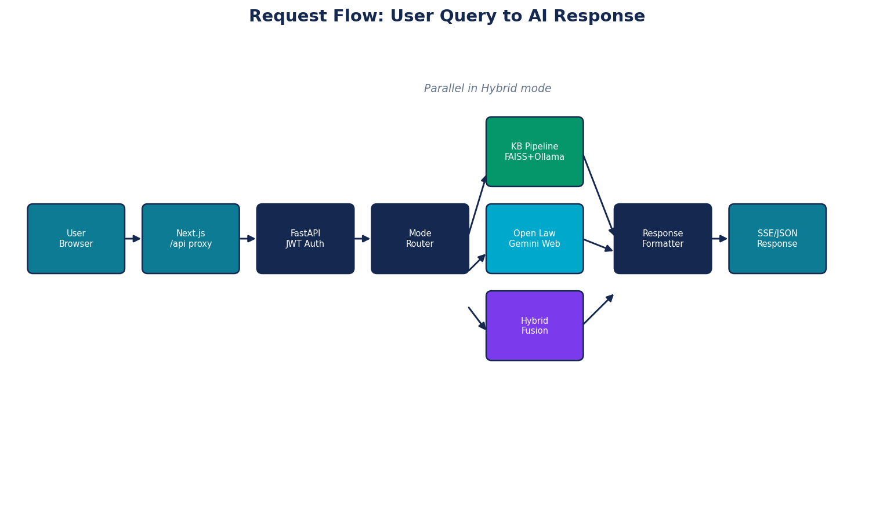

**Figure 2:** A chat turn traverses JWT authentication, mode routing, and one of three AI pipelines before formatted response delivery via JSON or SSE stream.

```mermaid
sequenceDiagram
  participant U as User Browser
  participant N as Next.js
  participant A as FastAPI
  participant R as Mode Router
  participant KB as KB Pipeline FAISS+Ollama
  participant OL as Open Law Gemini
  participant H as Hybrid Fusion
  U->>N: POST /api/v1/chat
  N->>A: JWT + mode + matter_id
  A->>R: classify intent + plan gate
  alt knowledge_base
    R->>KB: retrieve + synthesize
    KB-->>A: cited answer or NOT_FOUND
  else open_law
    R->>OL: grounded web search
    OL-->>A: markdown + sources
  else hybrid
    R->>KB: parallel KB chunks
    R->>OL: parallel web intel
    KB->>H: fuse report
    OL->>H
    H-->>A: multi-section report
  end
  A-->>N: JSON / SSE stream
  N-->>U: rendered markdown
```

---

## Component Architecture

### Frontend layer (Next.js 15)

**Location:** `web/`

| Component | Path | Responsibility |
|-----------|------|----------------|
| App shell | `app/(app)/layout.tsx` | Sidebar, auth gate, chat history |
| Chat home | `app/(app)/page.tsx` | `ChatViewport`, `ModePills`, `InputDock` |
| API client | `lib/api.ts` | ~150 typed functions, Bearer token from `localStorage` |
| Auth | `components/providers/AuthProvider.tsx` | Login state, token refresh |
| Proxy | `next.config.js` | Rewrites `/api/v1/*` → FastAPI backend |

**Integration pattern:** Browser calls same-origin `/api/v1/*`; Next.js rewrites to `NEXT_PUBLIC_API_URL` (default `http://127.0.0.1:8000`). Token stored as `legalease_token` in localStorage.

### Backend layer (FastAPI)

**Location:** `backend/app/`

| Module | Files | Responsibility |
|--------|-------|----------------|
| Router | `api/v1/router.py` | Mounts 27 endpoint modules |
| Chat | `services/chat_service.py` | `run_chat_turn()`, streaming variants |
| Mode routing | `services/mode_router.py` | User mode normalization, no silent KB→Open Law switch |
| KB execution | `services/kb_service.py` | Wrapper over `app.rag_query` |
| Open Law | `services/open_law_executor.py` | Gemini + fallback chain |
| Hybrid | `services/hybrid_orchestrator.py` | Parallel KB+web, Gemini fusion |
| Auth | `core/auth.py` | `get_current_user` dependency |
| Plan gates | `core/plan_enforcement.py` | Document limits, hybrid gating |

### AI layer

| Component | Technology | Scope |
|-----------|------------|-------|
| Local LLM | Ollama `legalease-tuned` | KB synthesis, drafting assist |
| Cloud LLM | Gemini 2.5 Flash | Open Law, Hybrid fusion, coach |
| Embeddings | SentenceTransformers (BGE/MiniLM) | FAISS indexing |
| Vector store | FAISS-CPU | Per-user/matter indexes |
| STT | faster-whisper | `/api/v1/speech/transcribe` |
| OCR | EasyOCR, PyMuPDF | Document ingestion |
| Reranking | cross-encoder/ms-marco-MiniLM-L-6-v2 | Optional (`RAG_ENABLE_CROSS_ENCODER=0`) |

### Data layer

| Store | Location | Contents |
|-------|----------|----------|
| PostgreSQL 16 | Docker volume `postgres_data` | Users, orgs, matters, CRM, billing, audit |
| Redis 7 | Docker volume `redis_data` | Job queues, rate limits, sessions |
| FAISS | `faiss_indexes/`, `faiss_index_global/` | Vector embeddings |
| Filesystem | `Data/` | Uploaded PDFs, Ollama exports |
| SQLite (legacy) | `legalease.db` | Local dev fallback |

---

## Database Schema & Data Model

### Schema organization

Tables are defined in `backend/app/core/*_schema.py` files and ensured at startup via `ensure_*_schema()` in `main.py`. Primary schemas:

- `p0_saas_schema.py` / `pg_core_schema.py` — users, orgs, auth
- `practice_schema.py` — matters, timeline, hearings, evidence
- `document_schema.py` — documents, KB status
- `saas_schema.py` / `pg_rest_schema.py` — CRM, billing, e-discovery, trust
- `crm_schema.py` — CRM v2 extensions
- `collab_schema.py` — collaboration rooms
- `saas_ops_schema.py` — audit, ML jobs

### Conceptual ER diagram

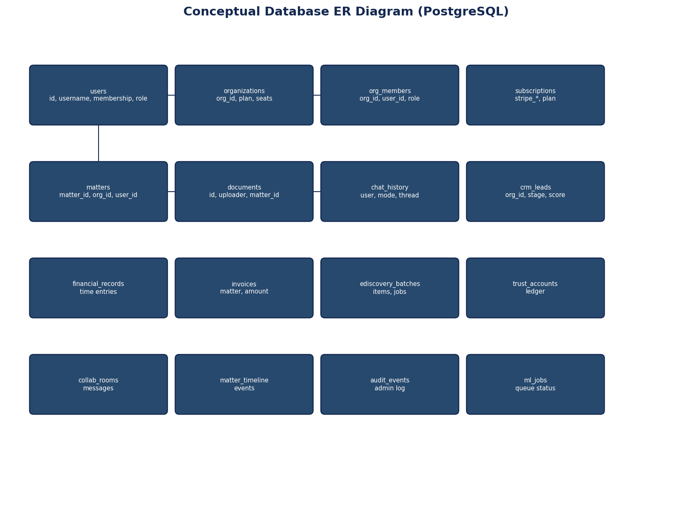

**Figure 3:** Core entity relationships showing multi-tenant org structure, matter-document linkage, and SaaS billing tables.

### Core tables (detailed)

#### Authentication & tenancy

| Table | Key columns | Notes |
|-------|-------------|-------|
| `users` | `id`, `username`, `password_hash`, `membership`, `role`, `suspended` | bcrypt passwords |
| `organizations` | `org_id`, `name`, `plan`, `seat_limit` | Tenant root |
| `org_members` | `org_id`, `user_id`, `role` | owner/member/lawyer/viewer |
| `org_invites` | `invite_id`, `token`, `status`, `expires_at` | Email invites |
| `subscriptions` | `user_id`, `stripe_customer_id`, `stripe_subscription_id`, `plan` | Stripe linkage |

#### Practice management

| Table | Key columns | Notes |
|-------|-------------|-------|
| `matters` | `matter_id`, `user_id`, `org_id`, case metadata | Org-scoped ACL |
| `matter_timeline` | events, dates, sources | Auto-extraction support |
| `matter_hearings` | date, court, notes | Cause list import |
| `matter_tasks` / `matter_deadlines` | assignee, due date | Workflow |
| `matter_entities` | parties, roles | NER extraction |
| `matter_evidence` | doc refs, tags | Evidence desk |
| `matter_contradictions` | claim pairs, severity | AI contradiction scan |
| `matter_members` | user_id, role | Shared access |

#### Documents & KB

| Table | Key columns | Notes |
|-------|-------------|-------|
| `documents` | `id`, `uploader_id`, `filename`, `matter_id`, `org_id`, `index_status` | Plan limits enforced |
| `knowledge_base_status` | vector counts, last index | Health panel data |
| `chat_history` | `question`, `answer`, `mode`, `thread_id`, `matter_id` | Session persistence |

#### CRM 2.0

| Table | Key columns | Notes |
|-------|-------------|-------|
| `crm_leads` | `org_id`, `stage`, `score`, `analysis_json` | Pipeline stages |
| `crm_lead_interactions` | type, notes, timestamp | Activity log |
| `crm_lead_documents` | file refs | Evidence attachments |
| `crm_stage_history` | from_stage, to_stage | Audit trail |
| `crm_intent_corrections` | predicted, corrected | Intent training |

#### Billing & finance

| Table | Key columns | Notes |
|-------|-------------|-------|
| `financial_records` | matter_id, hours, narrative | Time tracking |
| `invoices` | matter_id, amount, status | Generated invoices |
| `financial_lexicon_cache` | narrative hash, polished | AI narrative polish cache |
| `trust_accounts` / `trust_transactions` | IOLTA ledger | Trust accounting |

#### E-discovery

| Table | Key columns | Notes |
|-------|-------------|-------|
| `ediscovery_batches` | matter_id, status | Batch container |
| `discovery_items` | text, relevance, tags | Individual items |
| `ediscovery_jobs` | status, progress | Async worker jobs |
| `discovery_tag_weights` | tag, weight | Learning from review |

#### Collaboration

| Table | Key columns | Notes |
|-------|-------------|-------|
| `collab_rooms` | name, matter_id | Slack-like rooms |
| `collab_messages` | content, author | Thread messages |
| `collab_notifications` | user_id, read | Push-style alerts |

#### Operations

| Table | Key columns | Notes |
|-------|-------------|-------|
| `audit_events` | action, user_id, metadata | Admin audit viewer |
| `ml_jobs` | job_type, payload_json, status | Neural train queue |

### SQLAlchemy ORM (premium features)

`backend/app/core/orm_models.py` — used for deal rooms, witness sessions, judgments:

- `DealRoom`, `DealRoomDocument`
- `WitnessSession`, `WitnessMessage`
- `Judgment` (citation analytics)
- `TuningExportJob`

---

## Authentication & Authorization Flow

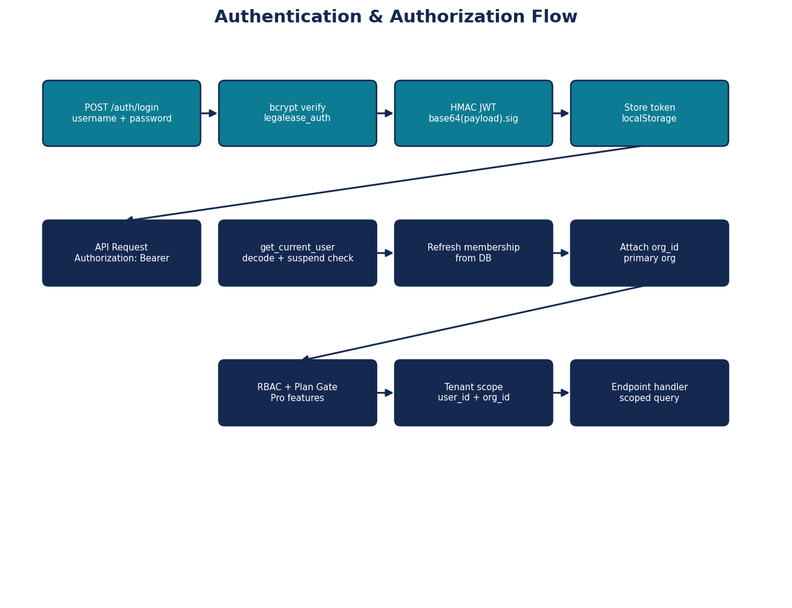

**Figure 4:** JWT-based authentication with live membership refresh and org context attachment on every request.

### Token format

Custom HMAC JWT in `legacy_saas/auth_tokens.py`:

- Secret: `LEGALEASE_API_SECRET` or `JWT_SECRET` (min 32 chars in production)
- Format: `base64(json_payload).hmac_sha256_hex`
- Payload: `sub`, `username`, `membership`, `role`, `exp` (default 7 days)

### Login flow (step-by-step)

1. Client POST `/api/v1/auth/login` with `{username, password}`
2. `legalease_auth.authenticate_user()` verifies bcrypt hash
3. Suspension check via `admin_auth.user_is_suspended`
4. `create_access_token(user)` returns HMAC token
5. Client stores token in `localStorage` as `legalease_token`
6. Subsequent requests: `Authorization: Bearer <token>`

### Request authorization

`get_current_user` dependency (`core/auth.py`):

1. Extract Bearer token via `HTTPBearer`
2. `decode_access_token()` — validate signature and expiry
3. Re-check suspension status
4. **Refresh membership from DB** — plan changes apply without re-login
5. Attach `org_id` from `org_service.get_primary_org_id`
6. Return user context to endpoint handler

### Role hierarchy

| Role | Capabilities |
|------|-------------|
| `owner` | Org admin, billing, invites, all matters |
| `lawyer` | Full matter write, CRM, billing entries |
| `member` | Read/write on assigned matters |
| `viewer` | Read-only matter access |
| `admin` / `superadmin` | Platform admin (`SUPERADMIN_USERNAMES`) |

### Registration flow

1. POST `/api/v1/auth/register` with username, password, terms acceptance
2. `create_user()` inserts into `users`
3. `create_org_for_user()` — user becomes org **owner**
4. Token issued immediately; email verification optional via `/account/verify-email`

---

## Multi-Tenancy Architecture

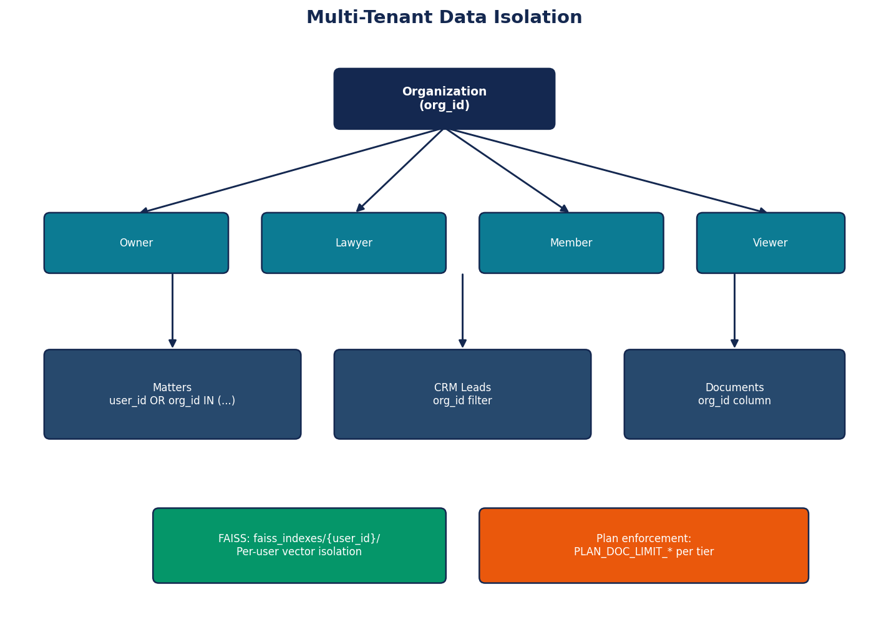

**Figure 5:** Organization-scoped data isolation across matters, CRM, documents, and vector indexes.

### Tenant model

- **Primary tenant unit:** Organization (`organizations.org_id`)
- **User membership:** `org_members` table with role
- **Registration:** Auto-creates org; user is owner
- **Invites:** Token-based via `/orgs/invites`; accept at `/invite/[token]`

### Data isolation mechanisms

| Resource | Isolation method | Code reference |
|----------|-----------------|----------------|
| Matters | `user_id OR org_id IN (user's orgs)` | `matter_repo.py` |
| CRM leads | `org_id = primary_org` | `crm_v2_service.py` |
| Documents | `org_id` column + uploader | `plan_enforcement.py` |
| FAISS indexes | `faiss_indexes/{user_id}/` | `rag.py`, `resolve_rag_index_dir()` |
| Chat history | `user_id` scoped | `sessions` endpoints |
| Billing | `user_id` + org plan sync | `stripe_billing.py` |

### Plan enforcement per tenant

`plan_enforcement.py`:

- Document count limits: `PLAN_DOC_LIMIT_FREE=2`, `PLAN_DOC_LIMIT_PRO=500`, `PLAN_DOC_LIMIT_LEGAL_PRO=5000`
- Hybrid mode blocked on Free tier
- Org-visible document counts for shared org limits
- Seat limits via `PLAN_SEATS` env map

### Matter strict scope

When `MATTER_STRICT_SCOPE_ENFORCEMENT=1`:

- Matter-scoped chat restricts retrieval to matter index
- Cross-matter document access blocked at API layer

---

## Chat Modes Deep Dive

### Mode overview

| Mode | API name | Aliases | Engine | Plan requirement |
|------|----------|---------|--------|------------------|
| Knowledge Base | `knowledge_base` | `kb`, `document` | FAISS + Ollama | All tiers |
| Open Law | `open_law`, `web_search` | `web`, `openlaw` | Gemini + fallbacks | All tiers (quota) |
| Hybrid / Jurisprudence | `hybrid`, `deep_case` | `deep`, `jurisprudence` | KB + Web fusion | Pro, Legal Pro |

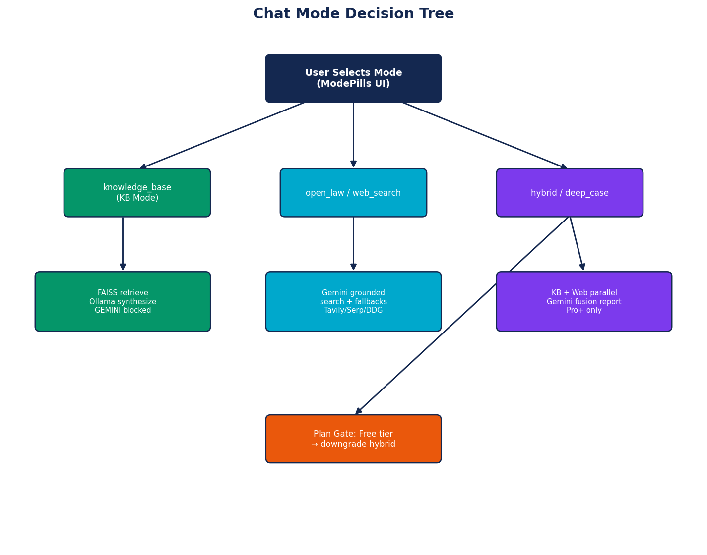

**Figure 6:** User-selected mode is respected; plan gate downgrades hybrid on Free tier.

### Mode normalization (`chat_mode.py`)

```python
CANONICAL_MODES = ("knowledge_base", "web_search", "deep_case", "open_law", "hybrid")
```

`normalize_api_chat_mode(mode, membership)`:

- Maps aliases to canonical strings
- **Plan gate:** `hybrid` / `deep_case` → forced to `knowledge_base` unless `membership in ("Pro", "Legal Pro")`

### Mode router policy (`mode_router.py`)

**Critical rule:** Never auto-switch KB → Open Law. User selection wins.

Returns `RouteDecision(mode, parse, effective_query, reason)` with reasons: `user_kb`, `user_open_law`, `user_hybrid`.

### KB mode code path

```
run_chat_turn(mode=knowledge_base)
  → _resolve_chat_routing()  [parse, merge follow-ups, route_query]
  → _run_kb_turn()
      → enforce_kb_gemini_policy()  [blocks GEMINI_KB_SYNTHESIS=1]
      → check_kb_ready_for_query()  [index gate]
      → execute_kb_query() → app.rag_query()
          → kb_pipeline()
              → legal_orchestrator_v2 (primary)
              → kb_retrieve() → rag.query_kb()
              → evaluate_retrieval()  [kb_rag_decision]
              → generate_answer() / orchestrate_kb_answer() [Ollama]
      → _finalize_kb_answer()  [NOT_FOUND enforcement]
```

**Index scope in chat:** `_run_kb_turn` uses `retrieval_scope = "global"` for main chat (matter-scoped KB available on matter pages).

### Open Law code path

```
run_chat_turn(mode in open_law, web_search)
  → _run_open_law_turn()
      → fetch_open_law_answer()
          1. lookup_answer_memory()  [strict cache]
          2. _from_grounded_research() → run_legal_web_research()  [Gemini]
          3. On failure: _from_legacy_web_search(skip_gemini=True)
               → llms.search_web() → Tavily/Serp/Google CSE/DDG
               → orchestrate_web_answer()
```

**Web fallback chain:** Gemini → OpenRouter → Tavily → SerpAPI → Google CSE → DuckDuckGo

### Hybrid / Jurisprudence code path

```
run_chat_turn(mode in hybrid, deep_case)
  → run_jurisprudence_turn() → run_hybrid_turn()
      Parallel:
        KB leg: _fetch_kb_hybrid() [HYBRID_KB_LIGHT=1] OR rag_query()
        Web leg: _fetch_web_hybrid() [HYBRID_SKIP_PREFETCH_WEB=1 option]
      assess_kb_for_hybrid()  [gate weak KB]
      synthesize_jurisprudence_report()  [Gemini fusion]
      else merge_hybrid_answers() or fetch_open_law_answer(mode=hybrid)
```

**Hybrid KB gate thresholds:**

| Env var | Default | Effect |
|---------|---------|--------|
| `HYBRID_KB_MIN_SCORE` | 0.32 | Min retrieval score to use KB |
| `HYBRID_KB_TERM_RATIO` | 0.4 | Term overlap with chunks |
| `HYBRID_SKIP_KB_PREFETCH_PUBLIC` | 1 | Skip KB for famous public cases |

### Streaming

Both sync and stream endpoints share routing:

- `POST /api/v1/chat` — JSON response
- `POST /api/v1/chat/stream` — SSE chunks via `_stream_kb_turn`, `_stream_open_law_turn`

### Frontend mode selection

`web/components/chat/ModePills.tsx` — three pills bound to session mode state, sent with each chat request.

---

## RAG Pipeline

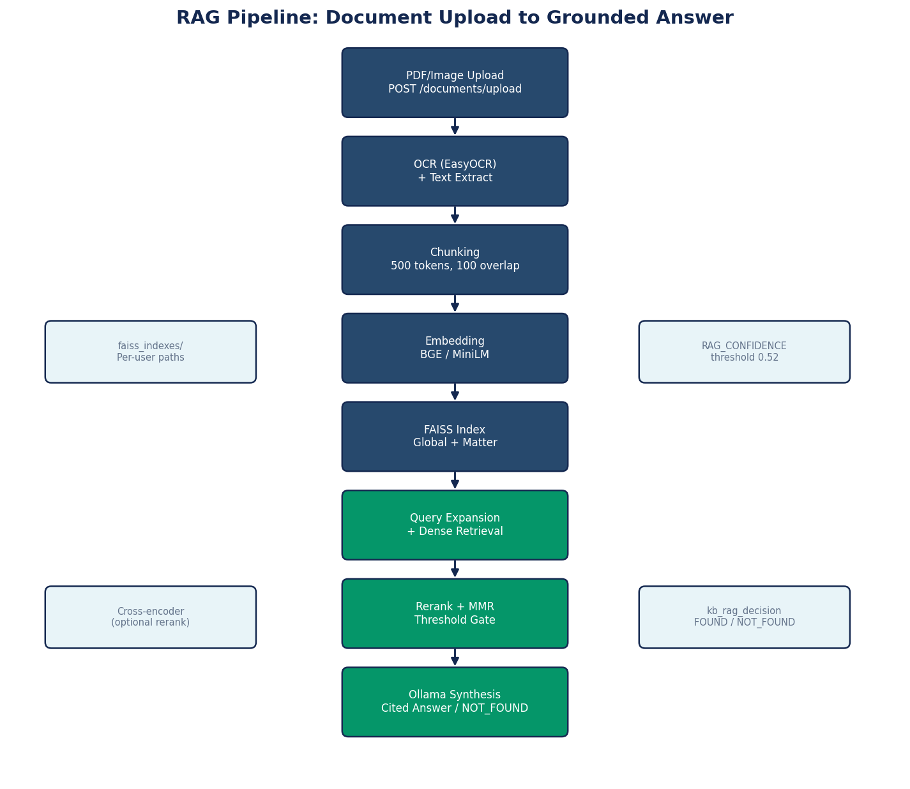

**Figure 7:** End-to-end retrieval-augmented generation from document upload through confidence-gated Ollama synthesis.

### Document ingestion

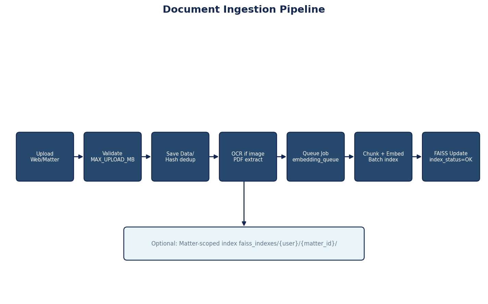

**Figure 8:** Upload validation, OCR, async embedding queue, and FAISS index update.

### Chunking configuration

| Env var | Default | Purpose |
|---------|---------|---------|
| `RAG_CHUNK_SIZE` | 500 | Target chunk token size |
| `RAG_CHUNK_OVERLAP` | 100 | Overlap between chunks |
| `RAG_MAX_CHUNK` | 600 | Hard max chunk size |
| `RAG_MAX_CHUNKS_PER_DOC` | 1000 | Cap per document |

**Functions:** `_split_text()`, `_split_by_statute_headings()`, `_chunk_size_for_text()` in `rag.py`.

Statute-aware chunking splits on section headings for Indian legal documents.

### Embedding

- Model: `HF_EMBEDDING_MODEL` default `sentence-transformers/all-MiniLM-L6-v2` (BGE-small also supported)
- Wrapper: `HuggingFaceEmbeddingsWrapper` → `EmbeddingManager.get_langchain_embeddings()`
- Per-user fine-tunes: optional PEFT adapters via learning loop
- Warmup: background load at API startup via `embedding_manager.py`

### FAISS indexing

| Index type | Path | Scope |
|------------|------|-------|
| Global | `faiss_index_global/` | All user documents |
| Per-user | `faiss_indexes/{user_id}/` | User-scoped |
| Per-matter | `faiss_indexes/{user_id}/{matter_id}/` | Matter-scoped |

**Functions:** `index_documents()`, `append_documents_to_index()`, `build_faiss_index()`.

### Retrieval pipeline (`query_kb()`)

1. **Query understanding** — `_detect_query_type()`, `_extract_query_signals()`
2. **Query expansion** — `_expand_queries()` / compare bundles for multi-section queries
3. **Dense retrieval** — FAISS similarity search (`RAG_TOP_K_DENSE=60`)
4. **Sparse retrieval** — keyword scoring (`RAG_TOP_K_KEYWORD=60`)
5. **Fusion** — combine dense + sparse scores
6. **Reranking** — heuristic or cross-encoder (`RAG_ENABLE_CROSS_ENCODER=0`)
7. **MMR selection** — `_mmr_select()` with `RAG_MMR_LAMBDA=0.65`
8. **Validation** — `_validate_context()`
9. **Exact section shortcut** — `exact_section_lookup()` for statute queries

### Confidence gating (`kb_rag_decision.py`)

| Env var | Default | Purpose |
|---------|---------|---------|
| `RAG_MIN_RETRIEVAL_THRESHOLD` | 0.28 | Global minimum confidence |
| `RAG_SCORE_THRESHOLD` | 1.6 | L2 distance threshold |
| `RAG_SIMILARITY_THRESHOLD` | 0.30 | Similarity floor |

**Per-query-type thresholds:**

- `law_replacement`: 0.22
- `section_lookup`: 0.25
- `document_qa`: 0.18
- `unknown`: 0.20
- Comparison queries: 0.30

**Outcomes:** `FOUND` → Ollama synthesis with citations; `NOT_FOUND` → explicit not-found response (no hallucination).

### KB synthesis (Ollama only)

- Model: `OLLAMA_MODEL=legalease-tuned` (locked via `OLLAMA_KB_LOCK_MODEL=1`)
- Timeout: `KB_LLM_TIMEOUT_SEC=60` (fast) / 180
- Max tokens: `KB_OLLAMA_MAX_TOKENS=1024` / 2048
- Prompts: `prompts.kb_prompt()`, `STRICT_KB_GROUNDING_PROMPT`, `KB_OLLAMA_QUALITY_PROMPT`

### Legal query engine (pre-retrieval)

`legal_query_engine.py` classifies queries into `LegalQueryKind`:

- `single_section_explanation`, `single_section_punishment`
- `same_law_comparison`, `law_mapping_comparison`
- `multi_section_explanation`, `constitutional_query`
- `general_legal_query`, `law_replacement`
- `entity_lookup`, `case_query`

Returns `LegalQueryPlan` with sections, laws, comparison flags — consumed by `kb_pipeline.kb_retrieve()`.

---

## LLM Integration & Routing

### Separation of duties

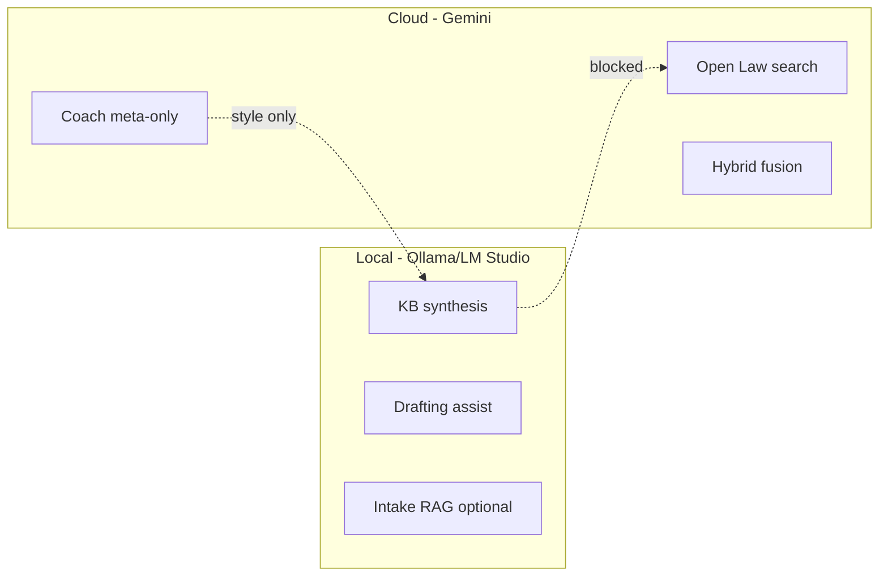
```mermaid
flowchart LR
  subgraph Local["Local - Ollama/LM Studio"]
    K1[KB synthesis]
    K2[Drafting assist]
    K3[Intake RAG optional]
  end
  subgraph Cloud["Cloud - Gemini"]
    G1[Open Law search]
    G2[Hybrid fusion]
    G3[Coach meta-only]
  end
  K1 -.->|blocked| G1
  G3 -.->|style only| K1
```

### Ollama configuration

| Env var | Default | Purpose |
|---------|---------|---------|
| `LLM_BACKEND` | `ollama` | Primary inference backend |
| `OLLAMA_BASE_URL` | `http://127.0.0.1:11434` | Ollama server |
| `OLLAMA_MODEL` | `legalease-tuned` | Default model |
| `OLLAMA_KB_LOCK_MODEL` | `1` | Force KB to use OLLAMA_MODEL |
| `OLLAMA_NUM_GPU` | — | GPU layer offload |
| `OLLAMA_NUM_CTX` | — | Context window size |

**LM Studio fallback:** `LM_STUDIO_URL`, `LM_STUDIO_MODEL` when `LLM_BACKEND=lmstudio`.

### Gemini configuration

| Env var | Default | Purpose |
|---------|---------|---------|
| `GEMINI_API_KEY` | — | Required for Open Law/Hybrid |
| `GEMINI_FREE_MODEL` | `gemini-2.5-flash` | Model for web intel |
| `GEMINI_DAILY_FREE` | 15 | Free tier daily quota |
| `GEMINI_DAILY_PRO` | 200 | Pro tier quota |
| `GEMINI_DAILY_LEGAL_PRO` | 1000 | Legal Pro quota |
| `GEMINI_KB_SYNTHESIS` | `0` | **Must be 0** — KB isolation |
| `GEMINI_KB_RERANK` | `0` | KB rerank blocked |
| `GEMINI_KB_RETRIEVAL_HINTS` | `0` | KB retrieval hints blocked |

### Task router (`llm_task_router.py`)

When `LLM_ROUTER_ENABLED=1`:

| TaskType | Model env | Use case |
|----------|-----------|----------|
| `classification` | `OLLAMA_MODEL_FAST` | Query classification |
| `legal_reasoning` | `OLLAMA_MODEL_LEGAL` | Complex legal analysis |
| `retrieval` | `OLLAMA_MODEL_FAST` | Retrieval assist |
| `web_research` | Cloud | Web synthesis |
| `draft_polish` | `OLLAMA_MODEL_LEGAL` | Draft refinement |
| `speech_cleanup` | `OLLAMA_MODEL_FAST` | STT post-processing |

KB synthesis bypasses router when `OLLAMA_KB_LOCK_MODEL=1`.

### Web search providers (`llms.search_web()`)

Priority order:

1. Gemini grounded snippets (if configured, `skip_gemini=False`)
2. Tavily REST (`TAVILY_API_KEY`, `WEB_PREFER_TAVILY_REST=1`)
3. SerpAPI (`SERP_API_KEY`)
4. Google Custom Search (`GOOGLE_API_KEY`, `GOOGLE_CSE_ID`)
5. DuckDuckGo (no key required)

### Coach / improvement automation

Settings-only Gemini coach (`GEMINI_OLLAMA_TUNING=0/1`):

- Analyzes feedback thumbs — style/tone only
- Blocked from KB substance injection (`KB_BLOCK_RUNTIME_COACH=1`)
- Scheduled via `COACH_AUTO_SCHEDULE=1`
- Full pipeline: feedback → neural train → KB re-index → `ollama create legalease-tuned`

---

## API Reference Overview

### Router mount table

Central router: `backend/app/api/v1/router.py` — all routes prefixed `/api/v1`.

| Prefix | Module | Key endpoints |
|--------|--------|---------------|
| `/health` | health | `/ping`, `/metrics`, `/health/live`, `/health/ready`, `/health/public` |
| `/chat` | chat | `POST ""`, `POST /stream`, `POST /export-report` |
| `/engines` | engines | `GET /status`, watchlist CRUD |
| `/documents` | documents | `GET ""`, `POST /upload`, `POST /index`, `DELETE /{doc_id}`, reindex |
| `/kb` | kb_debug | `GET /debug-query`, `/debug-batch` |
| `/sessions` | sessions | Chat history, threads, attachments |
| `/matters` | matters | CRUD, timeline, hearings, evidence, contradictions, intelligence (~50 routes) |
| `/crm` | crm | Dashboard, kanban, leads CRUD, analyze, convert |
| `/billing` | billing + subscriptions | Time entries, invoices, Stripe checkout/portal/webhook |
| `/orgs` | orgs | `GET /me`, invites CRUD, accept |
| `/account` | account | Onboarding, verify-email, export, delete, password reset |
| `/admin` | admin | Users, audit, suspend (superadmin) |
| `/trust` | trust | Trust account ledger |
| `/collaboration` | collab | Rooms, messages, reactions, notifications |
| `/portal` | portal | Client portal token access |
| `/esign` | esign | Signing requests (mock/DocuSign) |
| `/ediscovery` | ediscovery | Triage, batches, jobs, search, review |
| `/research` | research_log | Query expansion, research log |
| `/practice` | practice | Limitation calculator, court-day, evidence desk, public intake |
| `/dashboard` | dashboard | Practice KPIs |
| `/speech` | speech | `POST /transcribe`, `POST /polish` |
| `/premium` | premium | Witness, precedent, BNS, deal rooms, PII |
| `/learning` | learning | Feedback, signals, tuning, neural train |
| `/memory` | memory | Persona, facts, thread summaries |
| `/drafting` | drafting_studio | Smart draft, generate |
| `/templates` | templates | Document templates |
| `/clauses` | clauses | Clause library |

### Auth routes (on main.py)

| Method | Path | Auth | Purpose |
|--------|------|------|---------|
| POST | `/api/v1/auth/login` | Public | Login |
| POST | `/api/v1/auth/register` | Public | Register |
| GET | `/api/v1/auth/me` | JWT | Current user |
| POST | `/api/v1/billing/stripe/webhook` | Stripe sig | Subscription webhooks |

### Health routes (on main.py, no auth)

| Path | Purpose |
|------|---------|
| `/api/v1/health/live` | Liveness probe |
| `/api/v1/health/security` | Security posture (no secrets) |
| `/api/v1/health/embeddings` | Embedding model status |
| `/api/v1/health/gpu` | GPU/STT status |

### Rate limits

| Endpoint class | Default limit |
|----------------|---------------|
| General API | 180 req/min |
| Chat | 80 req/min |
| Key | Bearer token hash or client IP |

---

## Frontend Architecture & User Flows

### Navigation structure (`Sidebar.tsx`)

**Workspace:** `/dashboard`, `/` (chat), `/documents`

**Practice:** `/matters`, `/litigation`, `/intake`, `/collaboration`, `/billing`, `/discovery`

**Tools:** `/drafting`, `/tools`, `/premium`, `/analytics`

**Settings:** `/settings`, `/settings/subscription`, `/settings/team`

Learner mode hides several Practice/Tools links (`learnerHide: true`).

### User flow: New advocate onboarding

1. Register at `/login` → auto org creation
2. Optional email verify at `/verify-email`
3. Onboarding wizard at `/onboarding`
4. Upload documents at `/documents` → automatic FAISS index
5. First chat at `/` — select KB mode, ask question
6. Upgrade at `/settings/subscription` via Stripe

### User flow: Daily practice

1. **Morning:** `/dashboard` — hearings digest, evidence alerts, quick actions
2. **Intake:** `/intake/board` — Kanban pipeline review
3. **Research:** Matter workspace `/matters/[id]/ai` or main chat with Hybrid mode
4. **Drafting:** `/drafting` — template studio with STT dictation
5. **Billing:** `/billing` — log time entries, generate invoices
6. **Discovery:** `/discovery` — batch triage on new productions

### Chat UI components

| Component | File | Role |
|-----------|------|------|
| `ChatViewport` | `components/chat/ChatViewport.tsx` | Message rendering, markdown |
| `InputDock` | `components/chat/InputDock.tsx` | Text input, attachments, mic |
| `ModePills` | `components/chat/ModePills.tsx` | KB / Open Law / Hybrid selector |
| `EngineStatusBar` | `components/chat/EngineStatusBar.tsx` | KB health, LLM status, Gemini quota |
| `KbScopeHealth` | `components/chat/KbScopeHealth.tsx` | Index vector counts |
| `MessageFeedback` | `components/chat/MessageFeedback.tsx` | Thumbs up/down → learning loop |

### API client pattern

```typescript
// web/lib/api.ts
const token = localStorage.getItem("legalease_token");
fetch("/api/v1/chat", {
  headers: { Authorization: `Bearer ${token}` },
  method: "POST",
  body: JSON.stringify({ question, mode, matter_id }),
});
```

---

## CRM 2.0 Module

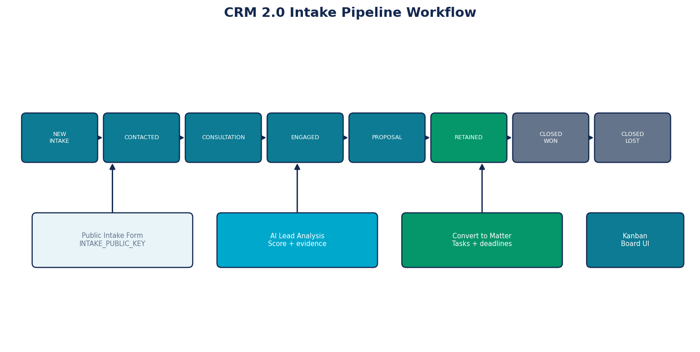

**Figure 9:** Eight-stage intake pipeline from public form through AI analysis to matter conversion.

### Pipeline stages

| Stage | Description |
|-------|-------------|
| `NEW_INTAKE` | Initial lead entry |
| `CONTACTED` | First outreach completed |
| `CONSULTATION` | Consultation scheduled/held |
| `ENGAGED` | Active discussion |
| `PROPOSAL` | Fee proposal sent |
| `RETAINED` | Client retained |
| `CLOSED_WON` | Successfully converted |
| `CLOSED_LOST` | Declined or lost |

### Frontend routes

| Route | Components | APIs |
|-------|------------|------|
| `/intake` | `CrmKpiStrip`, `AnalyticsPieChart` | `fetchCrmDashboard` |
| `/intake/board` | `CrmKanbanBoard` | `fetchCrmKanban`, `patchCrmLeadStage` |
| `/intake/new` | Lead form + `VoiceTextarea` | `createCrmLead` |
| `/intake/[leadId]` | `LeadAnalysisPanel`, `CrmAssistantPanel` | `analyzeCrmLead`, `convertLeadToMatter` |
| `/intake/analytics` | Charts | `fetchCrmAnalytics` |
| `/intake/public` | Public form | `submitPublicIntake` |

### AI features

- **Lead analysis:** `POST /api/v1/crm/{leadId}/analyze` — scoring, evidence readiness, `analysis_json`
- **Intent classification:** `POST /api/v1/crm/classify` — practice area detection
- **CRM assistant:** In-panel chat for lead-specific guidance
- **Intent corrections:** `crm_intent_corrections` table for training feedback

### Public intake

When `INTAKE_PUBLIC_ENABLED=1`:

- Public form at `/intake/public`
- Authenticated via `INTAKE_PUBLIC_KEY`
- Leads assigned to `INTAKE_ORG_USER_ID` firm user

### Lead → matter conversion

`POST /api/v1/crm/{leadId}/convert`:

1. Creates matter with lead metadata
2. Transfers entities, tasks, deadlines
3. Links CRM documents to matter
4. Updates lead stage to `RETAINED`

### RBAC

`crm_rbac.py` — role-based access for CRM operations within org scope.

---

## Matters & Case Management

### Matter workspace routes

Base layout: `web/app/(app)/matters/[matterId]/layout.tsx`

| Sub-route | Panel | Backend |
|-----------|-------|---------|
| `/matters/[id]` | `MatterDashboard` overview | Dashboard aggregate |
| `/matters/[id]/documents` | Document upload/link | `/documents` with matter_id |
| `/matters/[id]/timeline` | `MatterTimelinePanel` | Timeline CRUD, AI suggestions |
| `/matters/[id]/hearings` | `MatterHearingsPanel` | Hearings, cause list import |
| `/matters/[id]/tasks` | Tasks/deadlines | `matter_tasks`, `matter_deadlines` |
| `/matters/[id]/evidence` | `MatterEvidencePanel` | Evidence extraction |
| `/matters/[id]/entities` | `MatterEntitiesPanel` | NER / parties |
| `/matters/[id]/contradictions` | `ContradictionPanel` | AI contradiction scan |
| `/matters/[id]/knowledge` | `MatterKnowledgePanel` | Matter-scoped FAISS |
| `/matters/[id]/ai` | `MatterAIPanel` | Intelligence run |
| `/matters/[id]/discussion` | `CollaborationHub` | Matter chat room |
| `/matters/[id]/history` | `MatterChatHistory` | Scoped chat threads |
| `/matters/[id]/settings` | `MatterSettingsForm` | Metadata, members |

### Matter API surface (~50 endpoints)

Key groups in `backend/app/api/v1/endpoints/matters.py`:

- CRUD: create, read, update, delete, archive
- Members: add, remove, role assignment
- Timeline: events, AI extraction, suggestions accept/reject
- Hearings: CRUD, cause list CSV import, prep pack generation
- Evidence: upload, tag, extract entities
- Contradictions: scan, review, dismiss
- Intelligence: run matter AI analysis, status polling
- Export: matter bundle ZIP
- Client letters: generate from templates

### Client portal

- Tokenized access: `/portal/[token]`
- Backend: `client_portal_access` table
- Read-only matter view for clients

### Matter-scoped AI

- Matter knowledge index: separate FAISS path under `faiss_indexes/{user_id}/{matter_id}/`
- Matter chat history filtered by `matter_id`
- Intelligence run aggregates timeline, entities, evidence for AI summary

---

## Billing & Stripe Integration

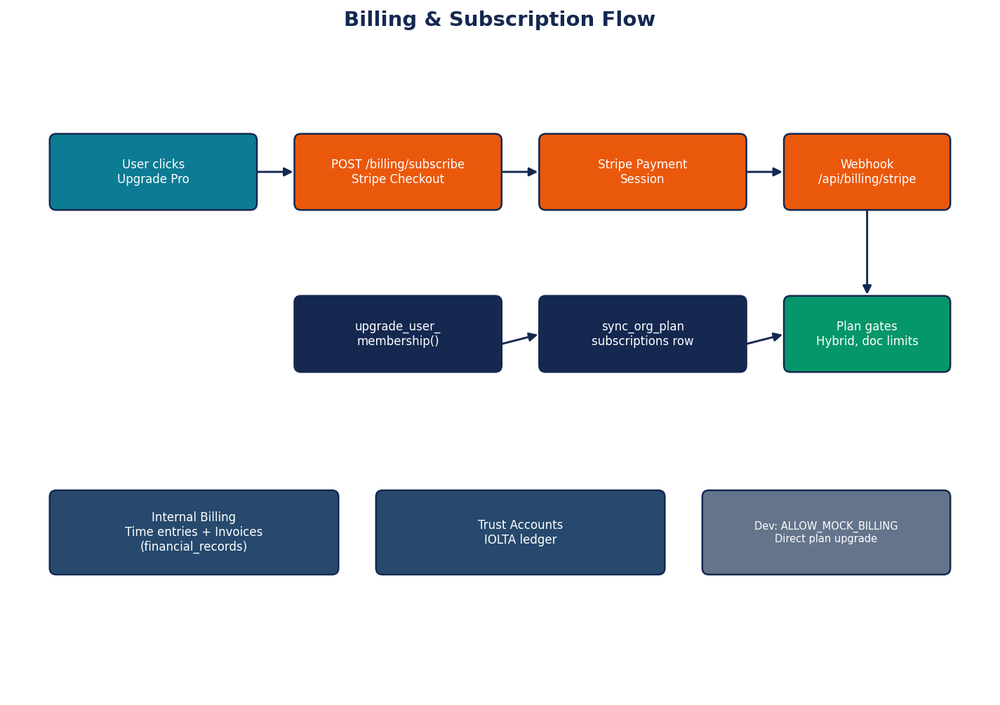

**Figure 10:** Stripe subscription checkout through webhook to plan enforcement; parallel internal time-tracking billing.

### Stripe subscriptions

**Module:** `backend/app/core/stripe_billing.py`

| Env var | Purpose |
|---------|---------|
| `STRIPE_SECRET_KEY` | API authentication |
| `STRIPE_WEBHOOK_SECRET` | Webhook signature verification |
| `STRIPE_PRICE_PRO` | Pro plan price ID |
| `STRIPE_PRICE_LEGAL_PRO` | Legal Pro price ID |
| `PUBLIC_APP_URL` | Checkout success/cancel URLs |

### Subscription flow

1. User clicks upgrade at `/settings/subscription`
2. `POST /api/v1/billing/subscribe` → `create_checkout_session()`
3. Redirect to Stripe Checkout
4. On payment: Stripe webhook `POST /api/v1/billing/stripe/webhook`
5. Handler processes: `checkout.session.completed`, `invoice.paid`, `customer.subscription.updated/deleted`
6. `upgrade_user_membership()` + `sync_org_plan_from_membership()`
7. `subscriptions` row updated with Stripe IDs

### Billing portal

`GET /api/v1/billing/portal` → Stripe Customer Portal for self-service plan management.

### Dev mock billing

When Stripe unset and not production: `ALLOW_MOCK_BILLING=1` enables direct plan upgrade via `plan_enforcement.mock_billing_allowed()`.

### Internal time tracking (separate from Stripe)

**Module:** `backend/app/core/billing_service.py`

| Endpoint | Purpose |
|----------|---------|
| `GET /api/v1/billing/summary` | Dashboard totals |
| `POST /api/v1/billing/entries` | Log time entry |
| `POST /api/v1/billing/narrative/polish` | AI narrative polish |
| `POST /api/v1/billing/invoices` | Generate invoice |

Tables: `financial_records`, `invoices`, `financial_lexicon_cache`.

### Trust accounts

IOLTA-style trust ledger:

- `trust_accounts` — account definitions
- `trust_transactions` — deposits, disbursements
- Routes under `/api/v1/trust`

---

## E-Discovery Module

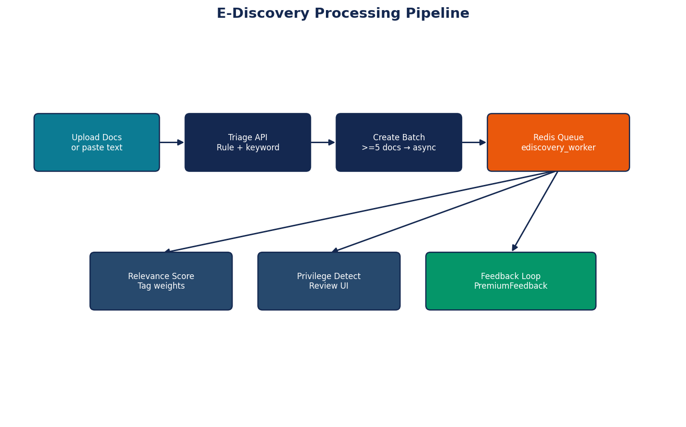

**Figure 11:** Document triage, async batch processing via Redis worker, and human review feedback loop.

### Frontend (`/discovery`)

Three sections on `DiscoveryPage`:

1. **Triage** — paste text or upload → `POST /api/v1/ediscovery/triage`
2. **Batch** — multi-document processing; async if ≥5 docs
3. **Research** — query expansion via `/api/v1/research/expand`

### Backend processing

| Step | Component | Details |
|------|-----------|---------|
| Triage | `ediscovery_service.py` | Rule-based + keyword relevance scoring |
| Batch create | `POST /api/v1/ediscovery/batches` | Stores items in `discovery_items` |
| Async queue | `job_queue.py` | Redis list `legalease:ediscovery:queue` |
| Worker | `scripts/ediscovery_worker.py` | Polls queue, processes batches |
| Review | `reviewDiscoveryItem` | Human tag + feedback |

### Worker architecture

- **Queue:** Redis list when `REDIS_URL` set; else SQLite poll on `ediscovery_jobs.status='QUEUED'`
- **Trigger:** `POST /api/v1/ediscovery/batches?async_job=true` or ≥5 documents auto-queues
- **Processing:** `process_job()` → `ediscovery_service.create_batch()`

### Tag weights learning

`discovery_tag_weights` table stores learned relevance weights from reviewer feedback, improving future triage accuracy.

---

## Document Drafting

### Frontend (`/drafting`)

Four tabs:

| Tab | API | Features |
|-----|-----|----------|
| Smart draft | `/api/v1/drafting/smart-draft/*` | Type selection, Q&A, generate |
| Templates | `/api/v1/templates/*` | FIR, notices, affidavits |
| Clause library | `/api/v1/clauses` | Searchable clauses, insert |
| Redline | `/api/v1/premium/drafting/redline` | Compare + AI suggestions |

### Smart draft flow

1. `listSmartDraftTypes()` — available document types
2. `getSmartDraftQuestions(type)` — dynamic form fields
3. User fills form (with STT via `useSpeechToText`)
4. `generateSmartDraft(type, answers)` — Ollama generates draft
5. User edits in textarea, optionally redline

### Template types

Stored in `document_templates` table:

- FIR (First Information Report)
- Legal notices
- Affidavits
- Contracts
- Custom firm templates

### Redline engine

`POST /api/v1/premium/drafting/redline`:

- Input: original text, revised text, instructions
- Output: tracked changes, AI commentary
- Uses Ollama for analysis

---

## Premium Tools

### Frontend (`/premium`)

Five tabs on `PremiumPage`:

| Tab | Features | Endpoints |
|-----|----------|-----------|
| Mock Trial | Witness simulation + cross-exam | `/api/v1/premium/witness/session`, `/chat`, `/feedback` |
| Precedent Tree | Landmark case graph, judge analytics | `/api/v1/premium/precedent/tree`, `/judge-analytics` |
| BNS Auditor | Compliance audit, risk overrides | `/api/v1/premium/compliance/bns-audit` |
| Deal Rooms | M&A doc analysis, anomaly detection | `/api/v1/premium/deal-rooms/*` |
| PII Redaction | Detect, redact, whitelist | `/api/v1/premium/pii/detect`, `/redact` |

### Witness simulation

ORM models: `WitnessSession`, `WitnessMessage`

1. Create session with case context
2. AI plays witness role
3. User conducts cross-examination
4. Feedback loop improves adaptation (`premium_witness_adaptations`)

### BNS compliance auditor

- Upload document or paste text
- AI scans for IPC→BNS mapping issues
- Risk overrides stored in `bns_overrides` table
- Critical for Indian criminal law transition

### Deal rooms

ORM: `DealRoom`, `DealRoomDocument`

- Create room, upload documents
- AI analyzes for anomalies, missing clauses
- Exception dismissals tracked for learning

### PII detection

- Pattern-based + AI detection
- Redaction with whitelist support (`pii_whitelist` table)
- Audit trail for compliance

---

## Learning Loop / Feedback System

### Feedback capture

`MessageFeedback` component → `POST /api/v1/learning/feedback`:

- Thumbs up/down on chat responses
- Mode, query, answer, chunk IDs logged
- Triggers async processing via `feedback_async.py`

### Learning pipeline

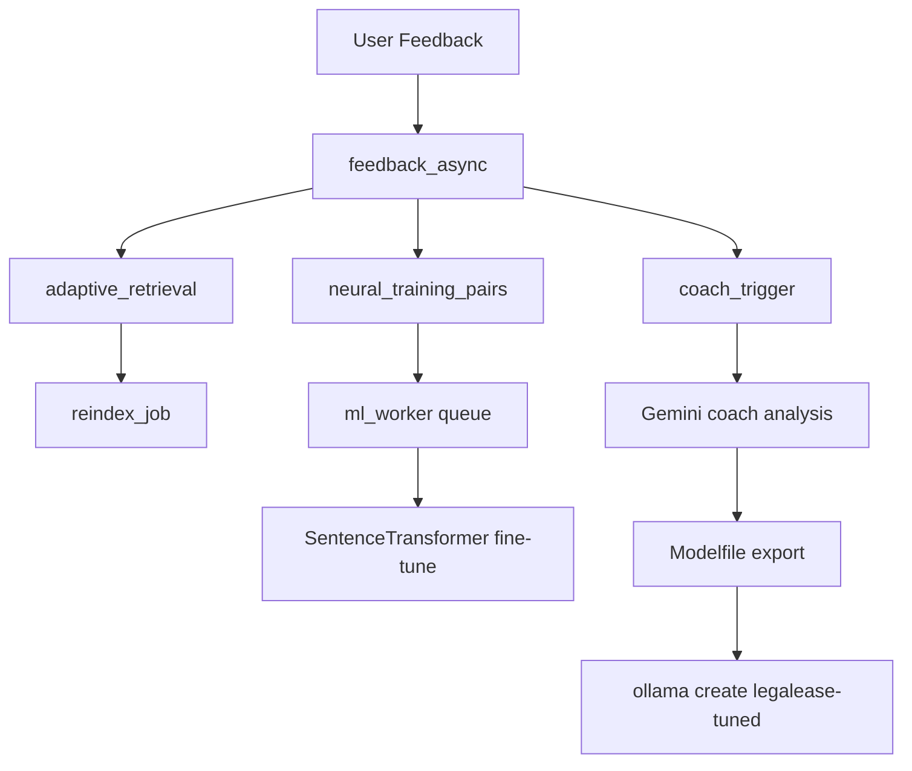
```mermaid
flowchart TD
  FB[User Feedback] --> AS[feedback_async]
  AS --> AR[adaptive_retrieval]
  AS --> NT[neural_training_pairs]
  AS --> CO[coach_trigger]
  AR --> RI[reindex_job]
  NT --> ML[ml_worker queue]
  ML --> FT[SentenceTransformer fine-tune]
  CO --> GM[Gemini coach analysis]
  GM --> MF[Modelfile export]
  MF --> OC[ollama create legalease-tuned]
```

### Neural embedding fine-tune

When `ML_USE_QUEUE=1` + Redis:

1. Feedback creates `ml_jobs` row
2. `scripts/ml_worker.py` picks up job
3. Trains SentenceTransformer on user Q→passage pairs
4. Exports per-user adapter to `Data/embeddings/{user_id}/`

### Ollama Modelfile export

- Coach analyzes feedback patterns (style only)
- Exports Modelfile to `Data/ollama_exports/{user_id}/`
- Auto-create when `OLLAMA_AUTO_CREATE=1` and `OLLAMA_AUTO_EXPORT_MIN_THUMBS=20`

### Improvement automation

When `IMPROVEMENT_AUTO=1`:

- Feedback → neural train → KB re-index → `ollama create legalease-tuned`
- Scheduled coach via `COACH_AUTO_SCHEDULE=1`
- Full pipeline in `improvement_automation.py`

### Analytics

- `/analytics` page — mode usage stats
- Export JSONL for external analysis
- Research log at `/api/v1/research/log`

---

## Speech-to-Text Integration

### Backend (`/api/v1/speech`)

**Module:** `backend/app/services/speech_service.py`

| Endpoint | Purpose |
|----------|---------|
| `GET /status` | STT engine availability |
| `POST /transcribe` | Audio → text |
| `POST /polish` | Cleanup transcribed text via Ollama |

### Configuration

| Env var | Default | Purpose |
|---------|---------|---------|
| `STT_ENABLED` | 1 | Enable STT |
| `STT_ENGINE` | faster-whisper | Engine selection |
| `STT_MODEL` | base | Model size |
| `STT_DEVICE` | cuda/cpu | Inference device |
| `STT_COMPUTE_TYPE` | float16 | Precision |
| `STT_PRELOAD` | 1 | Background model load at startup |
| `STT_MAX_SECONDS` | 120 | Max audio duration |
| `STT_POLISH_DEFAULT` | 1 | Auto-polish after transcribe |

### Multilingual support

Languages: Hindi, Tamil, Marathi, Bengali, Gujarati, English

### Frontend integration

`useSpeechToText` hook used on:

- Chat input (`InputDock`)
- Drafting forms
- Billing narrative fields
- Intake lead forms
- Discovery triage
- Tools pages

Mic button triggers browser MediaRecorder → POST audio blob to `/transcribe`.

---

## Security Architecture

### Defense in depth

| Layer | Control | Configuration |
|-------|---------|---------------|
| Transport | TLS at nginx | SSL profile in docker-compose |
| HTTPS redirect | `FORCE_HTTPS=1` | RequestGuardMiddleware |
| Authentication | HMAC JWT | `JWT_SECRET` min 32 chars |
| Passwords | bcrypt | `PASSWORD_MIN_LENGTH` |
| Rate limiting | Per-minute caps | `RATE_LIMIT_*` |
| Security headers | HSTS, CSP, X-Frame | SecurityHeadersMiddleware |
| IP firewall | Allowlist | `FIREWALL_ENABLED`, `FIREWALL_ALLOWED_IPS` |
| Field encryption | Fernet optional | `DATA_ENCRYPTION_KEY` |
| Audit logging | All sensitive actions | `audit_events` table |
| Production guard | Config validation | `SAAS_PRODUCTION=1` |
| Suspension | Admin suspend users | `users.suspended` flag |

### Health security endpoint

`GET /api/v1/health/security` — returns posture summary without exposing secrets.

### KB isolation (trust architecture)

| Control | Env var | Effect |
|---------|---------|--------|
| Block Gemini KB synthesis | `GEMINI_KB_SYNTHESIS=0` | RuntimeError if attempted |
| Block KB rerank via Gemini | `GEMINI_KB_RERANK=0` | Ignored for KB |
| Block coach in KB runtime | `KB_BLOCK_RUNTIME_COACH=1` | No coach injection |
| Block learning inject | `KB_BLOCK_LEARNING_INJECT=1` | No training data in KB answers |

### GDPR compliance

- `GET /api/v1/account/export` — ZIP export of all user data
- `DELETE /api/v1/account` — account deletion with cascade
- Privacy/terms pages at `/legal/privacy`, `/legal/terms`

### Encryption note

True client-side E2E encryption is **incompatible** with server-side RAG and matter AI; the product uses SaaS-grade encryption in transit/at rest plus tenant isolation—not messenger-style E2E.

### Regression tests

`tests/test_tenant_isolation.py` — automated tenant boundary verification.

---

## Deployment & Infrastructure

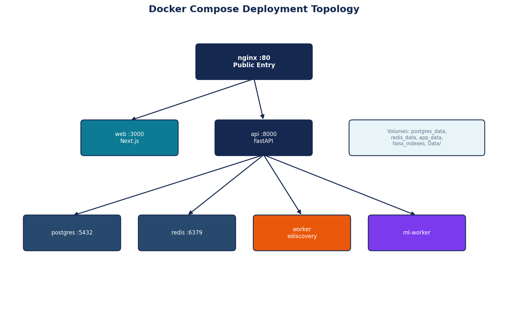

**Figure 12:** Docker Compose service topology with nginx public entry, shared volumes, and worker tier.

### Docker Compose services

| Service | Image/Build | Port | Command |
|---------|-------------|------|---------|
| postgres | postgres:16-alpine | 5432 (internal) | — |
| redis | redis:7-alpine | 6379 (internal) | AOF persistence |
| api | deploy/Dockerfile.api | 8000 (internal) | uvicorn |
| web | deploy/Dockerfile.web | 3000 (internal) | next start |
| worker | Same as api | — | ediscovery_worker.py |
| ml-worker | Same as api | — | ml_worker.py |
| nginx | nginx:1.27-alpine | **80** (public) | reverse proxy |
| nginx-ssl | profile: ssl | **443** | TLS termination |

### Volumes

| Volume | Mount | Purpose |
|--------|-------|---------|
| postgres_data | /var/lib/postgresql/data | Database persistence |
| redis_data | /data | Queue persistence |
| app_data | /data | Application data |
| ./Data | /app/Data | Document uploads |
| ./faiss_indexes | /app/faiss_indexes | Vector indexes |

### Health checks

- API: `GET /api/v1/health/live`
- Web: HTTP 200 on port 3000
- Postgres: `pg_isready`
- Redis: `redis-cli ping`

### Environment configuration groups

See Appendix B for complete `.env.example` reference (265+ lines).

**Critical production vars:**

```
SAAS_PRODUCTION=1
DATABASE_URL=postgresql://...
REDIS_URL=redis://...
JWT_SECRET=<32+ chars>
STRIPE_SECRET_KEY=sk_...
GEMINI_API_KEY=...
OLLAMA_BASE_URL=http://ollama:11434
```

### Deployment options (documented)

| Method | Doc | Use case |
|--------|-----|----------|
| Docker Compose | docker-compose.yml | Standard production |
| Zero-budget | DEPLOY_ZERO_BUDGET.md | Laptop + Cloudflare tunnel |
| Oracle free | DEPLOY_ORACLE_FREE.md | Cloud free tier |
| GPU setup | GPU_SETUP.md | RTX CUDA acceleration |

### CI/CD

GitHub Actions `ci.yml`:

- pytest suite
- SaaS smoke tests
- Optional Playwright E2E

### Backups

- `scripts/backup.sh`
- `scripts/backup_legalease.py`
- Postgres volume snapshots

### Observability

- Sentry DSN (optional APM)
- `/api/v1/metrics` endpoint
- Admin audit viewer at `/admin`
- `OBSERVABILITY_WEBHOOK_URL` for alerts

---

## Scalability & Performance

### Horizontal scaling path

| Component | Scaling strategy |
|-----------|-----------------|
| API | Stateless containers behind nginx load balancer |
| Web | Stateless Next.js containers |
| PostgreSQL | Read replicas (future), connection pooling |
| Redis | Single instance → Redis Cluster (future) |
| FAISS | Shared volume → object store migration (roadmap) |
| Workers | Scale worker/ml-worker container count |
| Ollama | Dedicated GPU nodes, model replication |

### Performance optimizations

| Optimization | Implementation |
|--------------|----------------|
| KB fast mode | `KB_FAST_MODE=1` — reduced timeout, no inference rerank |
| Embedding batch | `RAG_INDEX_EMBED_BATCH` — batched indexing |
| Fast index | `RAG_FAST_INDEX=1` — skip optional steps |
| Web intel fast | `WEB_INTEL_FAST=1` — reduced latency |
| Memory guard | Adaptive batch hints under memory pressure |
| Lazy loading | Whisper, embeddings loaded in background threads |
| Answer cache | `kb_answer_memory` — strict cache for repeat queries |
| FAISS VS cache | `FAISS_VS_CACHE_MAX=8` — vector search cache |

### Resource limits (docker-compose)

- API: 8G RAM cap
- Worker: shares API image, no public port
- GPU profile: `GPU_PROFILE=balanced|max_stt|max_chat`

### Queue-based decoupling

| Queue | Redis key | Worker |
|-------|-----------|--------|
| E-discovery | `legalease:ediscovery:queue` | ediscovery_worker.py |
| ML jobs | `legalease:ml:queue` | ml_worker.py |
| ML lock | `legalease:ml:lock:{user_id}` | Per-user training lock |

Prevents long-running ML training or batch e-discovery from blocking API response threads.

### Known scaling limits

1. **FAISS on filesystem** — per-tenant indexes; very large firms may need sharded/object-store architecture
2. **Single Ollama instance** — GPU memory bounds concurrent KB synthesis
3. **Gemini quotas** — daily limits per tier; fallback chain quality degrades without API key

---

## Business Model & Monetization

### SaaS tiers

| Plan | Price model | Document limit | Seats | Key features |
|------|-------------|----------------|-------|--------------|
| Free | $0 | 2 | 1 | KB + Open Law (quota) |
| Pro | Stripe subscription | 500 | 3 | Hybrid, higher Gemini quota |
| Legal Pro | Stripe subscription | 5,000 | 10 | Firm-scale usage |

### Revenue streams

1. **Seat-based subscriptions** (primary) — Stripe recurring billing
2. **Usage upsell** — Gemini overage packs (future roadmap)
3. **Enterprise** — private VPC deploy, custom SSO (roadmap)
4. **Professional services** — onboarding, custom Modelfile training

### Unit economics levers

| Lever | Mechanism |
|-------|-----------|
| Local Ollama for KB | Reduces per-token COGS vs full-cloud RAG |
| Gemini only for web/hybrid | Cloud spend only when public intel needed |
| ML queue | Prevents API blocking; efficient resource use |
| Plan document limits | Storage/compute cost control |
| Org seat limits | Revenue scales with firm size |

### Go-to-market

- Pilot launch: `docs/PILOT_LAUNCH.md`, `scripts/pilot_launch.ps1`
- Zero-budget demo: Ollama + Cloudflare tunnel
- Indian bar association partnerships
- Law school pilots with learner mode

---

## Competitive Analysis

| Competitor type | Typical offering | LegalEase differentiation |
|-----------------|------------------|---------------------------|
| Generic ChatGPT / Copilot | General LLM | Strict KB grounding, citations, NOT_FOUND gate |
| Global legal research (Westlaw) | Expensive corpora | India-focused, BNS/BNSS mapping, affordable SaaS |
| Practice management only (Clio-class) | No native AI | Integrated AI modes + CRM + billing |
| Document AI point solutions | Single feature | End-to-end matter lifecycle + learning loop |
| Self-hosted RAG kits | DIY | Productized UI, Stripe, org RBAC, coach automation |

### Moat elements

1. **Trust architecture** — Gemini/Ollama separation, code-enforced KB isolation
2. **Workflow breadth** — CRM, matters, billing, discovery, drafting in one platform
3. **Compounding data flywheel** — per-firm embedding fine-tunes, feedback-driven retrieval
4. **India-specific** — BNS/BNSS mapping, IPC transition, Indian court integrations (roadmap)
5. **Deployment flexibility** — local Ollama for data residency + cloud Gemini for public intel

---

## Roadmap

### Near-term (completed / in flight)

- Tenant isolation, Stripe, org RBAC, Postgres migration
- ML job queue, admin audit, GDPR export/delete
- Intake CRM 2.0 with Kanban and AI analysis
- Matter workspace with 13 sub-sections
- Premium tools suite (witness, precedent, BNS, deal rooms, PII)
- Speech-to-text multilingual support
- CI/CD pipeline with pytest + smoke tests

### Medium-term

- DocuSign production integration (`ESIGN_PROVIDER=docusign`)
- SSO / SAML for enterprise tier
- Object storage for FAISS + documents (S3-compatible)
- Mobile-responsive matter review PWA
- Bar Council compliance certifications
- Enhanced cross-encoder reranking by default
- Real-time collaboration (WebSocket upgrade)

### Long-term

- Court filing API integrations (eCourts)
- Multi-jurisdiction packs (UK, SG) as separate tenant configs
- Federated learning across opt-in firms (privacy-preserving)
- On-device LLM for offline courtrooms
- AI-assisted oral argument preparation
- Integration with Indian legal databases (Manupatra, SCC Online APIs)

---

## Appendices

### Appendix A — Complete API endpoint listing

#### Chat & sessions

```
POST   /api/v1/chat
POST   /api/v1/chat/stream
POST   /api/v1/chat/export-report
GET    /api/v1/sessions
GET    /api/v1/sessions/by-id/{session_id}
POST   /api/v1/sessions/{session_id}/attachments
```

#### Documents & KB

```
GET    /api/v1/documents
POST   /api/v1/documents/upload
POST   /api/v1/documents/index
POST   /api/v1/documents/reindex
GET    /api/v1/documents/jobs/{job_id}
DELETE /api/v1/documents/{doc_id}
GET    /api/v1/kb/debug-query
GET    /api/v1/kb/health
```

#### Matters (representative)

```
GET    /api/v1/matters
POST   /api/v1/matters
GET    /api/v1/matters/{id}
PATCH  /api/v1/matters/{id}
DELETE /api/v1/matters/{id}
GET    /api/v1/matters/{id}/dashboard
POST   /api/v1/matters/{id}/documents/upload
GET    /api/v1/matters/{id}/timeline
POST   /api/v1/matters/{id}/timeline
GET    /api/v1/matters/{id}/hearings
POST   /api/v1/matters/{id}/hearings
GET    /api/v1/matters/{id}/evidence
POST   /api/v1/matters/{id}/evidence/extract
GET    /api/v1/matters/{id}/contradictions
POST   /api/v1/matters/{id}/contradictions/scan
POST   /api/v1/matters/{id}/intelligence/run
GET    /api/v1/matters/{id}/members
POST   /api/v1/matters/{id}/members
```

#### CRM

```
GET    /api/v1/crm/dashboard
GET    /api/v1/crm/kanban
GET    /api/v1/crm/pipeline-stages
POST   /api/v1/crm/leads
GET    /api/v1/crm/leads/{id}
PATCH  /api/v1/crm/leads/{id}/stage
POST   /api/v1/crm/leads/{id}/analyze
POST   /api/v1/crm/leads/{id}/convert
POST   /api/v1/crm/classify
GET    /api/v1/crm/analytics
```

#### Premium

```
POST   /api/v1/premium/witness/session
POST   /api/v1/premium/witness/chat
POST   /api/v1/premium/precedent/tree
POST   /api/v1/premium/compliance/bns-audit
POST   /api/v1/premium/deal-rooms
POST   /api/v1/premium/pii/detect
POST   /api/v1/premium/pii/redact
POST   /api/v1/premium/drafting/redline
```

### Appendix B — Environment variable reference

#### LLM backends

| Variable | Default | Purpose |
|----------|---------|---------|
| `LLM_BACKEND` | ollama | Primary inference backend |
| `OLLAMA_BASE_URL` | http://127.0.0.1:11434 | Ollama server URL |
| `OLLAMA_MODEL` | legalease-tuned | Default model name |
| `OLLAMA_KB_LOCK_MODEL` | 1 | Lock KB to OLLAMA_MODEL |
| `LM_STUDIO_URL` | http://127.0.0.1:1234 | LM Studio fallback |
| `LLM_ROUTER_ENABLED` | 1 | Multi-model task routing |

#### Gemini / web intelligence

| Variable | Default | Purpose |
|----------|---------|---------|
| `GEMINI_API_KEY` | — | Google AI API key |
| `GEMINI_FREE_MODEL` | gemini-2.5-flash | Model for web intel |
| `GEMINI_KB_SYNTHESIS` | 0 | Must be 0 for KB isolation |
| `GEMINI_DAILY_FREE` | 15 | Free tier daily quota |
| `GEMINI_DAILY_PRO` | 200 | Pro tier quota |
| `TAVILY_API_KEY` | — | Tavily search fallback |
| `SERP_API_KEY` | — | SerpAPI fallback |

#### RAG / embeddings

| Variable | Default | Purpose |
|----------|---------|---------|
| `HF_EMBEDDING_MODEL` | all-MiniLM-L6-v2 | Embedding model |
| `RAG_CHUNK_SIZE` | 500 | Chunk size |
| `RAG_CHUNK_OVERLAP` | 100 | Chunk overlap |
| `RAG_SCORE_THRESHOLD` | 1.6 | L2 distance threshold |
| `RAG_MIN_RETRIEVAL_THRESHOLD` | 0.28 | Confidence gate |
| `RAG_ENABLE_CROSS_ENCODER` | 0 | Cross-encoder rerank |
| `RAG_TOP_K_DENSE` | 60 | Dense retrieval K |
| `RAG_FINAL_TOP_K` | 8 | Final context chunks |

#### SaaS / security

| Variable | Default | Purpose |
|----------|---------|---------|
| `DATABASE_URL` | — | PostgreSQL connection |
| `REDIS_URL` | — | Redis connection |
| `JWT_SECRET` | — | Token signing (32+ chars prod) |
| `SAAS_PRODUCTION` | 0 | Production mode flag |
| `STRIPE_SECRET_KEY` | — | Stripe API key |
| `RATE_LIMIT_PER_MINUTE` | 180 | General rate limit |
| `FIREWALL_ENABLED` | 0 | IP allowlist firewall |
| `DATA_ENCRYPTION_KEY` | — | Fernet field encryption |

#### Workers / automation

| Variable | Default | Purpose |
|----------|---------|---------|
| `ML_USE_QUEUE` | 0 | ML jobs via Redis queue |
| `IMPROVEMENT_AUTO` | 1 | Full improvement pipeline |
| `COACH_AUTO_SCHEDULE` | 1 | Scheduled coach runs |
| `OLLAMA_AUTO_CREATE` | 1 | Auto-create tuned model |

#### Speech / GPU

| Variable | Default | Purpose |
|----------|---------|---------|
| `STT_ENABLED` | 1 | Speech-to-text enabled |
| `STT_MODEL` | base | Whisper model size |
| `GPU_PROFILE` | balanced | GPU resource profile |
| `OCR_GPU` | 0 | GPU OCR acceleration |

### Appendix C — Glossary

| Term | Definition |
|------|------------|
| KB | Knowledge Base mode — RAG over uploaded documents |
| Open Law | Web intelligence mode using grounded search |
| Hybrid | Combined KB + web research report (Jurisprudence) |
| Matter | Case file container scoping documents and chat |
| RAG | Retrieval-Augmented Generation |
| FAISS | Facebook AI Similarity Search vector index |
| Coach | Gemini meta-tuner for style/retrieval (Settings only) |
| NOT_FOUND | KB response when confidence below threshold |
| BNS / BNSS | Bharatiya Nyaya Sanhita / Bharatiya Nagarik Suraksha Sanhita |
| Ollama | Local LLM runtime for KB synthesis |
| Modelfile | Ollama model definition exported from coach |
| MMR | Maximal Marginal Relevance — diversity in retrieval |
| IOLTA | Interest on Lawyers' Trust Accounts |
| STT | Speech-to-Text via faster-whisper |
| SSE | Server-Sent Events for chat streaming |

### Appendix D — File structure reference

```
Legal_AI_Final 3/
├── backend/
│   └── app/
│       ├── main.py                 # FastAPI entry, middleware, auth
│       ├── api/v1/
│       │   ├── router.py           # Central route mount
│       │   └── endpoints/          # 27 endpoint modules
│       ├── core/
│       │   ├── auth.py             # JWT dependency
│       │   ├── *_schema.py         # Database schemas
│       │   ├── stripe_billing.py   # Stripe integration
│       │   ├── plan_enforcement.py # Tier limits
│       │   └── org_service.py      # Multi-tenancy
│       ├── services/
│       │   ├── chat_service.py     # Chat turn dispatcher
│       │   ├── mode_router.py      # Mode normalization
│       │   ├── hybrid_orchestrator.py
│       │   └── open_law_executor.py
│       └── middleware/             # Rate limit, firewall, headers
├── web/
│   ├── app/(app)/                  # Authenticated pages
│   ├── components/                 # React components by domain
│   └── lib/api.ts                  # API client (~150 functions)
├── llms.py                         # Ollama/LM Studio, web search
├── rag.py                          # FAISS, chunking, retrieval
├── kb_pipeline.py                  # KB Q&A orchestration
├── app.py                          # Streamlit legacy UI
├── docker-compose.yml              # Production stack
├── .env.example                    # Environment template
├── faiss_indexes/                  # Vector indexes
├── Data/                           # Document uploads
├── scripts/
│   ├── ediscovery_worker.py
│   ├── ml_worker.py
│   ├── generate_thesis_pdf.py
│   └── generate_thesis_diagrams.py
└── docs/
    ├── LegalEase_SAAS_Thesis.md
    ├── LegalEase_SAAS_Thesis.pdf
    └── diagrams/                   # Architecture PNG figures
```

### Appendix E — Key code snippets

#### Chat mode dispatch (chat_service.py)

```python
def run_chat_turn(question, mode, user, matter_id=None):
    routing = _resolve_chat_routing(question, mode, user)
    if routing.mode == "knowledge_base":
        return _run_kb_turn(question, user, routing)
    elif routing.mode in ("open_law", "web_search"):
        return _run_open_law_turn(question, user, routing)
    elif routing.mode in ("hybrid", "deep_case"):
        return run_jurisprudence_turn(question, user, routing)
```

#### KB Gemini block (kb_gemini_safety.py)

```python
def enforce_kb_gemini_policy():
    if os.getenv("GEMINI_KB_SYNTHESIS", "0") == "1":
        raise RuntimeError("Gemini KB synthesis is forbidden")
```

#### Plan gate (chat_mode.py)

```python
def normalize_api_chat_mode(mode, membership):
    canonical = _alias_map.get(mode, "knowledge_base")
    if canonical in ("hybrid", "deep_case"):
        if membership not in ("Pro", "Legal Pro"):
            return "knowledge_base"
    return canonical
```

#### JWT creation (auth_tokens.py)

```python
def create_access_token(user):
    payload = {
        "sub": str(user["id"]),
        "username": user["username"],
        "membership": user["membership"],
        "role": user.get("role", "user"),
        "exp": time.time() + 7 * 86400,
    }
    return _sign_payload(payload)
```

### Appendix F — Document lineage

This comprehensive thesis was synthesized from:

- Production codebase: `backend/app/`, `web/`, `llms.py`, `rag.py`, `kb_pipeline.py`
- Documentation: `docs/LEGALEASE_COMPLETE_GUIDE.md`, `SAAS_STATUS.md`, `SECURITY.md`
- Infrastructure: `docker-compose.yml`, `.env.example`, `deploy/`
- Blueprint: `docs/blueprint/project-blueprint.md`, `feature-inventory.md`
- Runbooks: `docs/runbooks/`, `docs/PILOT_LAUNCH.md`, `docs/GPU_SETUP.md`

### Appendix G — Known limitations

1. **README drift** — Root README still emphasizes Streamlit; production UI is Next.js under `web/`.
2. **E2E encryption** — Not true client-side encryption; server must read documents for RAG.
3. **E-sign** — Mock provider default; DocuSign requires production credentials.
4. **Indian law focus** — Statute mapping and prompts optimized for India; other jurisdictions need config packs.
5. **FAISS scaling** — Per-tenant indexes on filesystem; very large firms may need sharded architecture.
6. **Gemini dependency** — Open Law/Hybrid require API key or fallback chain quality degrades.
7. **Single Ollama** — Concurrent KB queries share one inference endpoint; GPU memory bound.

---

## Collaboration Module

### Overview

The collaboration module provides Slack-like firm chat integrated with matter workspaces. Backend routes under `/api/v1/collaboration`; frontend at `/collaboration` and embedded in matter discussion tabs.

### Data model (`collab_schema.py`)

| Table | Purpose |
|-------|---------|
| `collab_rooms` | Room definitions, optional matter_id linkage |
| `collab_room_members` | User membership and roles per room |
| `collab_messages` | Message content, author, timestamps |
| `collab_attachments` | File attachments on messages |
| `collab_message_reactions` | Emoji reactions |
| `collab_mentions` | @user mention tracking |
| `collab_notifications` | Unread notification queue |
| `collab_audit_logs` | Moderation and compliance audit |
| `collab_chat_requests` | Direct message request workflow |
| `collab_connections` | User connection graph |

### Frontend components

| Component | File | Role |
|-----------|------|------|
| `CollaborationHub` | `components/collaboration/CollaborationHub.tsx` | Main chat interface |
| `FirmChat*` | `components/collaboration/` | Room list, message thread |

### API endpoints

```
GET    /api/v1/collaboration/rooms
POST   /api/v1/collaboration/rooms
GET    /api/v1/collaboration/rooms/{id}/messages
POST   /api/v1/collaboration/rooms/{id}/messages
POST   /api/v1/collaboration/messages/{id}/reactions
GET    /api/v1/collaboration/notifications
POST   /api/v1/collaboration/search
```

### Matter integration

Each matter can have a dedicated discussion room (`/matters/[id]/discussion`). Messages scoped to matter context; members inherit matter ACL from `matter_members`.

### Features

- Real-time polling for new messages (WebSocket upgrade planned medium-term)
- Task/deadline creation from messages
- Full-text search across firm conversations
- RBAC: room creation restricted by org role
- Audit log for compliance review

---

## Legal Tools Module

### Overview

The `/tools` page provides standalone legal calculators and research utilities, separate from premium features. Uses legacy `/api/tools/*` routes and newer `/api/v1/practice/*` endpoints.

### Tool inventory

| Tab | Route/API | Function |
|-----|-----------|----------|
| IPC-BNS Mapper | `/api/tools/ipc-bns/*` | Map IPC sections to BNS equivalents |
| Limitation Calculator | `/api/v1/practice/limitation/*` | Compute limitation periods under Indian law |
| Court Fee Calculator | `/api/tools/court-fee/*` | Estimate court fees by jurisdiction/value |
| Contract Review | `/api/tools/contract-review` | AI contract clause analysis |
| Case Prediction | `/api/tools/case-prediction` | Outcome probability estimation |
| Smart Citator | `/api/tools/citations` | Citation validation and formatting |
| ODR Portal | `/api/tools/odr` | Online dispute resolution workflow |

### IPC-BNS transition support

Critical for Indian practitioners during criminal code transition:

- Bidirectional section lookup (IPC section → BNS section)
- Punishment comparison tables
- Batch mapping for document review
- Integrated with BNS Auditor in premium tier for deep compliance scans

### Limitation calculator

Uses `/api/v1/practice/limitation/calculate`:

- Input: cause of action, accrual date, jurisdiction
- Output: limitation expiry date, applicable Article of Limitation Act
- Supports common torts, contracts, land disputes, consumer complaints

### Integration with chat

Tool results can be referenced in chat context. Limitation dates can be auto-added to matter deadlines upon calculation.

---

## Analytics & Admin Module

### Firm analytics (`/analytics`)

Aggregates usage data from learning logs and research queries:

- Chat mode distribution (KB vs Open Law vs Hybrid)
- Query volume trends over time
- Feedback ratio (positive/negative)
- Export JSONL for external BI tools

API: learning stats endpoints under `/api/v1/learning/stats`.

### Admin panel (`/admin`)

Superadmin-only (gated by `SUPERADMIN_USERNAMES` or `role=admin`):

| Feature | Endpoint | Purpose |
|---------|----------|---------|
| User list | `GET /api/v1/admin/users` | All platform users |
| Suspend user | `POST /api/v1/admin/users/{id}/suspend` | Disable access |
| Plan override | `PATCH /api/v1/admin/users/{id}/plan` | Manual plan change |
| Audit log | `GET /api/v1/admin/audit` | Platform-wide audit events |
| Usage metrics | `GET /api/v1/admin/usage` | Resource consumption |

### Dashboard service

`dashboard_service.py` aggregates for `/dashboard`:

- Upcoming hearings across all matters
- Evidence alerts (contradictions, missing documents)
- CRM pipeline summary
- Recent chat activity
- Billing totals (unbilled time)

---

## Legacy Streamlit Architecture

### Purpose

`app.py` (~3800 lines) is the original monolith UI retained for local demos and development. Production path is Next.js + FastAPI.

### Streamlit pages

| Page | Function |
|------|----------|
| Dashboard | Practice overview |
| AI Assistant | Three-mode chat |
| Documents | Upload and index management |
| Legal Tools | IPC-BNS, calculators |
| Drafting | Template generation |
| Analytics | Usage stats |
| Settings | Coach, tuning, preferences |

### Streamlit chat path

`_run_chat_intelligence()` dispatches directly to:

- `rag_query()` → `kb_pipeline()` for KB mode
- `web_search_query()` for Open Law
- `deep_case_query()` → `hybrid_orchestrator` for Hybrid

Does not use FastAPI `chat_service.py` — calls root Python modules directly.

### When to use Streamlit vs Next.js

| Scenario | Recommended UI |
|----------|---------------|
| Production SaaS deployment | Next.js (`web/`) |
| Local Ollama development | Either |
| Quick demo without Node.js | Streamlit (`app.py :8501`) |
| Multi-tenant org features | Next.js only |
| Stripe billing | Next.js only |

---

## API Startup Sequence

### Cold start (`main.py` startup thread)

When API container starts, a background thread executes:

1. **Schema ensure** — `ensure_app_schemas()` creates/updates all PostgreSQL tables
2. **Schema migrations** — `schema_migrations.py` applies incremental changes
3. **Embedding warmup** — `embedding_manager.py` loads SentenceTransformer in background
4. **Ollama manager** — `ollama_manager.py` verifies tuned model availability
5. **Whisper preload** — `speech_service.py` loads faster-whisper if `STT_PRELOAD=1`
6. **Coach scheduler** — `coach_scheduler.py` starts periodic check if enabled

### Environment flags for startup control

| Flag | Effect |
|------|--------|
| `SAAS_MINIMAL_STARTUP=1` | Skip non-essential warmup |
| `STT_PRELOAD=0` | Defer Whisper load until first request |
| `OLLAMA_AUTO_START=0` | Do not auto-start Ollama process |

### Health check progression

```
GET /api/v1/health/live     → Always 200 if process running
GET /api/v1/health/ready    → 200 when schemas + embeddings ready
GET /api/v1/health/public   → Version, mode, feature flags
GET /api/v1/health/embeddings → Model loaded, dimension, device
GET /api/v1/health/llm      → Ollama/LM Studio connectivity
```

### Graceful degradation

| Component down | Behavior |
|----------------|----------|
| Ollama offline | KB mode returns error; Open Law still works |
| Gemini no key | Open Law uses Tavily/Serp/DDG fallback chain |
| Redis offline | In-memory rate limits; SQLite job poll for workers |
| Postgres offline | API returns 503; SQLite fallback if legacy mode |
| Embeddings loading | Chat deferred with "warming up" message |

---

## Memory & Persona System

### Overview

The memory system (`/api/v1/memory`) maintains user persona and contextual facts across chat sessions, enabling personalized responses without compromising KB grounding.

### Data stores

| Table | Content |
|-------|---------|
| `user_profiles` | Persona, practice area, communication style |
| `user_facts` | Explicit user-stated facts |
| `thread_summaries` | Compressed prior conversation context |
| `kb_answer_memory` | Cached KB answers for repeat queries |

### API endpoints

```
GET    /api/v1/memory/persona
PUT    /api/v1/memory/persona
GET    /api/v1/memory/facts
POST   /api/v1/memory/facts
DELETE /api/v1/memory/facts/{id}
GET    /api/v1/memory/threads/{thread_id}/summary
```

### Coach memory guardrails

Coach (`GEMINI_OLLAMA_TUNING`) may adjust:

- Response tone and verbosity
- Retrieval expansion preferences
- Formatting style

Coach is **blocked** from injecting:

- Legal substance into KB answers (`KB_BLOCK_RUNTIME_COACH=1`)
- Training data into live responses (`KB_BLOCK_LEARNING_INJECT=1`)
- Any content that would alter grounded citations

Regex guards in coach pipeline enforce substance blocking.

### Frontend integration

`MemoryPanel` in `/settings` allows users to view/edit persona and facts. Engine status bar shows "Memory active" when persona loaded.

---

## Client Portal & E-Sign

### Client portal

Tokenized read-only matter access for clients:

- Frontend: `/portal/[token]`
- Backend: `client_portal_access` table with expiry
- API: `/api/v1/portal/{token}` — matter summary, timeline, documents
- Generated from matter settings by lawyer

### E-sign integration

| Provider | Status | Configuration |
|----------|--------|---------------|
| Mock | Default | `/esign/mock/[requestId]` for demo |
| DocuSign | Planned | `ESIGN_PROVIDER=docusign`, `DOCUSIGN_*` vars |

**Tables:** `signing_requests` — tracks request status, signers, document refs.

**API:**

```
POST   /api/v1/esign/requests
GET    /api/v1/esign/requests/{id}
POST   /api/v1/esign/requests/{id}/sign
```

---

# LegalEase Thesis — Expansion Chapters (v3.0 Blueprint)

The following chapters extend the SaaS Product Thesis into investor/CTO blueprint depth. Inserted before Conclusion in the master document.

---

## AI Governance & Trust Architecture

**Status key:** **Implemented** = production code today | **Planned Architecture** = design target, not fully shipped

LegalEase treats AI trust as a first-class architectural layer—not a marketing claim. Trust controls are enforced in `backend/app/core/kb_gemini_safety.py`, `rag.py`, `llms.py`, `kb_pipeline.py`, and `backend/app/services/chat_service.py`.

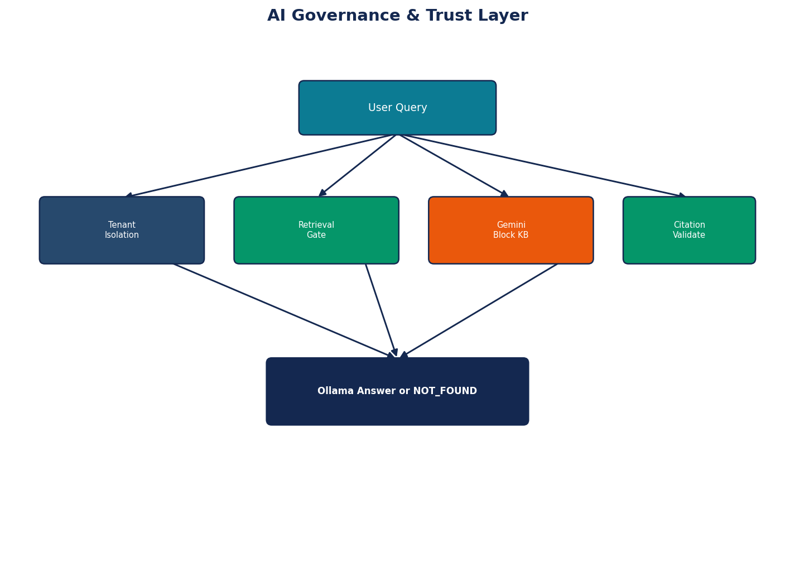

**Figure A1:** Separation of duties: Ollama for confidential KB synthesis; Gemini isolated to Open Law / Hybrid web legs and settings-only coach.

### Why Ollama for Knowledge Base synthesis (**Implemented**)

| Factor | Rationale | Code / config |
|--------|-----------|---------------|
| Data sovereignty | Client PDFs never sent to Google for KB answers | `LLM_BACKEND=ollama`, `OLLAMA_MODEL=legalease-tuned` |
| Cost control | Per-query COGS near zero vs per-token cloud APIs | Local inference on firm GPU or VPS |
| Latency for dense corpora | Repeated retrieval + synthesis without round-trip to cloud | `OLLAMA_KB_LOCK_MODEL=1` serializes hot path |
| Fine-tuning flywheel | Modelfile export from firm feedback (`OLLAMA_TUNED_MODEL_NAME`) | `learning_engine.py`, `ollama_manager.py` |
| Air-gapped deploy | Oracle/zero-budget docs support laptop-only stack | `docs/DEPLOY_ZERO_BUDGET.md` |

Ollama is **not** used for live public law—that duty is intentionally assigned to Gemini + fallback search chain to maximize citation freshness.

### Why Gemini is isolated (**Implemented**)

| Surface | Gemini role | Blocked for KB? |
|---------|-------------|-----------------|
| Open Law / web_search | Grounded web research, markdown + sources | N/A (not KB) |
| Hybrid fusion | Multi-section report combining KB + web legs | KB leg still Ollama-only |
| Settings coach | Tone/retrieval tuning from thumbs feedback | Yes — `KB_BLOCK_RUNTIME_COACH=1` |
| KB synthesis | **Forbidden** | `GEMINI_KB_SYNTHESIS=0` → `RuntimeError` |

```text
enforce_kb_gemini_policy()  # kb_gemini_safety.py
  if GEMINI_KB_SYNTHESIS: raise RuntimeError(...)
  if GEMINI_KB_RETRIEVAL_HINTS or GEMINI_KB_RERANK: log warning, ignore for KB path
```

Optional retrieval-only helpers exist in `kb_gemini_enhancer.py` but default **off** (`GEMINI_KB_RETRIEVAL_HINTS=0`, `GEMINI_KB_RERANK=0`).

### Hallucination prevention architecture (**Implemented**)

| Stage | Mechanism | Location |
|-------|-----------|----------|
| Retrieval gate | L2 distance threshold + confidence score | `rag.py`: `RAG_SCORE_THRESHOLD`, `RAG_CONFIDENCE_THRESHOLD` |
| Decision enum | `FOUND` / `NOT_FOUND` / `LOW_CONFIDENCE` | `kb_rag_decision.py`, `evaluate_retrieval()` |
| Answer finalization | Strip uncited claims; force NOT_FOUND template | `chat_service._finalize_kb_answer()` |
| Strict citations (web) | `STRICT_CITATIONS=1` for Open Law | `web_intelligence` modules |
| Hybrid KB gate | Weak KB suppressed in fusion | `HYBRID_KB_MIN_SCORE`, `HYBRID_KB_TERM_RATIO` |
| Claim audit | Post-synthesis claim ↔ chunk alignment | `tests/test_kb_claim_audit.py` |

**Default thresholds (`.env.example`):**

| Variable | Default | Meaning |
|----------|---------|---------|
| `RAG_SCORE_THRESHOLD` | 1.6 | Max L2 distance for chunk acceptance |
| `RAG_CONFIDENCE_THRESHOLD` | 0.52 | Min normalized confidence to synthesize |
| `RAG_TOP_K_DENSE` | 16 | Dense retrieval pool |
| `RAG_FINAL_TOP_K` | 10 | Chunks passed to LLM |
| `RAG_MMR_LAMBDA` | 0.7 | MMR diversity vs relevance |

When retrieval fails gates, users see an explicit **NOT_FOUND** or "insufficient evidence" response—not a fabricated statute or fact.

### Feedback learning architecture (**Implemented**)

| Component | Function | Status |
|-----------|----------|--------|
| Thumbs up/down on chat | `learning_signals.py` records implicit/explicit feedback | Implemented |
| Coach scheduler | Gemini analyzes feedback → Ollama tuning hints | `COACH_AUTO_SCHEDULE=1` |
| Neural embedding fine-tune | Redis ML queue trains per-user embeddings | `ML_USE_QUEUE` + `ml_worker.py` |
| KB re-index | `OLLAMA_AUTO_REINDEX=1` after training | Implemented |
| Learning inject block | Training artifacts never injected into live KB answers | `KB_BLOCK_LEARNING_INJECT=1` |

**Planned Architecture:** Federated cross-firm learning with differential privacy (roadmap)—not in codebase today.

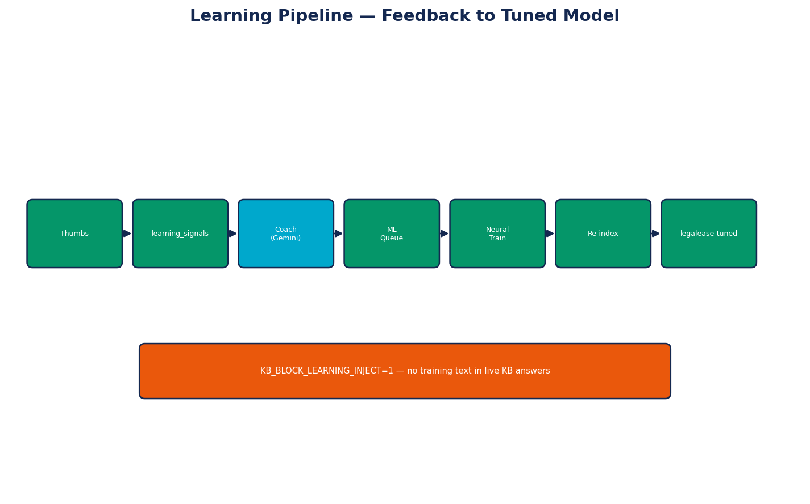

**Figure A2:** Feedback → coach → optional neural train → re-index → Ollama modelfile (settings path only for substance).

### Knowledge contamination prevention (**Implemented**)

| Isolation type | Implementation |
|----------------|----------------|
| Tenant DB rows | `user_id`, `org_id` on matters, documents, CRM |
| FAISS paths | `faiss_indexes/{user_id}/` global; `faiss_indexes/{user_id}/{matter_id}/` matter-scoped |
| Chat scope | Main chat KB uses `retrieval_scope=global`; matter pages pass `matter_id` |
| Cross-tenant tests | `tests/test_tenant_isolation.py`, `test_crm_tenant_isolation.py` |
| Org RBAC | `org_service.py`, `collab_scope_id()` uses primary org |

**Gap:** Shared org-level FAISS index is **Planned Architecture**; today vectors remain user-scoped with org ACL on metadata.

### Prompt injection defense (**Implemented**)

| Control | Detail |
|---------|--------|
| System prompts | KB synthesis prompts require cite-or-refuse patterns in `llms.py` / orchestrator |
| User content boundary | Retrieved chunks wrapped as untrusted context; instructions in system layer |
| Coach substance block | Regex guards prevent legal claims in tuning payloads |
| Rate limits | `RATE_LIMIT_CHAT_PER_MINUTE=40` reduces automated probing |
| Input size caps | Upload `MAX_UPLOAD_MB=200`; chunk caps per doc |

**Planned Architecture:** Dedicated prompt-injection classifier model; LLM firewall service.

### AI trust layer summary (**Implemented**)

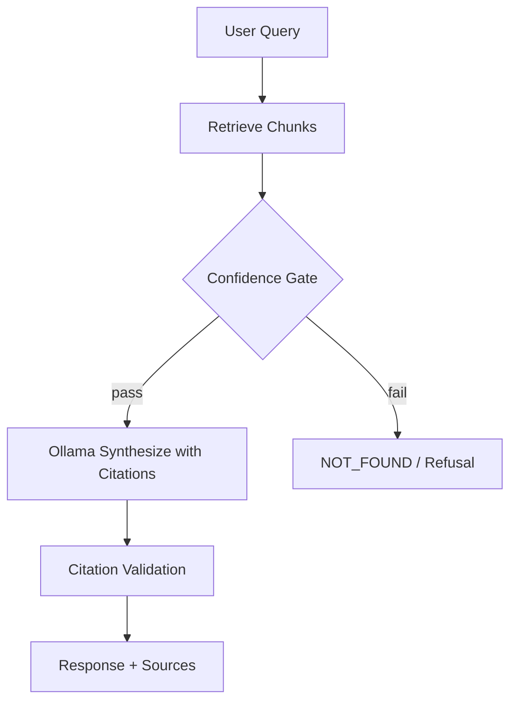
```mermaid
flowchart TB
  Q[User Query] --> R[Retrieve Chunks]
  R --> G{Confidence Gate}
  G -->|pass| S[Ollama Synthesize with Citations]
  G -->|fail| N[NOT_FOUND / Refusal]
  S --> V[Citation Validation]
  V --> O[Response + Sources]
```

| Trust signal | User-visible |
|--------------|--------------|
| Source attribution | Chunk filenames, page hints, web URLs |
| Confidence gates | No answer when below threshold |
| Refusal patterns | NOT_FOUND, empty index, plan gate messages |
| Mode honesty | Router never silently switches KB → Open Law |

### Governance operating model (operations)

| Activity | Owner | Frequency |
|----------|-------|-----------|
| Review `GEMINI_KB_*` env on deploy | DevOps | Each release |
| Run KB regression suite | Engineering | CI + weekly |
| Audit `audit_events` for exports/deletes | Compliance | Monthly |
| Red-team prompt injection | Security | Quarterly (**Planned**) |

---


## Firm Collaboration Architecture

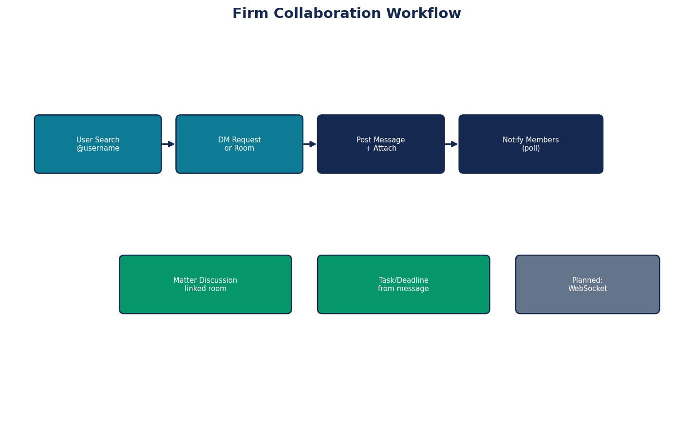

**Figure B1:** Implemented Firm Chat vs planned real-time collaboration platform.

### Implemented today (**Implemented**)

| Capability | Backend | Frontend |
|--------------|---------|----------|
| Firm-scoped rooms | `collab_service.py`, `collab_schema.py` | `CollaborationHub.tsx` |
| Default channels | general, client-intake, hearing-prep | `/collaboration` |
| Direct messages | `room_type=dm`, `dm_key` sorted pair | User search → DM room |
| Matter-linked rooms | `matter_id` on `collab_rooms` | `/matters/[id]/discussion` |
| Attachments | `Data/collab_uploads/` | `FirmChatMessage.tsx` |
| Reactions, mentions | `collab_message_reactions`, `collab_mentions` | In-thread UI |
| Notifications | `collab_notifications` table | Polling-based badge |
| Chat requests | `collab_chat_requests` | Connect / accept flow |
| User discovery | `GET /collaboration/users/search` | `FirmChatUserSearch.tsx` |
| Audit | `collab_audit_logs` | Admin review (**partial UI**) |
| RBAC | `collab_rbac.py` | Permissions endpoint |
| Create task/deadline from message | `matter_workflow.add_task` | Message actions |

**Transport:** HTTP polling for new messages—not WebSocket yet.

**Encryption:** Server-readable messages (SaaS TLS + DB). `SECURITY.md` documents that messenger-style E2E is incompatible with server-side RAG.

### Planned Architecture — WhatsApp/Slack-class platform

| Feature | Target design | Status |
|---------|---------------|--------|
| E2E encryption (optional) | Client-side keys for chat only; separate from document AI path | Planned |
| Username @discovery | Global handle registry + privacy controls | Partial (search by username) |
| Friend requests | Bidirectional connection graph | Implemented (`collab_connections`) |
| Team channels | Org-wide + practice-group channels | Implemented (firm rooms) |
| Presence status | online/away/busy via heartbeat | Planned |
| Read receipts | Per-message `read_at` | Planned |
| Push notifications | FCM/APNs + email digests | Planned |
| Voice notes | Upload OGG → Whisper transcribe | Planned (STT exists for chat mic) |
| Shared files versioning | Link to matter documents | Partial (attachments) |
| Matter-based chat default | Auto-room per matter on create | Implemented |

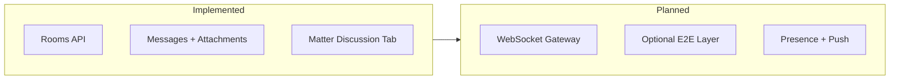
```mermaid
flowchart LR
  subgraph impl [Implemented]
    R[Rooms API]
    M[Messages + Attachments]
    D[Matter Discussion Tab]
  end
  subgraph plan [Planned]
    WS[WebSocket Gateway]
    E2E[Optional E2E Layer]
    P[Presence + Push]
  end
  impl --> plan
```

### Collaboration vs AI boundary

Firm Chat does **not** send messages to KB index by default (**Implemented**). **Planned:** opt-in "summarize thread to matter note" with explicit lawyer confirmation.

---


## Product Requirement Document (PRD)

### Personas

| Persona | Primary goals | Plan typical |
|---------|---------------|--------------|
| Lawyer (advocate) | Research, draft, manage matters | Pro / Legal Pro |
| Paralegal | Organize docs, timeline, discovery | Pro (member seat) |
| Firm Owner | Billing, team, CRM pipeline | Legal Pro |
| Client | Track case, upload, sign | Portal token (free to firm) |
| Admin (operator) | Users, audit, metrics | Internal superadmin |

### Lawyer user stories (**Implemented** unless noted)

| ID | Story | Acceptance |
|----|-------|------------|
| L-01 | As a **lawyer**, I want to **upload PDFs to my knowledge base**, so that **answers cite my documents**. | `POST /documents/upload`, FAISS index OK |
| L-02 | As a **lawyer**, I want to **ask questions in KB mode**, so that **I get grounded answers or NOT_FOUND**. | `mode=knowledge_base`, no Gemini synthesis |
| L-03 | As a **lawyer**, I want to **search live Indian law**, so that **I see current statutes and cases**. | Open Law + quota by tier |
| L-04 | As a **lawyer**, I want **hybrid reports**, so that **my files and public law appear in one brief**. | Pro+ plan, `hybrid` mode |
| L-05 | As a **lawyer**, I want to **create a matter with documents**, so that **work is organized per case**. | `/matters`, matter-scoped index |
| L-06 | As a **lawyer**, I want **matter intelligence** (timeline, entities), so that **I prepare faster**. | Pipeline in `matter_intel_pipeline.py` |
| L-07 | As a **lawyer**, I want to **share evidence with team**, so that **paralegals can access**. | Org matter members + collab room |
| L-08 | As a **lawyer**, I want to **log billable time**, so that **invoices are accurate**. | `/billing` time entries |
| L-09 | As a **lawyer**, I want to **run e-discovery triage**, so that **large productions are prioritized**. | `/discovery` batches |
| L-10 | As a **lawyer**, I want to **draft from templates**, so that **routine filings are faster**. | `/drafting` |

### Client user stories

| ID | Story | Status |
|----|-------|--------|
| C-01 | As a **client**, I want to **view matter status via secure link**, so that **I don't call the office daily**. | Implemented — portal token |
| C-02 | As a **client**, I want to **upload supporting documents**, so that **my lawyer has complete facts**. | Planned — portal upload |
| C-03 | As a **client**, I want to **sign engagement letters**, so that **retainer is formalized**. | Mock e-sign; DocuSign planned |

### Admin user stories

| ID | Story | Status |
|----|-------|--------|
| A-01 | As an **admin**, I want to **invite team members**, so that **the firm shares one org**. | Implemented — org invites |
| A-02 | As an **admin**, I want to **manage Stripe subscription**, so that **features match payment**. | Implemented |
| A-03 | As an **admin**, I want **usage and audit logs**, so that **compliance is demonstrable**. | Partial — `/admin`, audit table |
| A-04 | As an **admin**, I want **firm-wide analytics**, so that **I see pipeline and AI usage**. | CRM analytics + learning stats |

### Paralegal user stories

| ID | Story | Status |
|----|-------|--------|
| P-01 | As a **paralegal**, I want to **index and tag documents on a matter**, so that **lawyers find evidence quickly**. | Implemented |
| P-02 | As a **paralegal**, I want to **maintain the matter timeline**, so that **hearing prep is chronological**. | Implemented |
| P-03 | As a **paralegal**, I want **discovery review queues**, so that **privileged docs are flagged**. | Implemented |

### Firm Owner user stories

| ID | Story | Status |
|----|-------|--------|
| F-01 | As a **firm owner**, I want **CRM Kanban for intake**, so that **leads convert systematically**. | CRM 2.0 Implemented |
| F-02 | As a **firm owner**, I want **seat limits by plan**, so that **cost scales with team size**. | `PLAN_ORG_SEATS_*` |
| F-03 | As a **firm owner**, I want **trust account tracking**, so that **client funds are segregated**. | Implemented |

### Non-functional requirements

| NFR | Target | Measurement |
|-----|--------|-------------|
| Availability | 99.5% pilot / 99.9% enterprise | Uptime checks |
| KB answer latency P95 | < 45s CPU / < 15s GPU | `load_test_chat.py` |
| Tenant isolation | Zero cross-tenant reads | `test_tenant_isolation.py` |
| Data export | GDPR ZIP < 24h | `GET /account/export` |
| Accessibility | WCAG 2.1 AA (**Planned**) | Audit backlog |

---


## UI/UX Design System

Extracted from `web/tailwind.config.ts`, `web/app/globals.css`, and shared components.

### Design tokens (**Implemented**)

| Token | Value | Usage |
|-------|-------|-------|
| `canvas` | `#f8fafc` | Page background |
| `navy` | `#0f172a` | Primary text, headings |
| Font serif | Playfair Display | Marketing / legal gravitas accents |
| Font sans | Inter | UI body (system fallback) |
| `max-w-chat` | 1080px | Chat viewport width |
| Shadow `dock` | 32px blur slate | Input dock elevation |
| Shadow `card` | Subtle layered | Dashboard cards |
| Animation `fade-in` | 350ms ease-out | Route transitions |

**Gap:** No centralized `design-tokens.json` or Figma kit in repo—tokens live in Tailwind extend only.

### Component library (**Implemented**)

| Layer | Technology | Notes |
|-------|------------|-------|
| Primitives | Custom + Tailwind utility classes | Not full shadcn install; selective patterns |
| Chat | `ChatViewport`, `ModePills`, `InputDock` | Core product surface |
| Layout | `(app)/layout.tsx` sidebar + mobile nav | `MobileBottomNav`, `MobileTopBar` |
| Forms | Native + Tailwind | Login, intake, settings |
| Markdown | `react-markdown` | AI responses |
| Icons | Lucide-style inline SVGs | Consistent stroke |

### Button standards (inferred from codebase)

| Variant | Classes (typical) | Use |
|---------|-------------------|-----|
| Primary | `bg-blue-600 text-white hover:bg-blue-700` | CTA, submit |
| Secondary | `border border-slate-200 bg-white` | Cancel |
| Ghost | `text-blue-600 hover:underline` | Tertiary links |
| Danger | `text-red-600` | Delete account |

**Planned:** Documented `Button` component with size variants in `components/ui/`.

### Dashboard layouts (**Implemented**)

| Route | Layout pattern |
|-------|----------------|
| `/` | Full-height chat, docked input |
| `/dashboard` | Card grid — hearings, CRM, billing |
| `/matters/[id]/*` | Sub-nav tabs (13 sections) |
| `/intake/board` | Kanban columns |
| `/collaboration` | Master-detail (rooms + thread) |

### Mobile (**Implemented**)

- Responsive breakpoints via Tailwind `md:` / `lg:`
- Bottom navigation for primary routes on small screens
- Touch-friendly tap targets on `ModePills`

### Accessibility

| Item | Status |
|------|--------|
| Semantic HTML in app shell | Partial |
| Focus rings | Tailwind `focus-visible` on some inputs |
| Screen reader labels on icon buttons | **Gap** — audit needed |
| Color contrast navy on canvas | Generally AA for body text |
| Keyboard chat shortcuts | Limited |

**Planned:** axe-core in CI, dedicated a11y pass before enterprise sales.

---


## SaaS Metrics & KPI Dashboard

### North-star metrics (product)

| Metric | Definition | Tracked in code? |
|--------|------------|------------------|
| MAU | Distinct users with ≥1 chat turn / month | **Planned** — infer from `chat_history` |
| DAU | Distinct users per day | **Planned** |
| Retention D7/D30 | Cohort return rate | **Planned** |
| Churn | Paid → cancelled / inactive | Partial — Stripe webhooks |
| Trial → Paid | Checkout completion / signups | Partial — `subscriptions` table |
| KB Accuracy | % thumbs-up on KB mode | **Implemented** — learning signals |
| AI Accuracy (web) | Thumbs on Open Law / Hybrid | **Implemented** |
| KB NOT_FOUND rate | Retrieval failures | **Implemented** — logs / observability |
| Time-to-first-answer | Upload → first successful KB query | **Planned** analytics pipeline |

### Business metrics

| Metric | Source | Status |
|--------|--------|--------|
| MRR | Stripe | Implemented |
| ARPU | MRR / paying orgs | Spreadsheet / **Planned** dashboard |
| CAC | Marketing spend / new paid | **Planned** |
| LTV | ARPU × months retained | **Planned** model |
| Conversion rate | Visitors → signup → paid | **Planned** — needs product analytics SDK |
| Seat utilization | Active members / purchased seats | Partial — org_members |

### Operational metrics (**Implemented**)

`GET /api/v1/metrics` (superadmin when `SAAS_PRODUCTION=1`):

- `core_db`, `postgres_legacy`, `redis`, `ml_queue` status
- `embeddings_ok` from startup snapshot

`/api/v1/learning/stats` and `/api/v1/learning/analytics/full` — feedback and mode distribution.

`/api/v1/admin/usage` — admin resource snapshot.

CRM `/api/v1/crm/analytics` — lead funnel, stage counts (**Implemented**).

### KPI dashboard design (**Planned Architecture**)

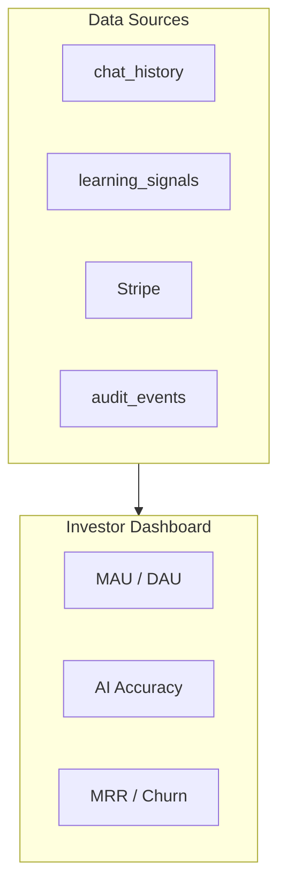
```mermaid
flowchart TB
  subgraph ingest [Data Sources]
    CH[chat_history]
    LS[learning_signals]
    ST[Stripe]
    AU[audit_events]
  end
  subgraph dash [Investor Dashboard]
    MAU[MAU / DAU]
    ACC[AI Accuracy]
    REV[MRR / Churn]
  end
  ingest --> dash
```

**Recommendation:** Metabase or Posthog on Postgres read replica; no embedded BI in v3.0 web app.

---


## Revenue Forecast & Financial Model

> **Disclaimer:** All figures below are **illustrative projections** for investor discussion—not audited financials. Adjust assumptions before board or filing use.

### Pricing basis (**Implemented** env defaults)

| Tier | Docs | Seats | Gemini/day | Stripe |
|------|------|-------|------------|--------|
| Free | 2 | 1 | 15 | — |
| Pro | 500 | 3 | 200 | `STRIPE_PRICE_PRO` |
| Legal Pro | 5,000 | 10 | 1,000 | `STRIPE_PRICE_LEGAL_PRO` |

Assumed ARPU for modeling (configure in Stripe):

| Tier | Illustrative monthly price (INR equiv.) |
|------|------------------------------------------|
| Pro | ₹2,499 / ~$30 USD |
| Legal Pro | ₹9,999 / ~$120 USD |

### Year 1–3 projection (illustrative)

| Year | Paying firms (EOY) | Avg seats | MRR (EOY) | ARR run-rate |
|------|-------------------|-----------|-----------|--------------|
| Y1 | 120 | 2.5 | ₹4.2L (~$5k) | ₹50L |
| Y2 | 450 | 3.2 | ₹18L (~$22k) | ₹2.1Cr |
| Y3 | 1,200 | 4.0 | ₹55L (~$66k) | ₹6.6Cr |

Assumptions: 8% monthly paid churn Y1 improving to 5% Y3; 12% trial-to-paid; 60% Pro / 40% Legal Pro mix by Y2.

### Expense model (illustrative)

| Category | Y1 | Y2 | Y3 |
|----------|----|----|-----|
| Cloud infra (API, DB, Redis) | ₹6L | ₹18L | ₹45L |
| Gemini API variable | ₹2L | ₹12L | ₹35L |
| Engineering (4 FTE → 10) | ₹48L | ₹96L | ₹1.6Cr |
| Sales/marketing | ₹12L | ₹36L | ₹72L |
| **Total opex** | **~₹68L** | **~₹1.62Cr** | **~₹3.12Cr** |

### Break-even analysis (illustrative)

- **Gross margin:** ~75% (Ollama KB offsets cloud token cost for core workload)
- **Break-even MRR:** ~₹5.5L/month at Y2 cost structure (~330 paying firms blended)
- **Timeline:** Month 20–24 under base case; Month 14 optimistic if Legal Pro mix >50%

### Sensitivity levers

| Lever | Impact |
|-------|--------|
| Gemini quota overage packs | Upside revenue; manage COGS |
| Local Ollama adoption | Lowers COGS, increases stickiness |
| Enterprise VPC deals | High ACV, services margin |
| Churn >12% | Delays break-even 6+ months |

---


## Investor Brief — Why LegalEase Wins

### Market size (Indian legal tech)

| Segment | TAM indicator | Notes |
|---------|---------------|-------|
| Advocates (India) | ~1.7M enrolled (BCI estimates) | Large solo segment |
| Corporate legal teams | Growing in-house departments | Compliance + contracts |
| Legal tech spend India | $200M+ and growing double-digit CAGR | Fragmented vendors |
| Digitization tailwind | eCourts, BNS/BNSS transition | Drives research demand |

**SOM focus (3-year):** 5,000 paying seats = <0.3% of advocate population—achievable with bar partnerships.

### Why LegalEase wins

1. **Trust-by-architecture** — Gemini cannot write KB answers (`GEMINI_KB_SYNTHESIS=0` enforced).
2. **Workflow completeness** — CRM → matter → billing → discovery in one SKU vs point tools.
3. **India-specific** — IPC→BNS tools, Indian web intel, matter templates for local practice.
4. **Deployment choice** — Local Ollama for confidentiality; cloud only for public law.
5. **Compounding moat** — Per-firm embedding fine-tunes + feedback coach (**Implemented**).

### Competitive advantage matrix

| Competitor type | Weakness | LegalEase answer |
|-----------------|----------|------------------|
| Generic LLM wrappers | Hallucination on firm facts | KB gates + NOT_FOUND |
| Global research (Westlaw-class) | Price, India coverage gap | Affordable hybrid + local sources |
| Practice mgmt only | No native AI | Integrated modes + matter intel |
| DIY RAG kits | No SaaS, billing, RBAC | Production Docker stack |

### Moat layers

| Moat | Mechanism |
|------|-----------|
| Data flywheel | Feedback → embedding train → better retrieval |
| Switching cost | Matters, FAISS indexes, CRM pipeline history |
| Network effects | Firm Chat + org collaboration (**early**) |
| Regulatory alignment | Audit logs, GDPR export, tenant isolation tests |

### AI advantage (defensible)

- Separated inference paths reduce compliance objections vs "send all PDFs to OpenAI"
- Matter intelligence pipeline extracts entities/timeline/contradictions from same corpus
- Continuous learning without contaminating live answers (`KB_BLOCK_LEARNING_INJECT=1`)

### Use of funds (illustrative seed round)

| Allocation | % |
|------------|---|
| Engineering (mobile, collab, court APIs) | 45% |
| GTM India bar partnerships | 25% |
| Infra + security (SOC2) | 15% |
| Legal/compliance | 10% |
| Reserve | 5% |

---


## Matter Intelligence Architecture

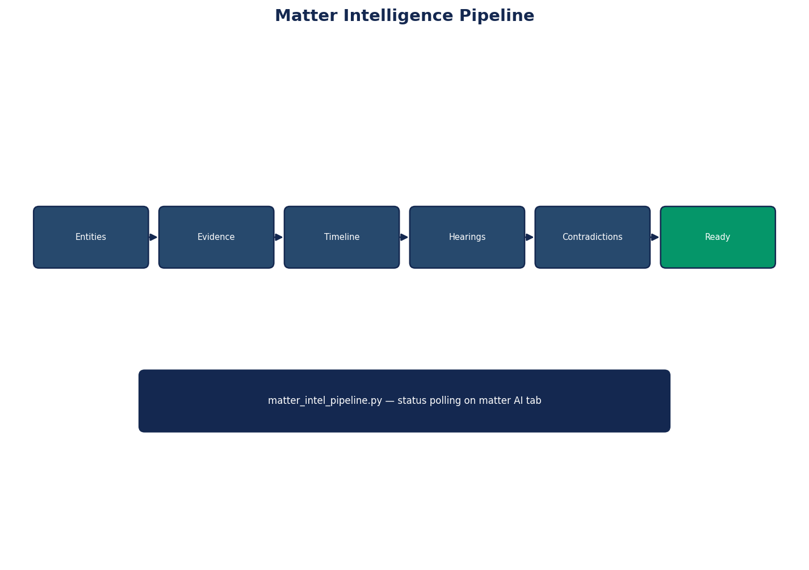

**Figure H1:** Staged pipeline from document upload through entity/timeline/contradiction extraction.

### Orchestrator (**Implemented**)

`backend/app/core/matter_intel_pipeline.py` — `run_matter_intelligence_pipeline()`:

| Stage | Module | Output |
|-------|--------|--------|
| entities | `matter_entities.extract_entities_from_docs` | Parties, courts, statutes |
| evidence | `matter_evidence.extract_evidence_from_docs` | Exhibits, witness refs |
| timeline | `matter_intelligence.generate_timeline_from_docs` | `matter_timeline` rows |
| hearings | `matter_hearings_intel.extract_hearings_from_docs` | Hearing dates, notes |
| contradictions | `matter_enhancements.extract_and_persist_contradictions` | `matter_contradictions` |

Status tracking: `set_intel_status()` — polled by UI on matter AI tab.

Enqueue: `enqueue_matter_intelligence()` for async (**Implemented** when workers available).

### Matter AI chat (**Implemented**)

- Route: `/matters/[matterId]/ai` — matter-scoped retrieval
- Intent classification: `matter_qa.classify_matter_intent()` — witness, evidence, hearing, timeline, contradiction
- Uses matter FAISS index + structured tables

### Feature matrix

| Capability | Status | Notes |
|------------|--------|-------|
| Entity extraction | **Implemented** | Rule + LLM assist |
| Timeline extraction | **Implemented** | Auto-insert optional |
| Hearing prediction / next date | **Partial** | Extraction yes; ML prediction **Planned** |
| Contradiction detection | **Implemented** | `analyze_contradictions()` |
| Risk analysis score | **Planned** | Intake has `risk_score`; matter-level **Planned** |
| Evidence correlation | **Partial** | Evidence desk + exhibits |
| Legal strategy suggestions | **Planned** | `matter_autopilot.py` prototypes queries |
| Export matter brief ZIP | **Implemented** | `matter_enhancements` export |

### API surface (**Implemented**)

```
POST /api/v1/matters/{id}/intelligence/run
GET  /api/v1/matters/{id}/intelligence/status
GET  /api/v1/matters/{id}/entities
GET  /api/v1/matters/{id}/timeline
GET  /api/v1/matters/{id}/contradictions
GET  /api/v1/matters/{id}/hearings
```

### Aspirational architecture (**Planned**)

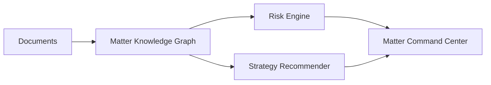
```mermaid
flowchart LR
  Docs[Documents] --> Graph[Matter Knowledge Graph]
  Graph --> Risk[Risk Engine]
  Graph --> Strategy[Strategy Recommender]
  Risk --> UI[Matter Command Center]
  Strategy --> UI
```

- Cross-matter precedent linking
- Outcome prediction from anonymized corpus
- Automated hearing prep pack generation (partial in premium tools)

---


## Knowledge Base Accuracy Architecture

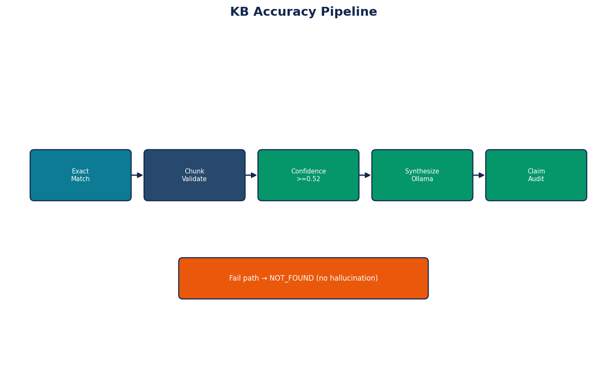

**Figure I1:** Retrieval validation, citation checks, and refusal paths.

### KB Reliability Framework (**Implemented**)

| Layer | Function |
|-------|----------|
| Ingestion quality | OCR sparse mode, PDF chunking, `test_pdf_index_quality` |
| Index health | `index_status` per document; `check_kb_ready_for_query` |
| Retrieval | Dense + keyword + MMR; optional cross-encoder |
| Validation | `evaluate_retrieval`, confidence scoring |
| Synthesis | Ollama with cite-or-refuse prompts |
| Post-audit | Claim ↔ chunk alignment tests |

### Exact match retrieval (**Implemented**)

- Section-aware parsing for statutes and lists (`test_kb_strict_section_retrieval`)
- Case caption lock (`test_kb_case_context_lock`)
- Document-first routing when query names a file (`test_kb_document_first`)

### Chunk validation (**Implemented**)

- Minimum character thresholds per chunk
- Stitching adjacent chunks for continuity (`kb_chunk_stitch`)
- Content cleaner removes OCR garbage (`kb_content_cleaner`)

### Citation validation (**Implemented**)

- Answers must reference retrieved chunk IDs / filenames
- `test_kb_claim_audit.py` — regression for unsupported claims
- Export quality gate for reports (`test_export_quality_gate`)

### Hallucination detection (**Implemented**)

| Signal | Action |
|--------|--------|
| Low `RAG_CONFIDENCE_THRESHOLD` | Skip synthesis → NOT_FOUND |
| Empty retrieval | NOT_FOUND with upload hint |
| Hybrid weak KB | Web-only or labeled low-confidence section |
| Gemini KB block | RuntimeError if misconfigured |

### Confidence scoring (**Implemented**)

From `rag.py`:

- Distance → normalized confidence
- Compared against `RAG_CONFIDENCE_THRESHOLD` (default **0.52** in `.env.example`)
- Logged in debug via `KB_PIPELINE_DEBUG=1`

### Follow-up memory (**Implemented**)

- `followup_detector.py` — resolves "what about section 302?"
- `kb_context_resolver.py` — document scope from thread
- `kb_answer_memory` — strict cache for identical queries

### Multi-query retrieval (**Implemented**)

- `RAG_MAX_QUERY_EXPANSIONS=5`
- Legal query parser expands statutes / party names
- Comparison queries (CrPC vs BNSS) routed correctly (`test_conceptual_comparison`)

### Context verification (**Implemented**)

- `legal_orchestrator_v2` — primary KB orchestration path
- Case topic resolver prevents wrong-document answers
- Matter vs global scope enforced in chat service

### Source attribution (**Implemented**)

- Markdown footnotes with document name + page
- Hybrid report attributes KB vs Web sections separately

### Environment reference table

| Variable | Default | Role |
|----------|---------|------|
| `RAG_SCORE_THRESHOLD` | 1.6 | L2 gate |
| `RAG_CONFIDENCE_THRESHOLD` | 0.52 | Synthesis gate |
| `RAG_RETRIEVAL_K` | 8 | Initial k |
| `RAG_FINAL_TOP_K` | 10 | LLM context |
| `RAG_ENABLE_CROSS_ENCODER` | 0 | Accuracy vs speed |
| `KB_CACHE_TTL_SEC` | 300 | Answer cache |
| `GEMINI_KB_SYNTHESIS` | 0 | Must stay 0 |

---


## Security Audit & Compliance Readiness

Expands `SECURITY.md` with enterprise control mapping.

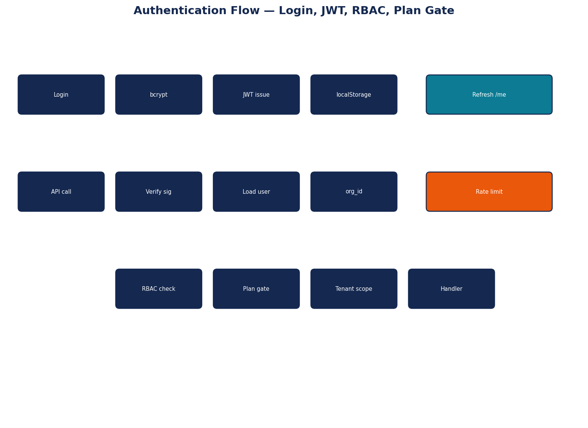

### Control inventory (**Implemented**)

| Control | Implementation |
|---------|----------------|
| TLS | nginx `nginx-ssl.conf`, `FORCE_HTTPS=1` |
| JWT | HMAC, `JWT_SECRET` ≥32 chars in production |
| Passwords | bcrypt, `PASSWORD_MIN_LENGTH=12` |
| Rate limiting | `RateLimitMiddleware` |
| Security headers | HSTS, CSP, X-Frame-Options |
| IP firewall | `IPFirewallMiddleware` |
| Field encryption | Fernet `DATA_ENCRYPTION_KEY` optional |
| Audit | `audit_service` — login, upload, export, billing |
| Tenant isolation | Scoped queries + tests |
| GDPR | Export ZIP + account delete |

### SOC 2 readiness mapping (**Planned** certification)

| Trust criteria | LegalEase posture |
|----------------|-------------------|
| CC6.1 Logical access | JWT + RBAC + org roles |
| CC6.6 Encryption | TLS + optional Fernet |
| CC7.2 Monitoring | Sentry, metrics endpoint, audit log |
| CC8.1 Change management | GitHub Actions CI, Alembic migrations |
| A1 Availability | Docker healthchecks, RUNBOOK backups |

**Gap:** Formal SOC 2 Type I audit not started; control evidence collection **Planned** Q3–Q4 2026.

### ISO 27001 mapping (selected)

| Annex A | Control | Status |
|---------|---------|--------|
| A.9 | Access control | Implemented RBAC |
| A.10 | Cryptography | TLS + bcrypt + optional Fernet |
| A.12 | Operations security | Backups, runbooks |
| A.14 | Secure development | CI tests, production guards |
| A.18 | Compliance | GDPR endpoints |

### GDPR

| Right | Endpoint | Status |
|-------|----------|--------|
| Access / portability | `GET /account/export` | Implemented |
| Erasure | `DELETE /account` | Implemented |
| Rectification | Profile settings | Implemented |
| Restriction | Suspend user (admin) | Implemented |

### Data residency

- **Self-host / India VPC:** Docker Compose on Indian cloud (Oracle Mumbai, etc.)
- **Default SaaS:** Operator chooses region; Postgres + `Data/` locality per deployment
- **Planned:** Explicit `DATA_REGION=IN` flag and region-locked Gemini routing

### Tenant isolation testing (**Implemented**)

- `tests/test_tenant_isolation.py` — automated
- Manual pen-test playbook **Planned**

### Penetration testing strategy (**Planned**)

| Phase | Scope |
|-------|-------|
| SAST | Bandit/eslint in CI (**Partial**) |
| DAST | OWASP ZAP on staging |
| Annual third-party pen test | API + auth + IDOR on matters |

`GET /api/v1/health/security` — posture summary without secret leakage.

---


## Complete Chat Architecture

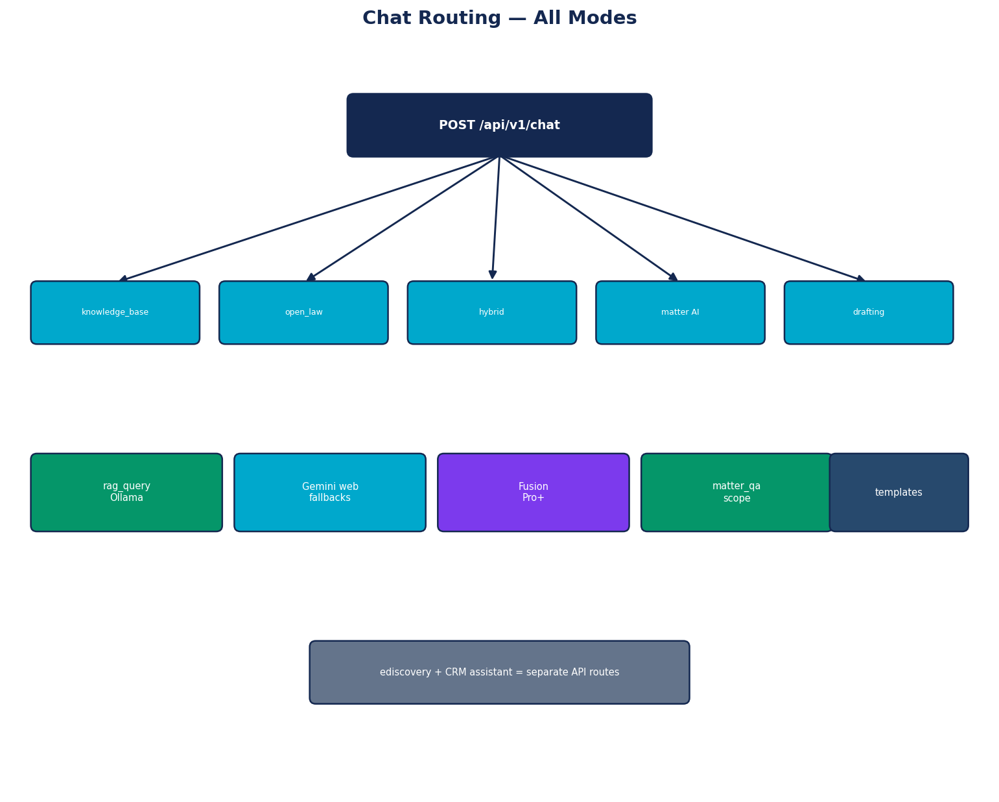

**Figure J1:** All chat modes and dispatch paths.

### Mode catalog

| Mode | Canonical API | Executor | Plan |
|------|---------------|----------|------|
| Knowledge Base | `knowledge_base` | `_run_kb_turn` → `rag_query` | All |
| Open Law | `open_law`, `web_search` | `_run_open_law_turn` | All (quota) |
| Hybrid / Deep Case | `hybrid`, `deep_case` | `run_hybrid_turn` / jurisprudence | Pro+ |
| Matter AI | matter page context | Matter-scoped RAG + `matter_qa` | All |
| Drafting assist | `/drafting` routes | Template + Ollama | All |
| Discovery assist | `/ediscovery` | Batch relevance | Pro features |
| CRM assistant | `/crm` analyze | `intake_intelligence` | Org CRM perm |

### Routing pipeline (**Implemented**)

```
POST /api/v1/chat
  → get_current_user (JWT)
  → normalize_api_chat_mode (plan gate)
  → _resolve_chat_routing
       → parse_legal_query (legal_engine)
       → route_query (mode_router) — user mode wins
       → merge follow-up context (session_mem)
  → branch by mode
  → _record_mode_interaction (learning)
  → format response / SSE stream
```

**Critical policy:** `mode_router.route_query` never auto-switches KB → Open Law.

### Memory logic (**Implemented**)

| Store | Purpose |
|-------|---------|
| `thread_summaries` | Compressed history |
| `user_facts` / persona | Style only in KB; not legal facts |
| `kb_answer_memory` | Repeat query cache |
| Session attachments | `POST /sessions/{id}/attachments` |

### Context management

- Token budget: Ollama `num_ctx` via model config; chunk cap `RAG_FINAL_TOP_K`
- Learner mode prefix when enabled (`get_learner_mode`)
- Matter mode instruction appended for matter-scoped turns

### Token management

| Knob | Location |
|------|----------|
| `LLM_LEGAL_TIMEOUT_SEC` | 90s default |
| `WEB_LLM_MAX_TOKENS_FAST` | Open Law cap |
| Streaming SSE | Chunked to client without full buffer |

### Streaming (**Implemented**)

- `POST /api/v1/chat/stream` — `_stream_kb_turn`, `_stream_open_law_turn`
- Shared routing with sync path

### Legacy Streamlit path

`app.py` `_run_chat_intelligence()` — bypasses FastAPI; same root `rag.py` / `llms.py` modules.

---


## Startup Roadmap — Phased Execution

> Timelines assume 2026 calendar; adjust with funding and hiring.

### Phase 1 — LegalEase Core (Q1–Q2 2026) (**Implemented** ~85%)

| Milestone | Status |
|-----------|--------|
| Multi-tenant Postgres + JWT | Done |
| Stripe + plan gates | Done |
| KB / Open Law / Hybrid | Done |
| Matters 13-tab workspace | Done |
| CRM 2.0 Kanban | Done |
| CI/CD + tenant tests | Done |

**Remaining:** production DocuSign, SOC2 prep kickoff.

### Phase 2 — Mobile App (Q3 2026) (**Planned**)

| Deliverable | Dependency |
|-------------|------------|
| React Native or PWA wrap | API stability |
| Offline matter read | Portal cache |
| Push notifications | Phase 3 infra |

### Phase 3 — Collaboration (Q3–Q4 2026) (**Partial**)

| Deliverable | Status |
|-------------|--------|
| Firm Chat MVP | **Implemented** |
| WebSocket real-time | Planned |
| Presence + read receipts | Planned |
| Mobile chat | Phase 2 |

### Phase 4 — AI Agents (Q4 2026 – Q1 2027) (**Planned**)

- Autonomous research agent with human approval gates
- Scheduled matter intel refresh
- Client intake auto-responder (supervised)

### Phase 5 — Court Integrations (2027) (**Planned**)

- eCourts cause list import
- Filing status webhooks (when APIs available)
- Hearing calendar sync

### Phase 6 — Enterprise (2027+) (**Planned**)

- SAML SSO, SCIM provisioning
- Dedicated VPC / on-prem Helm chart
- 99.9% SLA, named CSM

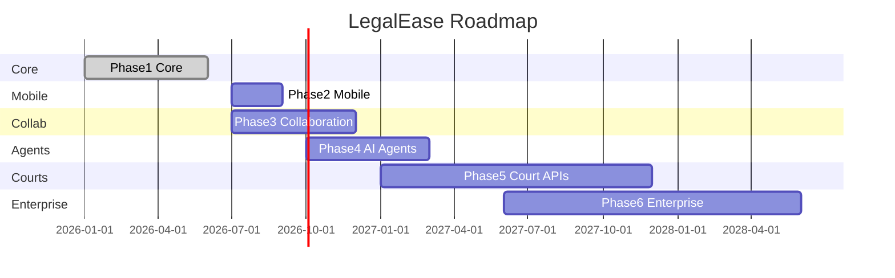
```mermaid
gantt
  title LegalEase Roadmap
  dateFormat YYYY-MM
  section Core
  Phase1 Core           :done, 2026-01, 2026-06
  section Mobile
  Phase2 Mobile         :2026-07, 2026-09
  section Collab
  Phase3 Collaboration  :2026-07, 2026-12
  section Agents
  Phase4 AI Agents      :2026-10, 2027-03
  section Courts
  Phase5 Court APIs     :2027-01, 2027-12
  section Enterprise
  Phase6 Enterprise     :2027-06, 2028-06
```

### Dependency graph

- Phase 4 agents **depend on** KB accuracy + audit (Phase 1)
- Phase 5 **depends on** government API partnerships
- Phase 6 **depends on** SOC2 + SSO

---


## Testing & Quality Assurance

### Test inventory (**Implemented** in `tests/`)

| Category | Examples | Count (approx.) |
|----------|----------|-----------------|
| KB / RAG accuracy | `test_kb_*`, `test_rag_*`, `test_dense_kb_*` | 40+ files |
| Tenant security | `test_tenant_isolation`, `test_security_saas` | 5+ |
| SaaS billing/org | `test_p0_saas`, `test_saas_days5_10` | 10+ |
| CRM | `test_crm_v2_api`, `test_crm_tenant_isolation` | 5+ |
| Collaboration | `test_collab_api`, `test_collab_integration` | 3+ |
| Matter / practice | `test_litigation_practice_api`, `test_api_matter_hardening` | 8+ |
| Learning | `test_learning_engine`, `test_full_learning_pipeline` | 6+ |
| E2E smoke | `e2e_saas_smoke.py`, Playwright `tests/e2e/` | 2+ |

`pytest.ini` excludes `slow` and `legacy_kb` in default CI gate.

### Test types

| Type | Tooling | Status |
|------|---------|--------|
| Unit | pytest | Extensive for KB |
| Integration | FastAPI TestClient | Implemented |
| Security | `test_security_saas`, tenant isolation | Implemented |
| Load | `scripts/load_test_chat.py` | Manual ops |
| RAG accuracy | Golden sets `test_legal_orchestrator_v2_golden` | Implemented |
| Hallucination | `test_kb_claim_audit`, `test_kb_strict_policy` | Implemented |
| UAT | Pilot checklist `docs/PILOT_LAUNCH.md` | Process |

### Planned QA investments

| Item | Target |
|------|--------|
| Playwright required in CI | Q2 2026 |
| KB golden set per release | 100 queries |
| Chaos testing (Redis/Ollama down) | Q3 2026 |
| a11y automated scan | Q4 2026 |

### Quality gates before release

1. `pytest` SaaS gate green
2. `e2e_saas_smoke.py` pass
3. Manual hybrid + Stripe webhook check
4. `GET /health/security` no critical gaps

---


## Technical Debt & Risk Register

Honest assessment from `SAAS_STATUS.md`, codebase review, and production operations.

### Known technical risks

| Risk | Severity | Mitigation |
|------|----------|------------|
| RAG failure / wrong doc | High | Confidence gates, regression tests, NOT_FOUND |
| FAISS index corruption | Medium | Reindex API, backups of `faiss_indexes/` |
| Ollama downtime | High | Health checks; Open Law still works; status banner |
| Postgres split-brain (legacy) | Medium | `SAAS_USE_POSTGRES_LEGACY=1` migration path |
| Gemini quota exhaustion | Medium | Daily tiers + Tavily/Serp fallback chain |
| Vector scale on disk | Medium | Roadmap: object store sharding |
| README / doc drift | Low | This thesis + SAAS_STATUS as source of truth |

### Scaling limits (**Current**)

| Limit | Bound |
|-------|-------|
| Concurrent Ollama | Single model instance GPU RAM |
| FAISS | Filesystem per user; large firms 10k+ docs slow |
| API workers | Uvicorn workers × memory (8G cap compose) |
| Redis single instance | Queue backlog under heavy ML |

### Security risks

| Risk | Status |
|------|--------|
| IDOR on matters | Mitigated by ACL tests; pen-test **Planned** |
| JWT theft | HTTPS + short session; httpOnly cookies **Planned** |
| Prompt injection | Partial; red-team **Planned** |
| Legal liability (AI advice) | Disclaimers in ToS; NOT_FOUND reduces harm |

### Product / market risks

| Risk | Note |
|------|------|
| Slow bar adoption | Requires trust demos + local Ollama |
| Incumbent bundling | Differentiate on India + KB isolation |
| Regulatory change | BNS/BNSS already supported in tools |

### Technical debt register

| Item | Effort | Priority |
|------|--------|----------|
| WebSocket for collab | M | P1 |
| Consolidate Streamlit vs API paths | L | P2 |
| Centralize design system | S | P2 |
| httpOnly JWT cookies | M | P1 |
| FAISS → managed vector DB | L | P2 |
| Product analytics (MAU) | M | P1 |

### Documentation gaps (this thesis flags)

- Exact Stripe price amounts not in repo (env placeholders only)
- MAU/DAU dashboards not implemented
- E2E encryption for chat explicitly **not** implemented (by design for AI)
- Matter risk scoring engine **Planned**
- Court API integrations **Planned**

---

---

## System Diagrams Catalog (Extended)

<!-- THESIS_BULK_APPEND -->

Regenerate: `py scripts/generate_thesis_diagrams.py`. **24 PNG files** in `docs/diagrams/`.

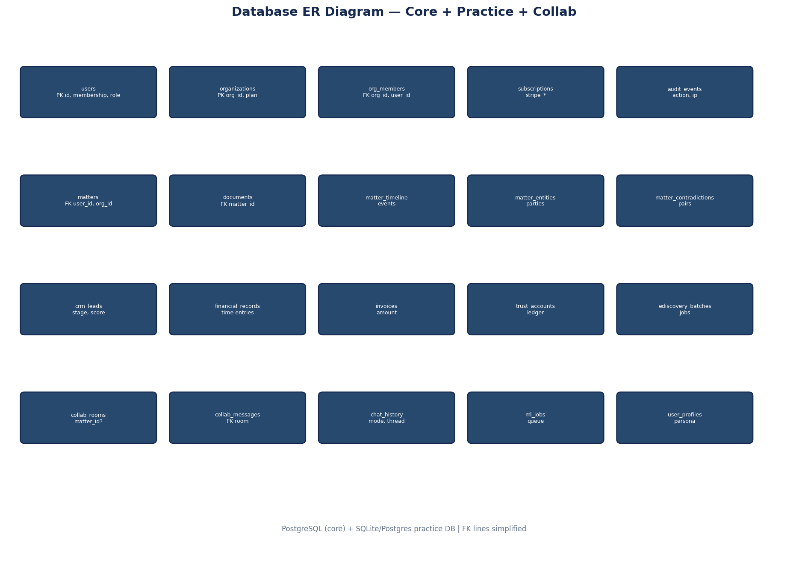

**Figure 13:** Detailed database ER.

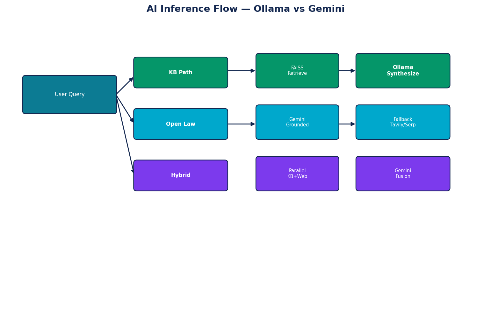

**Figure 14:** AI inference flow.

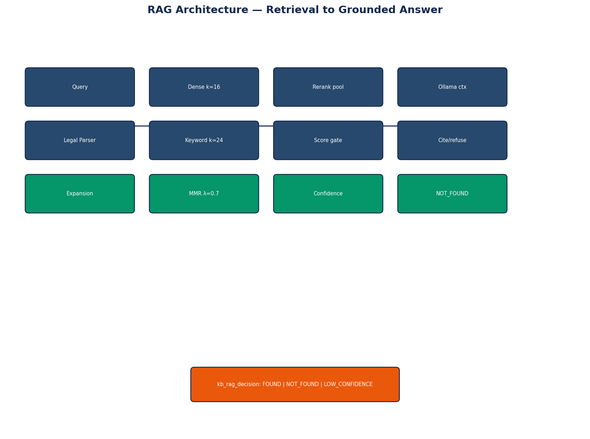

**Figure 15:** RAG architecture detailed.

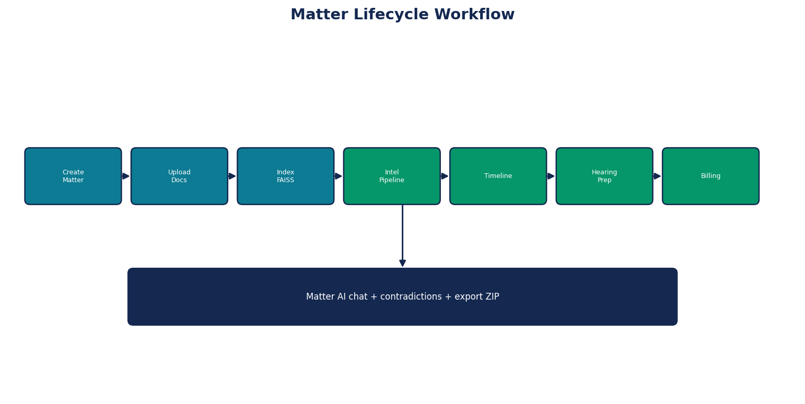

**Figure 16:** Matter workflow.


**Figure 17:** Collaboration workflow.


**Figure 18:** Authentication enhanced.

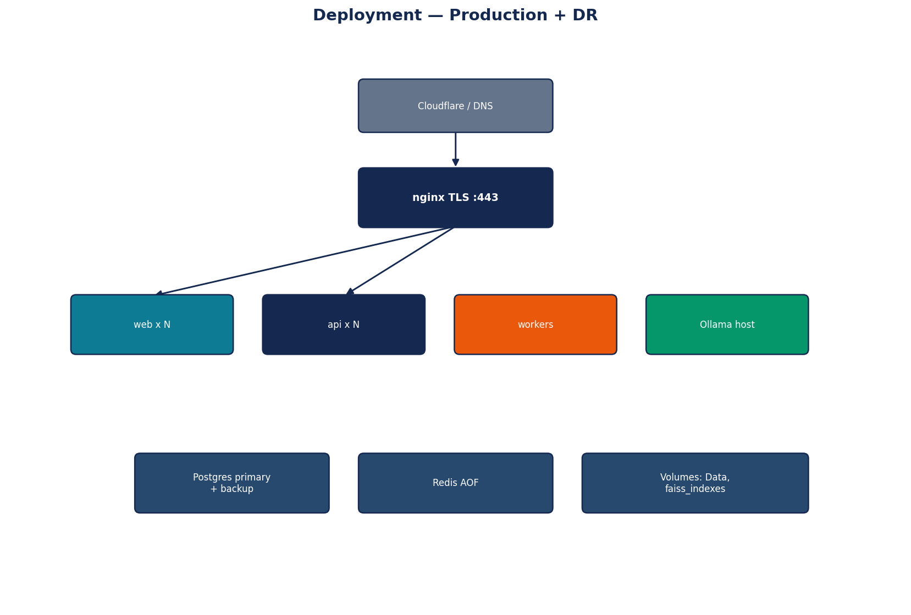

**Figure 19:** Deployment enhanced.


**Figure 20:** Learning pipeline.


**Figure 21:** AI governance trust layer.


**Figure 22:** Matter intelligence pipeline.


**Figure 23:** KB accuracy pipeline.


**Figure 24:** Chat routing tree.

## Implementation Deep Dive — Core Modules

### Module map (production paths)

| Module path | Lines (approx.) | Responsibility |
|-------------|-----------------|----------------|
| `app.py` | 3,800 | Legacy Streamlit monolith |
| `llms.py` | 1,700 | LLM clients, web search, synthesis helpers |
| `rag.py` | 2,500+ | FAISS retrieval, scoring, indexing |
| `kb_pipeline.py` | 1,000+ | KB orchestration entry |
| `backend/app/main.py` | 400+ | FastAPI app, middleware |
| `backend/app/services/chat_service.py` | 1,200+ | Chat turn execution |
| `web/lib/api.ts` | 1,500+ | Typed API client |

### Chat service branching (reference)

The function `run_chat_turn()` in `chat_service.py` is the single production entry for SaaS chat. It:

1. Resolves routing via `_resolve_chat_routing()` (shared with streaming).
2. Applies `_apply_plan_route_guard()` so Free users never receive Hybrid fusion.
3. Dispatches to `_run_kb_turn`, `_run_open_law_turn`, or hybrid/jurisprudence handlers.
4. Records learning signals via `_record_mode_interaction()` when enabled.
5. Returns formatted markdown with optional `sources` array for UI rendering.

Matter-scoped chat on `/matters/[id]/ai` passes `matter_id` and uses matter FAISS paths under `faiss_indexes/{user_id}/{matter_id}/`.

### Database dual-store note

LegalEase uses PostgreSQL for core SaaS tables (auth, chat, memory, subscriptions) when `DATABASE_URL` is set, and a practice data store (SQLite file or Postgres legacy) for matters, documents, CRM, and collaboration. Migration scripts: `migrate_core_to_postgres.py`, `migrate_sqlite_to_pg.py`. Operators should run both paths before cutover.

### Worker processes

| Worker | Script | Queue |
|--------|--------|-------|
| E-discovery | `scripts/ediscovery_worker.py` | `legalease:ediscovery:queue` |
| ML training | `scripts/ml_worker.py` | `legalease:ml:queue` |

Workers call `ensure_app_schemas()` on startup to avoid schema drift vs API.

### Frontend API proxy pattern

Next.js rewrites `/api/v1/*` to `NEXT_PUBLIC_API_URL`. Tokens in `localStorage` key `legalease_token`. This keeps cookies off the critical path for local dev; production hardening should migrate to httpOnly cookies (technical debt item).

### Indian jurisdiction features (implemented)

| Feature | Code entry |
|---------|------------|
| IPC → BNS mapping | `/api/tools/ipc-bns` |
| Limitation calculator | `practice/limitation` |
| BNS auditor (premium) | `premium_services` |
| Law code comparison in KB | `test_conceptual_comparison` |
| CrPC vs BNSS routing fix | mode router + query parser |

### Operational runbooks (document index)

| Document | Purpose |
|----------|---------|
| `RUNBOOK.md` | Incidents, backup restore |
| `docs/PILOT_LAUNCH.md` | Pilot checklist |
| `docs/PRODUCTION_CHECKLIST.md` | Go-live gates |
| `DEPLOY.md` | Docker production |
| `docs/DEPLOY_ZERO_BUDGET.md` | Laptop demo |
| `SAAS_STATUS.md` | Sprint status truth |

---

### Appendix F — Complete Environment Variable Reference

Sourced from `.env.example` in repository.

| Variable | Default / value |
|----------|-----------------|
| `LLM_BACKEND` | `ollama` |
| `LM_STUDIO_URL` | `http://127.0.0.1:1234` |
| `LM_STUDIO_MODEL` | `meta-llama-3.1-8b-instruct` |
| `OLLAMA_BASE_URL` | `http://127.0.0.1:11434` |
| `OLLAMA_MODEL` | `legalease-tuned` |
| `LLM_ROUTER_ENABLED` | `1` |
| `OLLAMA_MODEL_LEGAL` | `legalease-tuned` |
| `OLLAMA_MODEL_FAST` | `legalease-tuned` |
| `OLLAMA_MODEL_LEGAL_FALLBACK` | `legalease-tuned` |
| `LLM_CLASSIFY_MAX_TOKENS` | `320` |
| `LLM_CLASSIFY_TIMEOUT_SEC` | `8` |
| `LLM_LEGAL_TIMEOUT_SEC` | `90` |
| `LLM_INTAKE_USE_RAG` | `1` |
| `LLM_INTAKE_RAG_K` | `3` |
| `LLM_INTAKE_FULL_ANALYSIS` | `1` |
| `INTAKE_PUBLIC_ENABLED` | `0` |
| `INTAKE_PUBLIC_KEY` | `` |
| `INTAKE_ORG_USER_ID` | `` |
| `OPENROUTER_API_KEY` | `` |
| `OPENROUTER_MODEL` | `google/gemma-2-9b-it:free` |
| `DEEPSEEK_API_KEY` | `` |
| `QWEN_API_KEY` | `` |
| `DASHSCOPE_API_KEY` | `` |
| `GEMINI_API_KEY` | `` |
| `GEMINI_FREE_MODEL` | `gemini-2.5-flash` |
| `WEB_INTELLIGENCE_DEBUG` | `0` |
| `STRICT_CITATIONS` | `0` |
| `LEGACY_WEB` | `0` |
| `JURISPRUDENCE_KB_K` | `14` |
| `GEMINI_DAILY_FREE` | `15` |
| `GEMINI_DAILY_PRO` | `200` |
| `GEMINI_DAILY_LEGAL_PRO` | `1000` |
| `GEMINI_OLLAMA_TUNING` | `0` |
| `GEMINI_COACH_MODEL` | `gemini-2.5-flash` |
| `GEMINI_COACH_FEEDBACK_LIMIT` | `25` |
| `COACH_AUTO_SCHEDULE` | `1` |
| `COACH_AUTO_INTERVAL_DAYS` | `1` |
| `COACH_AUTO_MIN_NEW_FEEDBACK` | `1` |
| `COACH_AUTO_CHECK_INTERVAL_SEC` | `1800` |
| `COACH_AUTO_EXPORT_MODELFILE` | `1` |
| `COACH_AUTO_ENABLE_ON_FEEDBACK` | `1` |
| `IMPROVEMENT_AUTO` | `1` |
| `OLLAMA_AUTO_REINDEX` | `1` |
| `OLLAMA_AUTO_CREATE` | `1` |
| `OLLAMA_AUTO_USE_TUNED` | `1` |
| `OLLAMA_AUTO_EXPORT_MIN_THUMBS` | `20` |
| `OLLAMA_TUNED_MODEL_NAME` | `legalease-tuned` |
| `OLLAMA_CREATE_TIMEOUT_SEC` | `900` |
| `GEMINI_KB_SYNTHESIS` | `0` |
| `GEMINI_KB_RETRIEVAL_HINTS` | `0` |
| `GEMINI_KB_RERANK` | `0` |
| `KB_BLOCK_RUNTIME_COACH` | `1` |
| `KB_BLOCK_LEARNING_INJECT` | `1` |
| `TAVILY_API_KEY` | `` |
| `TAVILY_SEARCH_URL` | `https://api.tavily.com/search` |
| `LEGAL_ONLY_WEB` | `1` |
| `WEB_INTEL_FAST` | `1` |
| `WEB_INTEL_USE_LLM` | `0` |
| `WEB_SKIP_TAVILY_MCP` | `1` |
| `WEB_PREFER_TAVILY_REST` | `1` |
| `WEB_SEARCH_MAX_RESULTS` | `6` |
| `TAVILY_REST_TIMEOUT` | `12` |
| `TAVILY_MCP_TIMEOUT` | `8` |
| `WEB_LLM_MAX_TOKENS_FAST` | `900` |
| `WEB_LLM_MAX_TOKENS_CASE` | `1100` |
| `OCR_ENABLED` | `1` |
| `OCR_LANGUAGES` | `en` |
| `OCR_GPU` | `0` |
| `GOOGLE_API_KEY` | `` |
| `GOOGLE_CSE_ID` | `` |
| `SERP_API_KEY` | `` |
| `SERP_TIMEOUT` | `10` |
| `SERP_ENGINE` | `google` |
| `HF_EMBEDDING_MODEL` | `BAAI/bge-small-en-v1.5` |
| `HF_EMBEDDING_FALLBACK` | `BAAI/bge-base-en-v1.5` |
| `RAG_PREFER_BASE_EMBEDDINGS` | `1` |
| `RAG_USE_LANGCHAIN_HF` | `0` |
| `RAG_SCORE_THRESHOLD` | `1.6` |
| `RAG_CONFIDENCE_THRESHOLD` | `0.52` |
| `RAG_ENABLE_CROSS_ENCODER` | `0` |
| `RAG_RERANK_MODEL` | `cross-encoder/ms-marco-MiniLM-L-6-v2` |
| `RAG_RERANK_POOL_SIZE` | `12` |
| `MAX_UPLOAD_MB` | `200` |
| `PDF_MAX_PAGES` | `0` |
| `OCR_MAX_PAGES` | `0` |
| `OCR_SPARSE_ONLY` | `1` |
| `OCR_WORKERS` | `4` |
| `OCR_MIN_CHARS_PER_PAGE` | `120` |
| `RAG_CHUNK_SIZE` | `1000` |
| `RAG_CHUNK_OVERLAP` | `200` |
| `RAG_MAX_CHUNK` | `1400` |
| `RAG_INDEX_EMBED_BATCH` | `128` |
| `RAG_FAST_INDEX` | `1` |
| `INDEX_JOB_WORKERS` | `1` |
| `INDEX_JOB_USE_PROCESS` | `1` |
| `RAG_MAX_QUERY_EXPANSIONS` | `5` |
| `RAG_TOP_K_KEYWORD` | `24` |
| `FAISS_VS_CACHE_MAX` | `8` |
| `OLLAMA_KB_LOCK_MODEL` | `1` |
| `PDF_UPLOAD_TIMEOUT_SEC` | `900` |
| `KB_PIPELINE_DEBUG` | `1` |
| `KB_CACHE_TTL_SEC` | `300` |
| `KB_CACHE_MAX_ENTRIES` | `256` |
| `RATE_LIMIT_ENABLED` | `1` |
| `RATE_LIMIT_PER_MINUTE` | `120` |
| `RATE_LIMIT_CHAT_PER_MINUTE` | `40` |
| `SECURITY_HEADERS_ENABLED` | `1` |
| `FORCE_HTTPS` | `1` |
| `HSTS_MAX_AGE` | `31536000` |
| `DATA_ENCRYPTION_KEY` | `` |
| `FIREWALL_ENABLED` | `0` |
| `FIREWALL_ALLOWED_IPS` | `` |
| `PASSWORD_MIN_LENGTH` | `12` |
| `RAG_RETRIEVAL_K` | `8` |
| `RAG_FINAL_TOP_K` | `10` |
| `RAG_TOP_K_DENSE` | `16` |
| `RAG_MMR_LAMBDA` | `0.7` |
| `LEGALEASE_DB_PATH` | `` |
| `REDIS_URL` | `redis://127.0.0.1:6379/0` |
| `SESSION_TTL_SEC` | `86400` |
| `JWT_SECRET` | `change-me-in-production` |
| `PUBLIC_APP_URL` | `http://localhost:3000` |
| `ESIGN_PROVIDER` | `mock` |
| `LLM_FINETUNE_ENABLED` | `1` |
| `LLM_FINETUNE_AUTO` | `1` |
| `LLM_FINETUNE_BASE_MODEL` | `google/gemma-2-2b-it` |
| `LLM_FINETUNE_MIN_SFT` | `5` |
| `LLM_FINETUNE_MIN_DPO` | `2` |
| `LLM_USE_TRAINED_ADAPTER` | `1` |
| `INFERENCE_REWARD_ENABLED` | `1` |
| `INFERENCE_REWARD_RERANK` | `1` |
| `CHAT_COACH_RUNTIME` | `1` |
| `CHAT_COACH_POSITIVE_EVERY` | `3` |
| `GPU_PROFILE` | `balanced` |
| `STT_ENABLED` | `1` |
| `STT_ENGINE` | `faster_whisper` |
| `STT_MODEL` | `small` |
| `STT_DEVICE` | `cuda` |
| `STT_COMPUTE_TYPE` | `float16` |
| `STT_PRELOAD` | `0` |
| `STT_MAX_SECONDS` | `90` |
| `STT_MAX_UPLOAD_MB` | `12` |
| `STT_FALLBACK_BROWSER` | `1` |
| `STT_POLISH_DEFAULT` | `0` |
| `KB_LLM_TEMPERATURE` | `0.23` |
| `RAG_MIN_ACCEPT_SCORE` | `0.50` |
| `KB_INDEX_MIN_VECTORS_WARN` | `20` |
| `KB_LLM_TOP_P` | `0.1` |
| `SAAS_PRODUCTION` | `0` |
| `SAAS_PRODUCTION_STRICT` | `1` |
| `ALLOW_MOCK_BILLING` | `1` |
| `SAAS_AUTO_POSTGRES_LEGACY` | `1` |
| `SAAS_USE_POSTGRES_LEGACY` | `0` |
| `ML_USE_QUEUE` | `1` |
| `REDIS_URL` | `redis://127.0.0.1:6379/0` |
| `PLAN_DOC_LIMIT_FREE` | `2` |
| `PLAN_DOC_LIMIT_PRO` | `500` |
| `PLAN_DOC_LIMIT_LEGAL_PRO` | `5000` |
| `JWT_SECRET` | `change_this_jwt_secret_min_32_chars` |
| `LEGALEASE_API_SECRET` | `` |
| `REDIS_URL` | `redis://127.0.0.1:6379/0` |
| `PUBLIC_APP_URL` | `http://localhost:3000` |
| `CORS_ORIGINS` | `http://localhost:3000,http://127.0.0.1:3000` |
| `STRIPE_SECRET_KEY` | `` |
| `STRIPE_WEBHOOK_SECRET` | `` |
| `STRIPE_PRICE_PRO` | `` |
| `STRIPE_PRICE_LEGAL_PRO` | `` |
| `MATTER_STRICT_SCOPE_ENFORCEMENT` | `1` |
| `MATTER_STRICT_ROLE_WRITE` | `1` |
| `LEARNING_SCOPE_PROMOTION_ENABLED` | `0` |
| `ORG_SEATS_FREE` | `1` |
| `ORG_SEATS_PRO` | `3` |
| `ORG_SEATS_LEGAL_PRO` | `10` |
| `EMAIL_PROVIDER` | `console` |
| `EMAIL_FROM` | `noreply@your-domain.com` |
| `SUPERADMIN_USERNAMES` | `admin` |
### Appendix G — Automated Test Suite Index

**138 test modules** under `tests/` (pytest).

| Test module | Focus area |
|-------------|------------|
| `test_adaptive_learning.py` | Adaptive Learning |
| `test_answer_orchestrator_kb.py` | Answer Orchestrator Kb |
| `test_api_chat_mocked.py` | Api Chat Mocked |
| `test_api_matter_e2e_flow.py` | Api Matter E2E Flow |
| `test_api_matter_hardening.py` | Api Matter Hardening |
| `test_api_premium.py` | Api Premium |
| `test_api_saas.py` | Api Saas |
| `test_case_narrative_engine.py` | Case Narrative Engine |
| `test_case_routing.py` | Case Routing |
| `test_case_topic_resolver.py` | Case Topic Resolver |
| `test_chat_mode_api.py` | Chat Mode Api |
| `test_chat_persistence.py` | Chat Persistence |
| `test_collab_api.py` | Collab Api |
| `test_collab_integration.py` | Collab Integration |
| `test_comparison_memory.py` | Comparison Memory |
| `test_conceptual_comparison.py` | Conceptual Comparison |
| `test_constitutional_routing.py` | Constitutional Routing |
| `test_court_day.py` | Court Day |
| `test_crm_api.py` | Crm Api |
| `test_crm_tenant_isolation.py` | Crm Tenant Isolation |
| `test_crm_v2_api.py` | Crm V2 Api |
| `test_dense_kb_test_queries.py` | Dense Kb Queries |
| `test_document_schema_fresh_db.py` | Document Schema Fresh Db |
| `test_embedding_manager.py` | Embedding Manager |
| `test_enterprise_db.py` | Enterprise Db |
| `test_eval_holdout.py` | Eval Holdout |
| `test_evidence_desk.py` | Evidence Desk |
| `test_export_quality_gate.py` | Export Quality Gate |
| `test_followup_detector.py` | Followup Detector |
| `test_full_learning_pipeline.py` | Full Learning Pipeline |
| `test_gemini_ollama_coach.py` | Gemini Ollama Coach |
| `test_golden_kb.py` | Golden Kb |
| `test_improvement_automation.py` | Improvement Automation |
| `test_integration_demo.py` | Integration Demo |
| `test_intent_engine.py` | Intent Engine |
| `test_jurisprudence_engine.py` | Jurisprudence Engine |
| `test_kb_case_context_lock.py` | Kb Case Context Lock |
| `test_kb_case_lock_rescue.py` | Kb Case Lock Rescue |
| `test_kb_chunk_stitch.py` | Kb Chunk Stitch |
| `test_kb_claim_audit.py` | Kb Claim Audit |
| `test_kb_comparison.py` | Kb Comparison |
| `test_kb_constitutional_list.py` | Kb Constitutional List |
| `test_kb_content_cleaner.py` | Kb Content Cleaner |
| `test_kb_context_resolver.py` | Kb Context Resolver |
| `test_kb_conversation_sections.py` | Kb Conversation Sections |
| `test_kb_dense_document.py` | Kb Dense Document |
| `test_kb_doc_scope_multi.py` | Kb Doc Scope Multi |
| `test_kb_document_first.py` | Kb Document First |
| `test_kb_document_scan.py` | Kb Document Scan |
| `test_kb_document_scoping.py` | Kb Document Scoping |
| `test_kb_e2e.py` | Kb E2E |
| `test_kb_explanation_mode.py` | Kb Explanation Mode |
| `test_kb_followup_explanation.py` | Kb Followup Explanation |
| `test_kb_force_answer.py` | Kb Force Answer |
| `test_kb_full_document.py` | Kb Full Document |
| `test_kb_gemini_safety.py` | Kb Gemini Safety |
| `test_kb_hybrid_gate.py` | Kb Hybrid Gate |
| `test_kb_landmark_case.py` | Kb Landmark Case |
| `test_kb_law_replacement.py` | Kb Law Replacement |
| `test_kb_master_contract.py` | Kb Master Contract |
| `test_kb_observability.py` | Kb Observability |
| `test_kb_pipeline.py` | Kb Pipeline |
| `test_kb_query_types.py` | Kb Query Types |
| `test_kb_question_aware.py` | Kb Question Aware |
| `test_kb_rag_decision.py` | Kb Rag Decision |
| `test_kb_rag_hardening.py` | Kb Rag Hardening |
| `test_kb_response_state.py` | Kb Response State |
| `test_kb_retrieval.py` | Kb Retrieval |
| `test_kb_retrieval_fixes.py` | Kb Retrieval Fixes |
| `test_kb_section_explanation.py` | Kb Section Explanation |
| `test_kb_smoke_query_builder.py` | Kb Smoke Query Builder |
| `test_kb_smoke_test.py` | Kb Smoke Test |
| `test_kb_strict_policy.py` | Kb Strict Policy |
| `test_kb_strict_section_retrieval.py` | Kb Strict Section Retrieval |
| `test_kb_validate.py` | Kb Validate |
| `test_learning_engine.py` | Learning Engine |
| `test_learning_signals.py` | Learning Signals |
| `test_legal_orchestrator_v2_golden.py` | Legal Orchestrator V2 Golden |
| `test_legal_query_parser.py` | Legal Query Parser |
| `test_legal_web_query.py` | Legal Web Query |
| `test_legal_web_response.py` | Legal Web Response |
| `test_litigation_practice_api.py` | Litigation Practice Api |
| `test_llm_task_router.py` | Llm Task Router |
| `test_matter_faiss.py` | Matter Faiss |
| `test_matter_hardening_regression.py` | Matter Hardening Regression |
| `test_matter_policy_flags.py` | Matter Policy Flags |
| `test_memory_guard.py` | Memory Guard |
| `test_ml_pipeline.py` | Ml Pipeline |
| `test_mode_router_open_law.py` | Mode Router Open Law |
| `test_neural_finetuning.py` | Neural Finetuning |
| `test_ocr.py` | Ocr |
| `test_ocr_router.py` | Ocr Router |
| `test_ollama_export_scheduler.py` | Ollama Export Scheduler |
| `test_open_law_executor.py` | Open Law Executor |
| `test_p0_org_invite.py` | P0 Org Invite |
| `test_p0_saas.py` | P0 Saas |
| `test_p1_ops.py` | P1 Ops |
| `test_p2_saas.py` | P2 Saas |
| `test_parametrize_extended.py` | Parametrize Extended |
| `test_parametrize_legal.py` | Parametrize Legal |
| `test_pdf_chunking_dense.py` | Pdf Chunking Dense |
| `test_pdf_index_quality.py` | Pdf Index Quality |
| `test_pdf_kb_integration.py` | Pdf Kb Integration |
| `test_phase1_practice.py` | Phase1 Practice |
| `test_phase2_billing_rigorous.py` | Phase2 Billing Rigorous |
| `test_phase2_bundle.py` | Phase2 Bundle |
| `test_phase3_crm_rigorous.py` | Phase3 Crm Rigorous |
| `test_phase4_saas_rigorous.py` | Phase4 Saas Rigorous |
| `test_pii_hybrid.py` | Pii Hybrid |
| `test_polish_research_answer.py` | Polish Research Answer |
| `test_practice_integration.py` | Practice Integration |
| `test_premium_learning.py` | Premium Learning |
| `test_premium_parametrize_rigorous.py` | Premium Parametrize Rigorous |
| `test_premium_services.py` | Premium Services |
| `test_priority_features.py` | Priority Features |
| `test_prompt_budget.py` | Prompt Budget |
| `test_prompts.py` | Prompts |
| `test_rag.py` | Rag |
| `test_rag_money_expansion.py` | Rag Money Expansion |
| `test_response_mode_controller.py` | Response Mode Controller |
| `test_robust_search_kb.py` | Robust Search Kb |
| `test_saas_day4_6.py` | Saas Day4 6 |
| `test_saas_days5_10.py` | Saas Days5 10 |
| `test_saas_extensions.py` | Saas Extensions |
| `test_saas_production_guards.py` | Saas Production Guards |
| `test_saas_regression.py` | Saas Regression |
| `test_schema_migrations.py` | Schema Migrations |
| `test_security_saas.py` | Security Saas |
| `test_session_store.py` | Session Store |
| `test_speech_transcribe.py` | Speech Transcribe |
| `test_stability.py` | Stability |
| `test_tenant_isolation.py` | Tenant Isolation |
| `test_tools.py` | Tools |
| `test_universal_kb.py` | Universal Kb |
| `test_user_memory.py` | User Memory |
| `test_user_search.py` | User Search |
| `test_web_answer_cleaner.py` | Web Answer Cleaner |
| `test_web_intelligence.py` | Web Intelligence |

---

### Appendix H — API v1 Route Catalog (generated)

Mounted under `/api/v1` via `router.py`. Auth required unless noted.

| Method | Path suffix | Source file |
|--------|-------------|-------------|
| GET | `/api/v1/onboarding` | `account.py` |
| POST | `/api/v1/onboarding/dismiss` | `account.py` |
| GET | `/api/v1/preferences` | `account.py` |
| PATCH | `/api/v1/preferences/learner-mode` | `account.py` |
| POST | `/api/v1/verify-email/send` | `account.py` |
| POST | `/api/v1/verify-email/confirm` | `account.py` |
| GET | `/api/v1/export` | `account.py` |
| DELETE | `/api/v1/account` | `account.py` |
| POST | `/api/v1/forgot-password` | `account.py` |
| POST | `/api/v1/reset-password/{token}` | `account.py` |
| GET | `/api/v1/users` | `admin.py` |
| POST | `/api/v1/users/{user_id}/suspend` | `admin.py` |
| POST | `/api/v1/users/{user_id}/unsuspend` | `admin.py` |
| POST | `/api/v1/users/{user_id}/plan` | `admin.py` |
| GET | `/api/v1/audit` | `admin.py` |
| GET | `/api/v1/usage` | `admin.py` |
| GET | `/api/v1/health` | `admin.py` |
| GET | `/api/v1/summary` | `billing.py` |
| GET | `/api/v1/entries` | `billing.py` |
| POST | `/api/v1/entries` | `billing.py` |
| POST | `/api/v1/narrative/preview` | `billing.py` |
| POST | `/api/v1/narrative/correct` | `billing.py` |
| POST | `/api/v1/invoices` | `billing.py` |
| POST | `/api/v1/chat` | `chat.py` |
| POST | `/api/v1/stream` | `chat.py` |
| POST | `/api/v1/export-report` | `chat.py` |
| GET | `/api/v1/clauses` | `clauses.py` |
| POST | `/api/v1/clauses` | `clauses.py` |
| POST | `/api/v1/feedback` | `clauses.py` |
| GET | `/api/v1/permissions` | `collab.py` |
| GET | `/api/v1/members` | `collab.py` |
| GET | `/api/v1/rooms` | `collab.py` |
| GET | `/api/v1/users/search` | `collab.py` |
| GET | `/api/v1/requests` | `collab.py` |
| POST | `/api/v1/requests` | `collab.py` |
| POST | `/api/v1/requests/{request_id}/accept` | `collab.py` |
| POST | `/api/v1/requests/{request_id}/reject` | `collab.py` |
| POST | `/api/v1/rooms/dm` | `collab.py` |
| POST | `/api/v1/rooms/channel` | `collab.py` |
| GET | `/api/v1/rooms/matter/{matter_id}` | `collab.py` |
| GET | `/api/v1/rooms/{room_id}` | `collab.py` |
| GET | `/api/v1/rooms/{room_id}/messages` | `collab.py` |
| POST | `/api/v1/rooms/{room_id}/messages` | `collab.py` |
| POST | `/api/v1/rooms/{room_id}/read` | `collab.py` |
| POST | `/api/v1/rooms/{room_id}/messages/{message_id}/reactions` | `collab.py` |
| POST | `/api/v1/rooms/{room_id}/messages/{message_id}/attachments` | `collab.py` |
| GET | `/api/v1/attachments/{attachment_id}/download` | `collab.py` |
| POST | `/api/v1/messages/{message_id}/create-task` | `collab.py` |
| POST | `/api/v1/messages/{message_id}/create-deadline` | `collab.py` |
| GET | `/api/v1/search` | `collab.py` |
| GET | `/api/v1/notifications` | `collab.py` |
| POST | `/api/v1/notifications/{notification_id}/read` | `collab.py` |
| POST | `/api/v1/rooms/{room_id}/summarize` | `collab.py` |
| GET | `/api/v1/permissions` | `crm.py` |
| GET | `/api/v1/dashboard` | `crm.py` |
| GET | `/api/v1/kanban` | `crm.py` |
| GET | `/api/v1/analytics` | `crm.py` |
| GET | `/api/v1/pipeline-stages` | `crm.py` |
| POST | `/api/v1/classify` | `crm.py` |
| GET | `/api/v1/crm` | `crm.py` |
| POST | `/api/v1/crm` | `crm.py` |
| POST | `/api/v1/assistant` | `crm.py` |
| GET | `/api/v1/{lead_id}` | `crm.py` |
| PATCH | `/api/v1/{lead_id}` | `crm.py` |
| PATCH | `/api/v1/{lead_id}/stage` | `crm.py` |
| POST | `/api/v1/{lead_id}/analyze` | `crm.py` |
| GET | `/api/v1/{lead_id}/documents` | `crm.py` |
| POST | `/api/v1/{lead_id}/documents` | `crm.py` |
| GET | `/api/v1/{lead_id}/interactions` | `crm.py` |
| POST | `/api/v1/{lead_id}/interactions` | `crm.py` |
| GET | `/api/v1/{lead_id}/audit` | `crm.py` |
| POST | `/api/v1/{lead_id}/convert/preview` | `crm.py` |
| POST | `/api/v1/{lead_id}/convert` | `crm.py` |
| POST | `/api/v1/{lead_id}/convert-to-matter` | `crm.py` |
| POST | `/api/v1/{lead_id}/reject` | `crm.py` |
| POST | `/api/v1/{lead_id}/archive` | `crm.py` |
| GET | `/api/v1/{lead_id}/follow-up/templates` | `crm.py` |
| POST | `/api/v1/{lead_id}/follow-up/apply` | `crm.py` |
| POST | `/api/v1/{lead_id}/follow-up/send` | `crm.py` |
| POST | `/api/v1/{lead_id}/follow-up/preview` | `crm.py` |
| POST | `/api/v1/intent/correct` | `crm.py` |
| GET | `/api/v1/full` | `dashboard.py` |
| POST | `/api/v1/kb/sync-status` | `documents.py` |
| GET | `/api/v1/kb/health` | `documents.py` |
| POST | `/api/v1/kb/reindex-auto` | `documents.py` |
| POST | `/api/v1/kb/smoke-test` | `documents.py` |
| GET | `/api/v1/documents` | `documents.py` |
| POST | `/api/v1/upload` | `documents.py` |
| GET | `/api/v1/jobs/{job_id}` | `documents.py` |
| GET | `/api/v1/jobs` | `documents.py` |
| POST | `/api/v1/index` | `documents.py` |
| GET | `/api/v1/{doc_id}/timeline` | `documents.py` |
| GET | `/api/v1/{doc_id}/entities` | `documents.py` |
| DELETE | `/api/v1/{doc_id}` | `documents.py` |
| GET | `/api/v1/smart-draft/types` | `drafting_studio.py` |
| GET | `/api/v1/smart-draft/{draft_type}/questions` | `drafting_studio.py` |
| POST | `/api/v1/smart-draft/generate` | `drafting_studio.py` |
| POST | `/api/v1/triage` | `ediscovery.py` |
| GET | `/api/v1/batches` | `ediscovery.py` |
| POST | `/api/v1/batches` | `ediscovery.py` |
| GET | `/api/v1/jobs/{job_id}` | `ediscovery.py` |
| GET | `/api/v1/batches/{batch_id}` | `ediscovery.py` |
| GET | `/api/v1/batches/{batch_id}/search` | `ediscovery.py` |
| POST | `/api/v1/items/{item_id}/review` | `ediscovery.py` |
| GET | `/api/v1/status` | `engines.py` |
| GET | `/api/v1/matters/{matter_id}/autopilot` | `engines.py` |
| GET | `/api/v1/watchlist` | `engines.py` |
| POST | `/api/v1/watchlist` | `engines.py` |
| DELETE | `/api/v1/watchlist/{watch_id}` | `engines.py` |
| POST | `/api/v1/watchlist/{watch_id}/check` | `engines.py` |
| POST | `/api/v1/requests` | `esign.py` |
| GET | `/api/v1/requests/{request_id}` | `esign.py` |
| POST | `/api/v1/mock/{request_id}/complete` | `esign.py` |
| GET | `/api/v1/health/gpu` | `health.py` |
| GET | `/api/v1/ping` | `health.py` |
| GET | `/api/v1/metrics` | `health.py` |
| GET | `/api/v1/health/live` | `health.py` |
| GET | `/api/v1/health/embeddings` | `health.py` |
| GET | `/api/v1/health/llm` | `health.py` |
| GET | `/api/v1/health/ready` | `health.py` |
| GET | `/api/v1/health/public` | `health.py` |
| GET | `/api/v1/health` | `health.py` |
| GET | `/api/v1/debug-query` | `kb_debug.py` |
| GET | `/api/v1/debug-batch` | `kb_debug.py` |
| POST | `/api/v1/feedback` | `learning.py` |
| POST | `/api/v1/signals` | `learning.py` |
| GET | `/api/v1/signals/tags` | `learning.py` |
| GET | `/api/v1/signals/stats` | `learning.py` |
| POST | `/api/v1/correction` | `learning.py` |
| GET | `/api/v1/stats` | `learning.py` |
| POST | `/api/v1/tuning/scope/promote` | `learning.py` |
| GET | `/api/v1/analytics/full` | `learning.py` |
| POST | `/api/v1/tuning/export` | `learning.py` |
| POST | `/api/v1/tuning/export-saas` | `learning.py` |
| GET | `/api/v1/tuning/neural/status` | `learning.py` |
| POST | `/api/v1/tuning/neural/collect` | `learning.py` |
| POST | `/api/v1/tuning/neural/train` | `learning.py` |
| GET | `/api/v1/engine/status` | `learning.py` |
| POST | `/api/v1/engine/auto-improve` | `learning.py` |
| POST | `/api/v1/engine/rescue-test` | `learning.py` |
| GET | `/api/v1/tuning/coach/status` | `learning.py` |
| POST | `/api/v1/tuning/coach/toggle` | `learning.py` |
| POST | `/api/v1/tuning/coach/analyze` | `learning.py` |
| POST | `/api/v1/tuning/coach/apply` | `learning.py` |
| POST | `/api/v1/tuning/coach/run` | `learning.py` |
| GET | `/api/v1/automation/status` | `learning.py` |
| POST | `/api/v1/automation/run-now` | `learning.py` |
| GET | `/api/v1/automation/jobs` | `learning.py` |
| GET | `/api/v1/automation/jobs/{job_id}` | `learning.py` |
| GET | `/api/v1/tuning/coach/directives` | `learning.py` |
| POST | `/api/v1/tuning/coach/directives` | `learning.py` |
| POST | `/api/v1/tuning/coach/schedule/toggle` | `learning.py` |
| GET | `/api/v1/tuning/coach/schedule/status` | `learning.py` |
| POST | `/api/v1/tuning/coach/schedule/run-now` | `learning.py` |
| POST | `/api/v1/tuning/ollama/export-modelfile` | `learning.py` |
| GET | `/api/v1/tuning/ollama/export-status` | `learning.py` |
| GET | `/api/v1/progress` | `learning.py` |
| POST | `/api/v1/eval/holdout` | `learning.py` |
| GET | `/api/v1/quality-gate` | `learning.py` |
| GET | `/api/v1/preferences` | `learning.py` |
| GET | `/api/v1/training/status` | `learning.py` |
| POST | `/api/v1/training/export-sft` | `learning.py` |
| POST | `/api/v1/training/export-dpo` | `learning.py` |
| POST | `/api/v1/training/train-sft` | `learning.py` |
| POST | `/api/v1/training/train-dpo` | `learning.py` |
| GET | `/api/v1/training/llm-status` | `learning.py` |
| GET | `/api/v1/meta/types` | `matters.py` |
| GET | `/api/v1/health/indexing` | `matters.py` |
| GET | `/api/v1/documents/unlinked` | `matters.py` |
| GET | `/api/v1/matters` | `matters.py` |
| POST | `/api/v1/matters` | `matters.py` |
| GET | `/api/v1/evidence-desk` | `matters.py` |
| POST | `/api/v1/evidence-desk/scan` | `matters.py` |
| GET | `/api/v1/hearings/digest` | `matters.py` |
| DELETE | `/api/v1/{matter_id}` | `matters.py` |
| POST | `/api/v1/{matter_id}/restore` | `matters.py` |
| GET | `/api/v1/{matter_id}` | `matters.py` |
| PATCH | `/api/v1/{matter_id}` | `matters.py` |
| POST | `/api/v1/{matter_id}/notes` | `matters.py` |
| POST | `/api/v1/{matter_id}/documents/link` | `matters.py` |
| GET | `/api/v1/{matter_id}/dashboard` | `matters.py` |
| GET | `/api/v1/{matter_id}/timeline` | `matters.py` |
| POST | `/api/v1/{matter_id}/timeline` | `matters.py` |
| GET | `/api/v1/{matter_id}/hearings` | `matters.py` |
| POST | `/api/v1/{matter_id}/hearings` | `matters.py` |
| GET | `/api/v1/{matter_id}/tasks` | `matters.py` |
| POST | `/api/v1/{matter_id}/tasks` | `matters.py` |
| PATCH | `/api/v1/{matter_id}/tasks/{task_id}` | `matters.py` |
| GET | `/api/v1/{matter_id}/deadlines` | `matters.py` |
| POST | `/api/v1/{matter_id}/deadlines` | `matters.py` |
| GET | `/api/v1/{matter_id}/autopilot` | `matters.py` |
| GET | `/api/v1/{matter_id}/search` | `matters.py` |
| POST | `/api/v1/{matter_id}/timeline/generate` | `matters.py` |
| POST | `/api/v1/{matter_id}/entities/extract` | `matters.py` |
| GET | `/api/v1/{matter_id}/intelligence/status` | `matters.py` |
| POST | `/api/v1/{matter_id}/intelligence/run` | `matters.py` |
| GET | `/api/v1/{matter_id}/entities` | `matters.py` |
| GET | `/api/v1/{matter_id}/evidence` | `matters.py` |
| POST | `/api/v1/{matter_id}/evidence` | `matters.py` |
| POST | `/api/v1/{matter_id}/evidence/extract` | `matters.py` |
| POST | `/api/v1/{matter_id}/hearings/extract` | `matters.py` |
| POST | `/api/v1/{matter_id}/smoke` | `matters.py` |
| POST | `/api/v1/{matter_id}/documents/upload` | `matters.py` |
| GET | `/api/v1/notifications/all` | `matters.py` |
| GET | `/api/v1/{matter_id}/timeline/suggestions` | `matters.py` |
| POST | `/api/v1/{matter_id}/timeline/suggestions/{suggestion_id}/approve` | `matters.py` |
| POST | `/api/v1/{matter_id}/timeline/suggestions/{suggestion_id}/reject` | `matters.py` |
| GET | `/api/v1/{matter_id}/entities/profiles` | `matters.py` |
| GET | `/api/v1/{matter_id}/contradictions` | `matters.py` |
| POST | `/api/v1/{matter_id}/contradictions/extract` | `matters.py` |
| GET | `/api/v1/{matter_id}/export` | `matters.py` |
| GET | `/api/v1/{matter_id}/audit` | `matters.py` |
| GET | `/api/v1/{matter_id}/members` | `matters.py` |
| POST | `/api/v1/{matter_id}/members` | `matters.py` |
| PATCH | `/api/v1/{matter_id}/documents/{document_id}` | `matters.py` |
| GET | `/api/v1/{matter_id}/hearing-prep-pack` | `matters.py` |
| GET | `/api/v1/{matter_id}/client-status-letter` | `matters.py` |
| POST | `/api/v1/{matter_id}/hearings/import-cause-list` | `matters.py` |
| POST | `/api/v1/{matter_id}/hearings/from-voice` | `matters.py` |
| GET | `/api/v1/profile` | `memory.py` |
| PATCH | `/api/v1/profile` | `memory.py` |
| POST | `/api/v1/facts` | `memory.py` |
| PATCH | `/api/v1/facts/{fact_id}` | `memory.py` |
| DELETE | `/api/v1/facts/{fact_id}` | `memory.py` |
| POST | `/api/v1/facts/reindex-chats` | `memory.py` |
| GET | `/api/v1/context` | `memory.py` |
| GET | `/api/v1/me` | `orgs.py` |
| GET | `/api/v1/invites` | `orgs.py` |
| POST | `/api/v1/invite` | `orgs.py` |
| DELETE | `/api/v1/invites/{invite_id}` | `orgs.py` |
| GET | `/api/v1/invites/{token}` | `orgs.py` |
| POST | `/api/v1/invites/{token}/accept` | `orgs.py` |
| POST | `/api/v1/access` | `portal.py` |
| GET | `/api/v1/view/{token}` | `portal.py` |
| GET | `/api/v1/overview` | `practice.py` |
| GET | `/api/v1/limitation/presets` | `practice.py` |
| POST | `/api/v1/limitation/calculate` | `practice.py` |
| POST | `/api/v1/court-day/parse` | `practice.py` |
| POST | `/api/v1/court-day/import` | `practice.py` |
| GET | `/api/v1/court-day/today` | `practice.py` |
| GET | `/api/v1/court-day/prep/{matter_id}` | `practice.py` |
| GET | `/api/v1/evidence-desk` | `practice.py` |
| POST | `/api/v1/evidence-desk/scan` | `practice.py` |
| POST | `/api/v1/limitation/add-to-matter` | `practice.py` |
| POST | `/api/v1/public-intake` | `practice.py` |
| POST | `/api/v1/witness/session` | `premium.py` |
| POST | `/api/v1/witness/chat` | `premium.py` |
| POST | `/api/v1/witness/feedback` | `premium.py` |
| POST | `/api/v1/precedent/tree` | `premium.py` |
| POST | `/api/v1/precedent/correct-relation` | `premium.py` |
| GET | `/api/v1/precedent/judge-analytics` | `premium.py` |
| POST | `/api/v1/compliance/bns-audit` | `premium.py` |
| POST | `/api/v1/compliance/bns-risk-override` | `premium.py` |
| POST | `/api/v1/compliance/bns-audit/upload` | `premium.py` |
| POST | `/api/v1/deal-rooms` | `premium.py` |
| GET | `/api/v1/deal-rooms` | `premium.py` |
| POST | `/api/v1/deal-rooms/documents` | `premium.py` |
| POST | `/api/v1/deal-rooms/{room_id}/analyze` | `premium.py` |
| POST | `/api/v1/deal-rooms/dismiss-anomaly` | `premium.py` |
| POST | `/api/v1/drafting/redline` | `premium.py` |
| POST | `/api/v1/drafting/redline/feedback` | `premium.py` |
| POST | `/api/v1/pii/detect` | `premium.py` |
| POST | `/api/v1/pii/whitelist` | `premium.py` |
| POST | `/api/v1/pii/redact` | `premium.py` |
| POST | `/api/v1/expand` | `research_log.py` |
| POST | `/api/v1/log` | `research_log.py` |
| GET | `/api/v1/history` | `research_log.py` |
| POST | `/api/v1/feedback` | `research_log.py` |
| GET | `/api/v1/history` | `sessions.py` |
| DELETE | `/api/v1/history` | `sessions.py` |
| DELETE | `/api/v1/threads/{thread_id}` | `sessions.py` |
| GET | `/api/v1/threads/{thread_id}/attachment` | `sessions.py` |
| POST | `/api/v1/threads/{thread_id}/attachment` | `sessions.py` |
| DELETE | `/api/v1/threads/{thread_id}/attachment` | `sessions.py` |
| GET | `/api/v1/threads/{thread_id}` | `sessions.py` |
| GET | `/api/v1/by-id/{session_id}` | `sessions.py` |
| GET | `/api/v1/status` | `speech.py` |
| POST | `/api/v1/transcribe` | `speech.py` |
| POST | `/api/v1/polish` | `speech.py` |
| GET | `/api/v1/status` | `subscriptions.py` |
| GET | `/api/v1/portal` | `subscriptions.py` |
| POST | `/api/v1/subscribe` | `subscriptions.py` |
| GET | `/api/v1/templates` | `templates.py` |
| POST | `/api/v1/templates` | `templates.py` |
| GET | `/api/v1/{template_id}` | `templates.py` |
| POST | `/api/v1/{template_id}/generate` | `templates.py` |
| GET | `/api/v1/account` | `trust.py` |
| GET | `/api/v1/transactions` | `trust.py` |
| POST | `/api/v1/transactions` | `trust.py` |

---

## Conclusion

LegalEase.AI represents a **production-oriented Indian legal SaaS** that goes beyond a chat wrapper: it enforces document-grounded answers, separates cloud and local AI responsibilities, and embeds AI into intake, matters, billing, discovery, drafting, and premium litigation tools. The v3.0 stack (Next.js 15 + FastAPI + Postgres + Redis + FAISS + Ollama + Gemini) is deployable today via Docker Compose, with a credible path to firm-wide adoption through organizations, Stripe billing, and continuous learning from user feedback.

For investors and technical stakeholders, the product's defensibility lies in **trust architecture** (KB isolation enforced at code level), **workflow breadth** (13 matter sub-sections, 8-stage CRM, 5 premium tools), and **compounding data flywheel** (retrieval learning + neural fine-tunes per tenant)—not in a single model choice.

The architecture deliberately separates concerns: Ollama handles confidential document synthesis; Gemini handles public legal intelligence; Redis workers handle long-running batch jobs; PostgreSQL enforces multi-tenant isolation. This separation enables firms to adopt AI incrementally—starting with local KB on free tier, upgrading to hybrid research and firm-wide collaboration as trust and value are proven.

---

*End of document — LegalEase.AI SaaS Product Thesis v3.0 Comprehensive Edition*

## Platform expansion (auto-generated)

_Generated 2026-06-02 18:51 UTC from Phase 1–6 implementation._

### Production guards and environment audit

- `scripts/audit_env.py` compares `.env` to `.env.example` with critical/warn severity.
- `backend/app/core/production_guards.py` blocks weak JWT, console email, non-Postgres `DATABASE_URL`, and missing `REDIS_URL` when `SAAS_PRODUCTION=1`.
- Runbook: `docs/GO_LIVE.md`.

### Feedback learning pipeline

- Thumbs-down and low-confidence answers enqueue to `feedback_learning_queue`.
- Superadmin review via `/api/v1/feedback-learning/queue`.
- Wired from `/api/v1/learning/feedback`.

### Unified chat routing

- `resolve_chat_route()` maps kb, open_law, hybrid, matter_only, research, drafting, discovery, crm.
- Prompt injection sanitization in `backend/app/core/ai_trust.py`.

### Matter intelligence

- Pipeline stages: entities, evidence, timeline, hearings, contradictions.
- Outputs include `risk_score` and `contradiction_report` JSON.

### Collaboration

- Presence heartbeats (`/api/v1/collaboration/presence`) with Redis or in-memory fallback.
- Read receipts via `last_read_at` on room members.
- Email notifications on new DMs (console provider OK in dev).

### Client portal and PWA

- Portal e-sign stub: `POST /api/v1/portal/sign/<token>`.
- PWA: `web/public/manifest.json`, `sw.js`, responsive meta in root layout.

### Enterprise preview

- OIDC token exchange via `httpx` when `SSO_DEV_MOCK=0`.
- SCIM 2.0 stub at `/api/v1/scim/v2/Users`.
- eCourts paste sync with hearing date parser; live API requires government credentials.
- Pilot onboarding: `scripts/onboard_pilot_firm.py`.

### Security CI

- `tests/test_tenant_attack_ci.py` — cross-tenant isolation scenarios (`ci_gate`).
- `docs/TECH_DEBT_REGISTER.md` — RAG, vectors, Ollama, costs, split-brain.

### External-only (not code-complete)

- Live Stripe keys and webhooks
- SOC 2 Type II certification
- Native iOS/Android apps
- Live eCourts government API credentials
