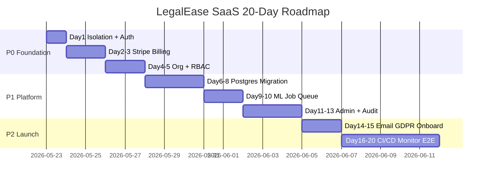

# LegalEase E2E SaaS — Master Roadmap

> **Active plan:** [SAAS_10_DAY_SPRINT.md](./SAAS_10_DAY_SPRINT.md) — compressed 10-day launch sprint.  
> This document is the extended 20-day reference if you need more buffer post-launch.

**Vision:** Production multi-tenant legal AI SaaS — firms sign up, pay via Stripe, upload docs, chat, bill clients, all isolated and compliant.

**Starting point:** Strong v3.0 product, single-user ready, multi-tenant not ready.

---

## Phase overview



---

## Phase 1 — Day 1: Secure the foundation

**Goal:** Fix cross-user ML leaks + auth config bugs.

| Task | Files | Priority |
|------|-------|----------|
| Per-user Ollama model registry | `improvement_automation.py`, `llms.py` | P0 |
| Per-user embedding scope | `neural_finetuning.py`, `llms.py`, `learning.py` | P0 |
| Isolation regression tests | `tests/test_tenant_isolation.py` | P0 |
| JWT secret unification | `auth_tokens.py`, `.env.docker.example` | P0 |
| DB membership for Hybrid gate | `chat.py`, `legalease_auth.py` | P1 |
| SaaS schema stubs | `saas_schema.py` | P1 |
| Admin route skeleton | `admin.py` endpoint, `admin/page.tsx` | P2 |

**Exit criteria:** Two test users cannot affect each other's model or embeddings.

---

## Phase 2 — Days 2–3: Stripe subscriptions

**Goal:** Real paid SaaS billing (not mock upgrade).

| Task | Details |
|------|---------|
| Stripe SDK + env vars | `STRIPE_SECRET_KEY`, `STRIPE_WEBHOOK_SECRET`, price IDs |
| Checkout session API | `POST /api/v1/billing/subscribe` |
| Webhook handler | `checkout.session.completed`, `invoice.paid`, `customer.subscription.deleted` |
| `subscriptions` table | Link org/user to Stripe customer + sub ID |
| Plan enforcement | Free / Pro / Legal Pro from DB on every gated route |
| Customer portal link | Stripe billing portal for self-service |
| Settings UI | Replace mock upgrade button with Stripe Checkout |
| Tests | Webhook signature + plan downgrade blocks Hybrid |

**Exit criteria:** User can pay → membership updates in DB within seconds → Hybrid unlocks.

---

## Phase 3 — Days 4–5: Organizations + RBAC

**Goal:** Sell to law firms, not just individual lawyers.

| Task | Details |
|------|---------|
| `organizations` table | Firm name, plan, billing contact |
| `org_members` table | owner / admin / member roles |
| Scoped queries | All repos filter by `org_id` (matters, docs, chat) |
| Invite flow | Email invite link → join org |
| Seat limits | Pro = 3 seats, Legal Pro = 10 (configurable) |
| Shared document library | Org-level docs visible to all members |
| UI | Org switcher, team settings page |

**Exit criteria:** Two lawyers in same firm share matters; two firms cannot see each other's data.

---

## Phase 4 — Days 6–8: Postgres migration

**Goal:** Horizontally scalable API (multiple workers, one database).

| Task | Details |
|------|---------|
| Migrate SQLite tables | users, chat, memory, learning, CRM, billing |
| Fix `gemini_usage.py` | Use `LEGALEASE_DB_PATH` / `DATABASE_URL` |
| Alembic migrations | Versioned schema changes |
| Connection pooling | SQLAlchemy pool config for prod |
| Docker | Single Postgres source of truth |
| Data migration script | SQLite → Postgres one-time import |

**Exit criteria:** 2+ API replicas share state; no SQLite in production path.

---

## Phase 5 — Days 9–10: ML job queue

**Goal:** Neural train, re-index, ollama create off the API hot path.

| Task | Details |
|------|---------|
| Extend `job_queue.py` | Job types: `neural_train`, `kb_reindex`, `ollama_create`, `coach_cycle` |
| Worker script | `scripts/ml_worker.py` (like ediscovery_worker) |
| Docker service | `ml-worker` in docker-compose.yml |
| User notifications | Job status in Settings + optional email |
| Retries + DLQ | Failed jobs logged, retry 3x |
| Dedup | Same as `_running_users` but Redis-backed |

**Exit criteria:** Thumbs-up triggers job; API returns immediately; worker completes pipeline.

---

## Phase 6 — Days 11–13: Admin + audit

**Goal:** Operate the business without database access.

| Admin feature | API |
|---------------|-----|
| User list + search | `GET /api/v1/admin/users` |
| Suspend / unsuspend | `POST /api/v1/admin/users/{id}/suspend` |
| Plan override | `POST /api/v1/admin/users/{id}/plan` |
| Usage dashboard | Gemini calls, storage, doc count |
| Audit log viewer | `GET /api/v1/admin/audit` |
| System health | Ollama, Redis, queue depth, embedding status |

| Audit events to log |
|---------------------|
| login, logout, failed_login |
| document upload, download, delete |
| chat export, modelfile export |
| plan change, payment webhook |
| admin actions (impersonate, suspend) |

**Exit criteria:** Superadmin can manage users and see audit trail from UI.

---

## Phase 7 — Days 14–15: Email + GDPR + onboarding

| Area | Deliverables |
|------|--------------|
| **Email** | SendGrid/SES: welcome, verify, reset password, portal invite |
| **GDPR** | `DELETE /api/v1/account` — full data purge |
| **Export** | `GET /api/v1/account/export` — ZIP of all user data |
| **Onboarding** | 5-step wizard: verify → upload → index → matter → plan |
| **Legal** | Privacy policy + ToS checkbox on register |

**Exit criteria:** New user completes onboarding; can delete account and all data is gone.

---

## Phase 8 — Days 16–20: CI/CD + monitoring + E2E

| Task | Details |
|------|---------|
| GitHub Actions | Build Docker images, push to registry |
| Deploy workflow | Staging → prod with manual approval |
| Playwright E2E | Register → upload → KB chat → upgrade → admin |
| Sentry | Error tracking frontend + backend |
| Prometheus | Request latency, queue depth, LLM availability |
| Alerting | Pager/email on API down, queue backlog |
| Load test | 50 concurrent chat users baseline |
| Security scan | Dependabot, container scan, secret scan |

**Exit criteria:** One-click deploy to staging; E2E green; alerts fire on simulated outage.

---

## Architecture target (end state)

```
                    [ Cloudflare / nginx TLS ]
                              |
              +---------------+---------------+
              |                               |
         [ Next.js web ]              [ FastAPI x N ]
              |                               |
              |                    +----------+----------+
              |                    |                     |
              |               [ Postgres ]          [ Redis ]
              |                    |                     |
              |              org-scoped data      sessions, queues
              |                    |
              +----------> [ Stripe webhooks ]
                              |
              +---------------+---------------+
              |               |               |
        [ ml-worker ]  [ ediscovery-worker ]  [ Ollama sidecar ]
        neural/reindex   batch triage         per-tenant or pooled
        ollama create
```

---

## What stays as-is (already good)

- KB / Open Law / Hybrid chat engines
- Per-matter FAISS isolation
- Practice modules (billing, CRM, discovery, premium)
- Gemini coach + improvement automation (after isolation fix)
- Docker Compose skeleton
- ~55 pytest files

---

## KPIs for SaaS launch

| Metric | Target |
|--------|--------|
| Signup → first indexed doc | < 10 minutes |
| API p95 latency (chat) | < 30s |
| Uptime | 99.5% |
| Cross-tenant data leak | 0 (tested) |
| Stripe webhook success | > 99% |
| GDPR delete completion | < 24 hours |

---

## Related docs

- [SAAS_DAY1_PLAN.md](./SAAS_DAY1_PLAN.md) — today's executable checklist
- [LEGALEASE_COMPLETE_GUIDE.md](./LEGALEASE_COMPLETE_GUIDE.md) — product feature guide
- [SAAS_STATUS.md](../SAAS_STATUS.md) — module completion status
- [exports/LEGALEASE_BLUEPRINT.docx](./exports/LEGALEASE_BLUEPRINT.docx) — architecture blueprint

---

*Last updated: Day 1 · LegalEase SaaS Transformation*
