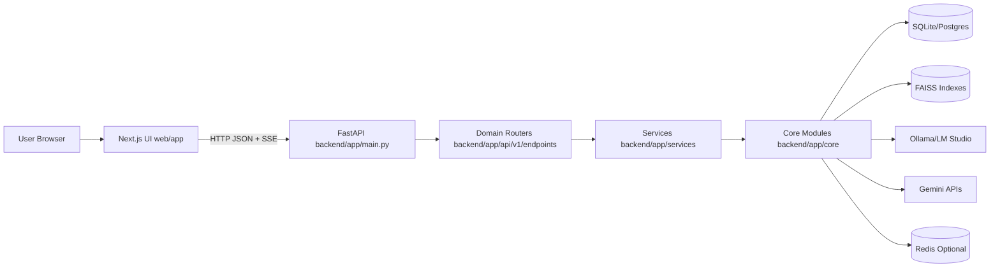
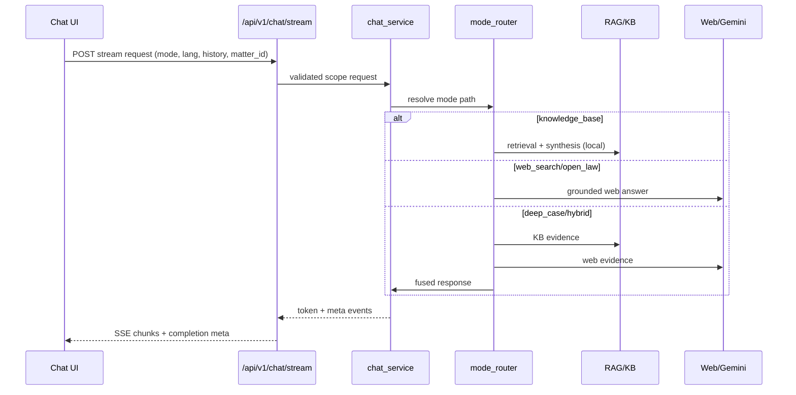

i # LegalEase Full-Stack Project Blueprint

Generated on 2026-05-28.

## 1) System Overview

LegalEase is a full-stack legal operations platform with:
- A `Next.js` App Router frontend in `web/` for chat, case workspaces, document operations, billing, CRM, discovery, premium tools, and settings.
- A `FastAPI` backend in `backend/app/` exposing `/api/v1/*` domain routers.
- Hybrid AI architecture combining local LLM inference (`Ollama` / `LM Studio`) with cloud grounded web research (`Gemini`) under strict scope boundaries.
- Multi-domain persistence on SQLite (default), with optional Postgres/Redis pathways.
- Matter-scoped RAG indexes with explicit isolation controls for matter vs global KB usage.

Primary execution entry points:
- Backend app bootstrap: `backend/app/main.py`
- Backend route composition: `backend/app/api/v1/router.py`
- Frontend authenticated shell: `web/app/(app)/layout.tsx`
- Frontend main chat surface: `web/app/(app)/page.tsx`
- Frontend API contract layer: `web/lib/api.ts`

## 2) Architecture Map

Layer responsibilities:
- **Client/UI**: route-level orchestration, stream rendering, optimistic UI and status surfaces.
- **API**: auth, validation, rate limits, scoped access checks, endpoint contracts.
- **Service orchestration**: chat mode routing, hybrid fusion orchestration, speech and KB workflows.
- **Core domain/data**: matter policy, repositories, schema migrations, indexing, learning, observability.
- **State/index engines**: RAG vector indexes, relational persistence, queue/scheduler workers.

## 3) Backend Deep Dive

### 3.1 Router topology

`backend/app/api/v1/router.py` mounts:
- `health`, `chat`, `engines`, `documents`, `kb`, `sessions`
- `premium`, `learning`, `memory`, `matters`
- `templates`, `drafting`, `clauses`
- `billing`, `trust`, `crm`, `portal`, `esign`
- `ediscovery`, `research`, `practice`, `dashboard`, `speech`

### 3.2 Startup and middleware

From `backend/app/main.py`:
- Loads `.env` roots and optional GPU profile.
- Registers:
  - `MemoryEfficiencyMiddleware` (`backend/app/middleware/memory_guard.py`)
  - `RateLimitMiddleware` (`backend/app/middleware/rate_limit.py`)
  - `CORSMiddleware` with configurable origin controls (`backend/app/core/config.py`).
- Starts non-blocking startup thread:
  - schema ensures/migrations
  - embedding preload
  - optional RAG warmup
  - optional reindex scheduler and coach scheduler.

### 3.3 Domain/service modules

- **Chat + mode routing**
  - `backend/app/api/v1/endpoints/chat.py`
  - `backend/app/services/chat_service.py`
  - `backend/app/services/mode_router.py`
  - `backend/app/services/hybrid_orchestrator.py`
- **Documents + indexing**
  - `backend/app/api/v1/endpoints/documents.py`
  - `backend/app/core/index_jobs.py`
  - `backend/app/core/reindex_scheduler.py`
  - `backend/app/core/matter_index.py`
  - `rag.py`, `kb_pipeline.py`
- **Matters + lifecycle + access**
  - `backend/app/api/v1/endpoints/matters.py`
  - `backend/app/core/matter_repo.py`
  - `backend/app/core/matter_policy.py`
  - `backend/app/core/matter_workflow.py`
- **Learning + tuning**
  - `backend/app/api/v1/endpoints/learning.py`
  - `backend/app/core/adaptive_learning.py`
  - `backend/app/core/learning_engine.py`
  - `backend/app/core/neural_finetuning.py`
  - `backend/app/core/llm_finetuning.py`
  - `backend/app/core/improvement_automation.py`
  - `backend/app/core/gemini_ollama_coach.py`
- **Practice ops modules**
  - billing: `backend/app/api/v1/endpoints/billing.py`
  - CRM: `backend/app/api/v1/endpoints/crm.py`
  - trust: `backend/app/api/v1/endpoints/trust.py`
  - e-discovery: `backend/app/api/v1/endpoints/ediscovery.py`
  - portal/e-sign/templates/clauses/drafting endpoints in same folder.

### 3.4 Data and schema layers

- Operational DB access and URL selection:
  - `backend/app/core/database.py`
  - `backend/app/core/db.py`
- Schema migration and sanity:
  - `backend/app/core/schema_migrations.py`
  - `backend/app/core/practice_schema.py`
  - `backend/app/core/saas_schema.py`
- Major table families:
  - auth/users and logs
  - chat history + thread attachments
  - matters, hearings, tasks, deadlines, entities, evidence, members, audit
  - learning interactions/feedback/signals/promotions
  - billing + invoices, CRM leads, trust accounts/transactions
  - discovery batches/items/jobs, research logs, templates/clauses

## 4) Frontend Deep Dive

### 4.1 App shell and route graph

Top-level route containers:
- Root app provider shell: `web/app/layout.tsx`
- Authenticated shell: `web/app/(app)/layout.tsx`
- Matter scoped nested shell: `web/app/(app)/matters/[matterId]/layout.tsx`

Feature pages:
- Chat: `web/app/(app)/page.tsx`
- Documents: `web/app/(app)/documents/page.tsx`
- Matters list + create + per-tab views under `web/app/(app)/matters/`
- Billing, Intake, Discovery, Drafting, Premium, Tools, Analytics, Settings, Dashboard
- Public token flows: `web/app/portal/[token]/page.tsx`

### 4.2 Core providers and hooks

- Auth/session provider: `web/components/providers/AuthProvider.tsx`
- API connectivity provider: `web/components/providers/ApiConnectionProvider.tsx`
- Chat session context: `web/components/providers/ChatSessionProvider.tsx`
- Chat orchestration hook: `web/hooks/useChat.ts`
- Speech orchestration hook: `web/hooks/useSpeechToText.ts`
- Matter notifications hook: `web/hooks/useMatterNotifications.ts`

### 4.3 Client contract layer

`web/lib/api.ts` is the frontend backend-contract surface:
- Auth, health, chat history/threads, stream chat.
- Document upload/index/health/job polling.
- Matter CRUD, notes, timeline/hearings/tasks/deadlines, entities/evidence, audit, members, export.
- Learning feedback/signals/tuning/automation endpoints.
- Billing, CRM, trust, discovery, portal, e-sign, premium, speech.

It also includes:
- timeout/retry wrappers (`fetchWithTimeout`, `fetchWithRetry`)
- browser/server API base normalization
- robust parsing for structured backend errors
- SSE-like stream parser for `/api/v1/chat/stream`.

## 5) Runtime Workflow Modeling

### 5.1 Auth bootstrap workflow

1. User submits credentials (`/api/v1/auth/login`).
2. Backend validates via `legacy_saas/legalease_auth.py` and signs token with `legacy_saas/auth_tokens.py`.
3. Frontend stores token (`legalease_token`) and hydrates `AuthProvider`.
4. Protected endpoints validate bearer token via `backend/app/core/auth.py`.

Guardrails:
- Password policy checks in register flow.
- Live membership fetched from DB during auth dependency resolution.

### 5.2 Chat workflow (all modes)

Failure paths:
- Network drop: frontend abort/retry-safe handling.
- Unauthorized scope: backend rejects invalid matter scope.
- Low-confidence retrieval: not_found behavior + escalation paths.

### 5.3 Document upload and indexing workflow

1. UI sends file to `/api/v1/documents/upload` or `/api/v1/matters/{id}/documents/upload`.
2. Backend extracts text (PDF/OCR path), stores doc metadata.
3. Index pipeline creates chunks and embeddings.
4. `index_status` transitions (`processing` -> `ready` or `queued`/`failed`).
5. Job status observable via `/api/v1/documents/jobs/{job_id}` and dashboard health endpoints.

Controls:
- scoped indexing directories (unlinked/global vs matter-specific).
- async index job runner via `backend/app/core/index_jobs.py`.
- reindex scheduler via `backend/app/core/reindex_scheduler.py`.
- observability events in `backend/app/core/observability.py`.

### 5.4 Matter lifecycle workflow

1. Create matter (`POST /api/v1/matters`).
2. Attach/upload matter documents, notes, tasks, hearings, evidence.
3. Execute scoped chat and matter intelligence.
4. Archive by default on delete endpoint; hard delete available via explicit query flag.
5. Restore archived matter via restore endpoint.

Authorization:
- centralized matter context resolution in `backend/app/core/matter_policy.py`.
- role-aware write controls and strict scope feature flags.

### 5.5 Learning/tuning workflow

1. Chat interactions + signals recorded per mode/scope.
2. Feedback endpoints update adaptive stores and learning stats.
3. Neural and LLM tuning endpoints expose collect/train/status.
4. Admin scope promotion endpoint allows controlled matter->global learning promotion.
5. Automation/coach scheduler performs periodic training actions where enabled.

Safety:
- promotion endpoint rate-limited and admin-gated.
- scope keys preserve global vs matter learning boundaries.

## 6) Security and Access Control Matrix

- Authentication: bearer JWT style token, password hashing with `bcrypt`.
- Authorization:
  - global auth dependency for protected routers.
  - matter-level access context and role checks.
  - owner-only controls for sensitive operations (delete/restore/export variants).
- API abuse protection: endpoint-specific rate limiting middleware.
- Scope isolation:
  - chat scope normalization and validation.
  - matter strict enforcement flags.
- CORS restrictions configurable via environment variables.

## 7) Observability and Reliability Surfaces

- Structured events: `backend/app/core/observability.py`.
- Health endpoints:
  - liveness/readiness/public/system checks under `/api/v1/health/*`
  - indexing health and KB health endpoints.
- Startup snapshot utilities for operational state visibility.
- Runbooks:
  - `docs/runbooks/matter-kb-ops.md`
  - `docs/runbooks/production-dry-run-checklist.md`
  - `RUNBOOK.md`

## 8) Frameworks, Libraries, and Tools

### Backend
- `FastAPI`, `uvicorn`, `pydantic`
- `sqlalchemy`, `sqlite3`, optional `psycopg2`
- `redis` integration for queue/session options
- `faiss-cpu`, `sentence-transformers`, `transformers`, `torch`
- OCR/PDF stack: `PyPDF2`, `pdfplumber`, `PyMuPDF`, `easyocr`, `pytesseract`, `opencv-python-headless`
- Optional ML tuning stack: `datasets`, `accelerate`, `peft`, `trl`

### Frontend
- `Next.js 15`, `React 19`, `TypeScript`
- `tailwindcss`, `react-markdown`, `remark-gfm`

### Tooling and ops
- `pytest` with marker-based suite partitioning.
- PowerShell scripts for backend/web startup and test execution.
- Docker compose deployment stack with API/web/worker/postgres/redis/nginx.
- CI workflow in `.github/workflows/ci.yml`.

## 9) API and Data Contract Highlights

- Chat stream event envelope includes `token`, `status`, `meta`, and `error` event types.
- Matter dashboard contract includes matter metadata, document list (with index and privilege markers), timelines/tasks/deadlines, KB health, autopilot, smoke checks.
- Document indexing contracts expose async job IDs for long-running operations.
- Learning contracts expose mode stats, quality signals, coach status, neural training state, progress checkpoints.

## 10) Testing and Validation Surfaces

Main suites under `tests/` include:
- RAG/KB retrieval and pipeline tests.
- API flow, chat, and session tests.
- Matter hardening, policy flag behavior, and E2E matter lifecycle tests.
- Learning, tuning, and automation tests.
- SaaS phase regressions across billing/CRM/discovery/premium.

Specific hardening-era tests:
- `tests/test_matter_hardening_regression.py`
- `tests/test_api_matter_e2e_flow.py`
- `tests/test_matter_policy_flags.py`

## 11) Feature Flags and Environment Controls

Representative controls (see `.env.example`):
- `MATTER_STRICT_SCOPE_ENFORCEMENT`
- `MATTER_STRICT_ROLE_WRITE`
- `LEARNING_SCOPE_PROMOTION_ENABLED`
- `LEGALEEASE_MINIMAL_STARTUP`
- `LEGALEEASE_SKIP_RAG_WARMUP`
- `LEGALEEASE_EMERGENCY_STARTUP`
- indexing and scheduler related toggles
- tuning and automation toggles

## 12) Small-Feature Coverage Notes

The appendix (`docs/blueprint/appendix/feature-inventory.md`) maps detailed small features, edge helpers, and utility controls to code locations, including:
- chat escalation rules
- thread attachments
- speech fallback paths and mic diagnostics
- KB health fallback object contracts
- timeline suggestion approve/reject loops
- matter notifications polling
- per-endpoint rate-limit overrides
- legacy alias endpoints for backward compatibility

## 13) Maintenance Notes

When updating this blueprint:
1. Update route inventory when `backend/app/api/v1/router.py` changes.
2. Update client API coverage when `web/lib/api.ts` changes.
3. Sync matter policy section after edits in `backend/app/core/matter_policy.py`.
4. Regenerate `project-blueprint.pdf` from this Markdown.
5. Keep appendix coverage aligned with newly added minor features.

