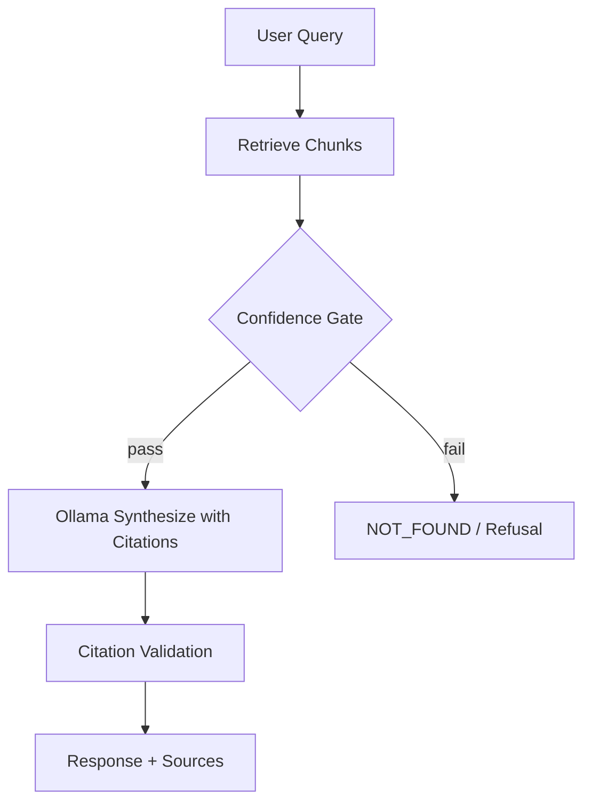
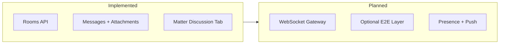
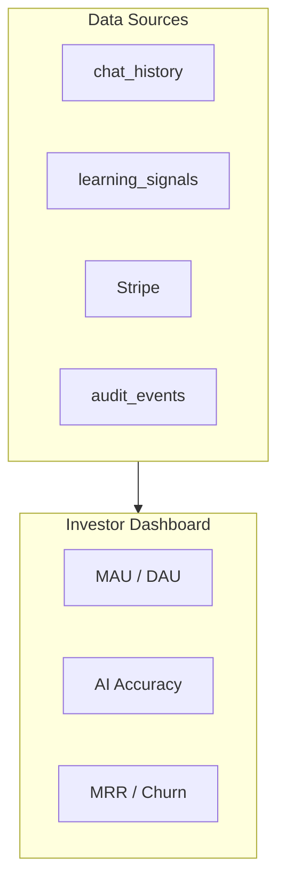
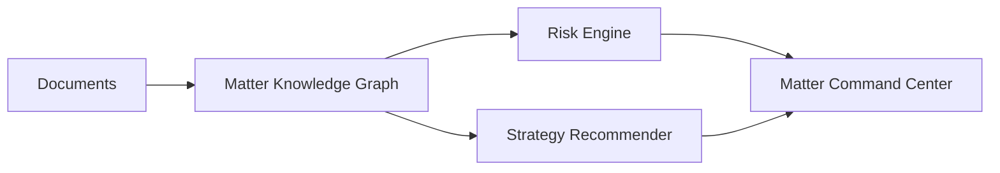
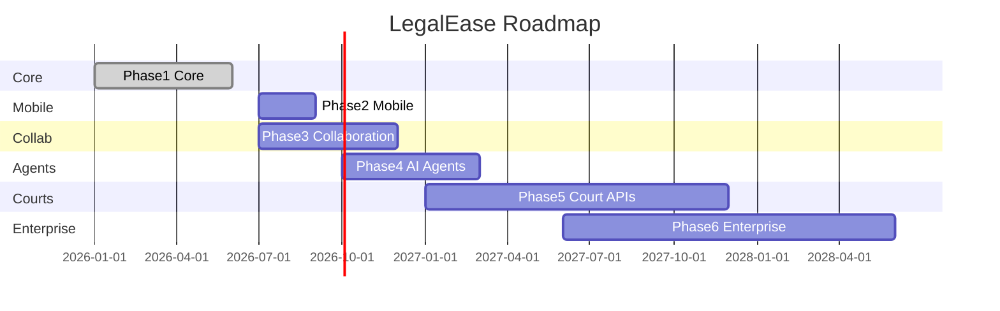

# LegalEase Thesis — Expansion Chapters (v3.0 Blueprint)

The following chapters extend the SaaS Product Thesis into investor/CTO blueprint depth. Inserted before Conclusion in the master document.

---

## AI Governance & Trust Architecture

**Status key:** **Implemented** = production code today | **Planned Architecture** = design target, not fully shipped

LegalEase treats AI trust as a first-class architectural layer—not a marketing claim. Trust controls are enforced in `backend/app/core/kb_gemini_safety.py`, `rag.py`, `llms.py`, `kb_pipeline.py`, and `backend/app/services/chat_service.py`.


**Figure A1:** Separation of duties: Ollama for confidential KB synthesis; Gemini isolated to Open Law / Hybrid web legs and settings-only coach.

### Why Ollama for Knowledge Base synthesis (**Implemented**)

| Factor | Rationale | Code / config |
|--------|-----------|---------------|
| Data sovereignty | Client PDFs never sent to Google for KB answers | `LLM_BACKEND=ollama`, `OLLAMA_MODEL=legalease-tuned` |
| Cost control | Per-query COGS near zero vs per-token cloud APIs | Local inference on firm GPU or VPS |
| Latency for dense corpora | Repeated retrieval + synthesis without round-trip to cloud | `OLLAMA_KB_LOCK_MODEL=1` serializes hot path |
| Fine-tuning flywheel | Modelfile export from firm feedback (`OLLAMA_TUNED_MODEL_NAME`) | `learning_engine.py`, `ollama_manager.py` |
| Air-gapped deploy | Oracle/zero-budget docs support laptop-only stack | `docs/DEPLOY_ZERO_BUDGET.md` |

Ollama is **not** used for live public law—that duty is intentionally assigned to Gemini + fallback search chain to maximize citation freshness.

### Why Gemini is isolated (**Implemented**)

| Surface | Gemini role | Blocked for KB? |
|---------|-------------|-----------------|
| Open Law / web_search | Grounded web research, markdown + sources | N/A (not KB) |
| Hybrid fusion | Multi-section report combining KB + web legs | KB leg still Ollama-only |
| Settings coach | Tone/retrieval tuning from thumbs feedback | Yes — `KB_BLOCK_RUNTIME_COACH=1` |
| KB synthesis | **Forbidden** | `GEMINI_KB_SYNTHESIS=0` → `RuntimeError` |

```text
enforce_kb_gemini_policy()  # kb_gemini_safety.py
  if GEMINI_KB_SYNTHESIS: raise RuntimeError(...)
  if GEMINI_KB_RETRIEVAL_HINTS or GEMINI_KB_RERANK: log warning, ignore for KB path
```

Optional retrieval-only helpers exist in `kb_gemini_enhancer.py` but default **off** (`GEMINI_KB_RETRIEVAL_HINTS=0`, `GEMINI_KB_RERANK=0`).

### Hallucination prevention architecture (**Implemented**)

| Stage | Mechanism | Location |
|-------|-----------|----------|
| Retrieval gate | L2 distance threshold + confidence score | `rag.py`: `RAG_SCORE_THRESHOLD`, `RAG_CONFIDENCE_THRESHOLD` |
| Decision enum | `FOUND` / `NOT_FOUND` / `LOW_CONFIDENCE` | `kb_rag_decision.py`, `evaluate_retrieval()` |
| Answer finalization | Strip uncited claims; force NOT_FOUND template | `chat_service._finalize_kb_answer()` |
| Strict citations (web) | `STRICT_CITATIONS=1` for Open Law | `web_intelligence` modules |
| Hybrid KB gate | Weak KB suppressed in fusion | `HYBRID_KB_MIN_SCORE`, `HYBRID_KB_TERM_RATIO` |
| Claim audit | Post-synthesis claim ↔ chunk alignment | `tests/test_kb_claim_audit.py` |

**Default thresholds (`.env.example`):**

| Variable | Default | Meaning |
|----------|---------|---------|
| `RAG_SCORE_THRESHOLD` | 1.6 | Max L2 distance for chunk acceptance |
| `RAG_CONFIDENCE_THRESHOLD` | 0.52 | Min normalized confidence to synthesize |
| `RAG_TOP_K_DENSE` | 16 | Dense retrieval pool |
| `RAG_FINAL_TOP_K` | 10 | Chunks passed to LLM |
| `RAG_MMR_LAMBDA` | 0.7 | MMR diversity vs relevance |

When retrieval fails gates, users see an explicit **NOT_FOUND** or "insufficient evidence" response—not a fabricated statute or fact.

### Feedback learning architecture (**Implemented**)

| Component | Function | Status |
|-----------|----------|--------|
| Thumbs up/down on chat | `learning_signals.py` records implicit/explicit feedback | Implemented |
| Coach scheduler | Gemini analyzes feedback → Ollama tuning hints | `COACH_AUTO_SCHEDULE=1` |
| Neural embedding fine-tune | Redis ML queue trains per-user embeddings | `ML_USE_QUEUE` + `ml_worker.py` |
| KB re-index | `OLLAMA_AUTO_REINDEX=1` after training | Implemented |
| Learning inject block | Training artifacts never injected into live KB answers | `KB_BLOCK_LEARNING_INJECT=1` |

**Planned Architecture:** Federated cross-firm learning with differential privacy (roadmap)—not in codebase today.


**Figure A2:** Feedback → coach → optional neural train → re-index → Ollama modelfile (settings path only for substance).

### Knowledge contamination prevention (**Implemented**)

| Isolation type | Implementation |
|----------------|----------------|
| Tenant DB rows | `user_id`, `org_id` on matters, documents, CRM |
| FAISS paths | `faiss_indexes/{user_id}/` global; `faiss_indexes/{user_id}/{matter_id}/` matter-scoped |
| Chat scope | Main chat KB uses `retrieval_scope=global`; matter pages pass `matter_id` |
| Cross-tenant tests | `tests/test_tenant_isolation.py`, `test_crm_tenant_isolation.py` |
| Org RBAC | `org_service.py`, `collab_scope_id()` uses primary org |

**Gap:** Shared org-level FAISS index is **Planned Architecture**; today vectors remain user-scoped with org ACL on metadata.

### Prompt injection defense (**Implemented**)

| Control | Detail |
|---------|--------|
| System prompts | KB synthesis prompts require cite-or-refuse patterns in `llms.py` / orchestrator |
| User content boundary | Retrieved chunks wrapped as untrusted context; instructions in system layer |
| Coach substance block | Regex guards prevent legal claims in tuning payloads |
| Rate limits | `RATE_LIMIT_CHAT_PER_MINUTE=40` reduces automated probing |
| Input size caps | Upload `MAX_UPLOAD_MB=200`; chunk caps per doc |

**Planned Architecture:** Dedicated prompt-injection classifier model; LLM firewall service.

### AI trust layer summary (**Implemented**)



| Trust signal | User-visible |
|--------------|--------------|
| Source attribution | Chunk filenames, page hints, web URLs |
| Confidence gates | No answer when below threshold |
| Refusal patterns | NOT_FOUND, empty index, plan gate messages |
| Mode honesty | Router never silently switches KB → Open Law |

### Governance operating model (operations)

| Activity | Owner | Frequency |
|----------|-------|-----------|
| Review `GEMINI_KB_*` env on deploy | DevOps | Each release |
| Run KB regression suite | Engineering | CI + weekly |
| Audit `audit_events` for exports/deletes | Compliance | Monthly |
| Red-team prompt injection | Security | Quarterly (**Planned**) |

---


## Firm Collaboration Architecture


**Figure B1:** Implemented Firm Chat vs planned real-time collaboration platform.

### Implemented today (**Implemented**)

| Capability | Backend | Frontend |
|--------------|---------|----------|
| Firm-scoped rooms | `collab_service.py`, `collab_schema.py` | `CollaborationHub.tsx` |
| Default channels | general, client-intake, hearing-prep | `/collaboration` |
| Direct messages | `room_type=dm`, `dm_key` sorted pair | User search → DM room |
| Matter-linked rooms | `matter_id` on `collab_rooms` | `/matters/[id]/discussion` |
| Attachments | `Data/collab_uploads/` | `FirmChatMessage.tsx` |
| Reactions, mentions | `collab_message_reactions`, `collab_mentions` | In-thread UI |
| Notifications | `collab_notifications` table | Polling-based badge |
| Chat requests | `collab_chat_requests` | Connect / accept flow |
| User discovery | `GET /collaboration/users/search` | `FirmChatUserSearch.tsx` |
| Audit | `collab_audit_logs` | Admin review (**partial UI**) |
| RBAC | `collab_rbac.py` | Permissions endpoint |
| Create task/deadline from message | `matter_workflow.add_task` | Message actions |

**Transport:** HTTP polling for new messages—not WebSocket yet.

**Encryption:** Server-readable messages (SaaS TLS + DB). `SECURITY.md` documents that messenger-style E2E is incompatible with server-side RAG.

### Planned Architecture — WhatsApp/Slack-class platform

| Feature | Target design | Status |
|---------|---------------|--------|
| E2E encryption (optional) | Client-side keys for chat only; separate from document AI path | Planned |
| Username @discovery | Global handle registry + privacy controls | Partial (search by username) |
| Friend requests | Bidirectional connection graph | Implemented (`collab_connections`) |
| Team channels | Org-wide + practice-group channels | Implemented (firm rooms) |
| Presence status | online/away/busy via heartbeat | Planned |
| Read receipts | Per-message `read_at` | Planned |
| Push notifications | FCM/APNs + email digests | Planned |
| Voice notes | Upload OGG → Whisper transcribe | Planned (STT exists for chat mic) |
| Shared files versioning | Link to matter documents | Partial (attachments) |
| Matter-based chat default | Auto-room per matter on create | Implemented |



### Collaboration vs AI boundary

Firm Chat does **not** send messages to KB index by default (**Implemented**). **Planned:** opt-in "summarize thread to matter note" with explicit lawyer confirmation.

---


## Product Requirement Document (PRD)

### Personas

| Persona | Primary goals | Plan typical |
|---------|---------------|--------------|
| Lawyer (advocate) | Research, draft, manage matters | Pro / Legal Pro |
| Paralegal | Organize docs, timeline, discovery | Pro (member seat) |
| Firm Owner | Billing, team, CRM pipeline | Legal Pro |
| Client | Track case, upload, sign | Portal token (free to firm) |
| Admin (operator) | Users, audit, metrics | Internal superadmin |

### Lawyer user stories (**Implemented** unless noted)

| ID | Story | Acceptance |
|----|-------|------------|
| L-01 | As a **lawyer**, I want to **upload PDFs to my knowledge base**, so that **answers cite my documents**. | `POST /documents/upload`, FAISS index OK |
| L-02 | As a **lawyer**, I want to **ask questions in KB mode**, so that **I get grounded answers or NOT_FOUND**. | `mode=knowledge_base`, no Gemini synthesis |
| L-03 | As a **lawyer**, I want to **search live Indian law**, so that **I see current statutes and cases**. | Open Law + quota by tier |
| L-04 | As a **lawyer**, I want **hybrid reports**, so that **my files and public law appear in one brief**. | Pro+ plan, `hybrid` mode |
| L-05 | As a **lawyer**, I want to **create a matter with documents**, so that **work is organized per case**. | `/matters`, matter-scoped index |
| L-06 | As a **lawyer**, I want **matter intelligence** (timeline, entities), so that **I prepare faster**. | Pipeline in `matter_intel_pipeline.py` |
| L-07 | As a **lawyer**, I want to **share evidence with team**, so that **paralegals can access**. | Org matter members + collab room |
| L-08 | As a **lawyer**, I want to **log billable time**, so that **invoices are accurate**. | `/billing` time entries |
| L-09 | As a **lawyer**, I want to **run e-discovery triage**, so that **large productions are prioritized**. | `/discovery` batches |
| L-10 | As a **lawyer**, I want to **draft from templates**, so that **routine filings are faster**. | `/drafting` |

### Client user stories

| ID | Story | Status |
|----|-------|--------|
| C-01 | As a **client**, I want to **view matter status via secure link**, so that **I don't call the office daily**. | Implemented — portal token |
| C-02 | As a **client**, I want to **upload supporting documents**, so that **my lawyer has complete facts**. | Planned — portal upload |
| C-03 | As a **client**, I want to **sign engagement letters**, so that **retainer is formalized**. | Mock e-sign; DocuSign planned |

### Admin user stories

| ID | Story | Status |
|----|-------|--------|
| A-01 | As an **admin**, I want to **invite team members**, so that **the firm shares one org**. | Implemented — org invites |
| A-02 | As an **admin**, I want to **manage Stripe subscription**, so that **features match payment**. | Implemented |
| A-03 | As an **admin**, I want **usage and audit logs**, so that **compliance is demonstrable**. | Partial — `/admin`, audit table |
| A-04 | As an **admin**, I want **firm-wide analytics**, so that **I see pipeline and AI usage**. | CRM analytics + learning stats |

### Paralegal user stories

| ID | Story | Status |
|----|-------|--------|
| P-01 | As a **paralegal**, I want to **index and tag documents on a matter**, so that **lawyers find evidence quickly**. | Implemented |
| P-02 | As a **paralegal**, I want to **maintain the matter timeline**, so that **hearing prep is chronological**. | Implemented |
| P-03 | As a **paralegal**, I want **discovery review queues**, so that **privileged docs are flagged**. | Implemented |

### Firm Owner user stories

| ID | Story | Status |
|----|-------|--------|
| F-01 | As a **firm owner**, I want **CRM Kanban for intake**, so that **leads convert systematically**. | CRM 2.0 Implemented |
| F-02 | As a **firm owner**, I want **seat limits by plan**, so that **cost scales with team size**. | `PLAN_ORG_SEATS_*` |
| F-03 | As a **firm owner**, I want **trust account tracking**, so that **client funds are segregated**. | Implemented |

### Non-functional requirements

| NFR | Target | Measurement |
|-----|--------|-------------|
| Availability | 99.5% pilot / 99.9% enterprise | Uptime checks |
| KB answer latency P95 | < 45s CPU / < 15s GPU | `load_test_chat.py` |
| Tenant isolation | Zero cross-tenant reads | `test_tenant_isolation.py` |
| Data export | GDPR ZIP < 24h | `GET /account/export` |
| Accessibility | WCAG 2.1 AA (**Planned**) | Audit backlog |

---


## UI/UX Design System

Extracted from `web/tailwind.config.ts`, `web/app/globals.css`, and shared components.

### Design tokens (**Implemented**)

| Token | Value | Usage |
|-------|-------|-------|
| `canvas` | `#f8fafc` | Page background |
| `navy` | `#0f172a` | Primary text, headings |
| Font serif | Playfair Display | Marketing / legal gravitas accents |
| Font sans | Inter | UI body (system fallback) |
| `max-w-chat` | 1080px | Chat viewport width |
| Shadow `dock` | 32px blur slate | Input dock elevation |
| Shadow `card` | Subtle layered | Dashboard cards |
| Animation `fade-in` | 350ms ease-out | Route transitions |

**Gap:** No centralized `design-tokens.json` or Figma kit in repo—tokens live in Tailwind extend only.

### Component library (**Implemented**)

| Layer | Technology | Notes |
|-------|------------|-------|
| Primitives | Custom + Tailwind utility classes | Not full shadcn install; selective patterns |
| Chat | `ChatViewport`, `ModePills`, `InputDock` | Core product surface |
| Layout | `(app)/layout.tsx` sidebar + mobile nav | `MobileBottomNav`, `MobileTopBar` |
| Forms | Native + Tailwind | Login, intake, settings |
| Markdown | `react-markdown` | AI responses |
| Icons | Lucide-style inline SVGs | Consistent stroke |

### Button standards (inferred from codebase)

| Variant | Classes (typical) | Use |
|---------|-------------------|-----|
| Primary | `bg-blue-600 text-white hover:bg-blue-700` | CTA, submit |
| Secondary | `border border-slate-200 bg-white` | Cancel |
| Ghost | `text-blue-600 hover:underline` | Tertiary links |
| Danger | `text-red-600` | Delete account |

**Planned:** Documented `Button` component with size variants in `components/ui/`.

### Dashboard layouts (**Implemented**)

| Route | Layout pattern |
|-------|----------------|
| `/` | Full-height chat, docked input |
| `/dashboard` | Card grid — hearings, CRM, billing |
| `/matters/[id]/*` | Sub-nav tabs (13 sections) |
| `/intake/board` | Kanban columns |
| `/collaboration` | Master-detail (rooms + thread) |

### Mobile (**Implemented**)

- Responsive breakpoints via Tailwind `md:` / `lg:`
- Bottom navigation for primary routes on small screens
- Touch-friendly tap targets on `ModePills`

### Accessibility

| Item | Status |
|------|--------|
| Semantic HTML in app shell | Partial |
| Focus rings | Tailwind `focus-visible` on some inputs |
| Screen reader labels on icon buttons | **Gap** — audit needed |
| Color contrast navy on canvas | Generally AA for body text |
| Keyboard chat shortcuts | Limited |

**Planned:** axe-core in CI, dedicated a11y pass before enterprise sales.

---


## SaaS Metrics & KPI Dashboard

### North-star metrics (product)

| Metric | Definition | Tracked in code? |
|--------|------------|------------------|
| MAU | Distinct users with ≥1 chat turn / month | **Planned** — infer from `chat_history` |
| DAU | Distinct users per day | **Planned** |
| Retention D7/D30 | Cohort return rate | **Planned** |
| Churn | Paid → cancelled / inactive | Partial — Stripe webhooks |
| Trial → Paid | Checkout completion / signups | Partial — `subscriptions` table |
| KB Accuracy | % thumbs-up on KB mode | **Implemented** — learning signals |
| AI Accuracy (web) | Thumbs on Open Law / Hybrid | **Implemented** |
| KB NOT_FOUND rate | Retrieval failures | **Implemented** — logs / observability |
| Time-to-first-answer | Upload → first successful KB query | **Planned** analytics pipeline |

### Business metrics

| Metric | Source | Status |
|--------|--------|--------|
| MRR | Stripe | Implemented |
| ARPU | MRR / paying orgs | Spreadsheet / **Planned** dashboard |
| CAC | Marketing spend / new paid | **Planned** |
| LTV | ARPU × months retained | **Planned** model |
| Conversion rate | Visitors → signup → paid | **Planned** — needs product analytics SDK |
| Seat utilization | Active members / purchased seats | Partial — org_members |

### Operational metrics (**Implemented**)

`GET /api/v1/metrics` (superadmin when `SAAS_PRODUCTION=1`):

- `core_db`, `postgres_legacy`, `redis`, `ml_queue` status
- `embeddings_ok` from startup snapshot

`/api/v1/learning/stats` and `/api/v1/learning/analytics/full` — feedback and mode distribution.

`/api/v1/admin/usage` — admin resource snapshot.

CRM `/api/v1/crm/analytics` — lead funnel, stage counts (**Implemented**).

### KPI dashboard design (**Planned Architecture**)



**Recommendation:** Metabase or Posthog on Postgres read replica; no embedded BI in v3.0 web app.

---


## Revenue Forecast & Financial Model

> **Disclaimer:** All figures below are **illustrative projections** for investor discussion—not audited financials. Adjust assumptions before board or filing use.

### Pricing basis (**Implemented** env defaults)

| Tier | Docs | Seats | Gemini/day | Stripe |
|------|------|-------|------------|--------|
| Free | 2 | 1 | 15 | — |
| Pro | 500 | 3 | 200 | `STRIPE_PRICE_PRO` |
| Legal Pro | 5,000 | 10 | 1,000 | `STRIPE_PRICE_LEGAL_PRO` |

Assumed ARPU for modeling (configure in Stripe):

| Tier | Illustrative monthly price (INR equiv.) |
|------|------------------------------------------|
| Pro | ₹2,499 / ~$30 USD |
| Legal Pro | ₹9,999 / ~$120 USD |

### Year 1–3 projection (illustrative)

| Year | Paying firms (EOY) | Avg seats | MRR (EOY) | ARR run-rate |
|------|-------------------|-----------|-----------|--------------|
| Y1 | 120 | 2.5 | ₹4.2L (~$5k) | ₹50L |
| Y2 | 450 | 3.2 | ₹18L (~$22k) | ₹2.1Cr |
| Y3 | 1,200 | 4.0 | ₹55L (~$66k) | ₹6.6Cr |

Assumptions: 8% monthly paid churn Y1 improving to 5% Y3; 12% trial-to-paid; 60% Pro / 40% Legal Pro mix by Y2.

### Expense model (illustrative)

| Category | Y1 | Y2 | Y3 |
|----------|----|----|-----|
| Cloud infra (API, DB, Redis) | ₹6L | ₹18L | ₹45L |
| Gemini API variable | ₹2L | ₹12L | ₹35L |
| Engineering (4 FTE → 10) | ₹48L | ₹96L | ₹1.6Cr |
| Sales/marketing | ₹12L | ₹36L | ₹72L |
| **Total opex** | **~₹68L** | **~₹1.62Cr** | **~₹3.12Cr** |

### Break-even analysis (illustrative)

- **Gross margin:** ~75% (Ollama KB offsets cloud token cost for core workload)
- **Break-even MRR:** ~₹5.5L/month at Y2 cost structure (~330 paying firms blended)
- **Timeline:** Month 20–24 under base case; Month 14 optimistic if Legal Pro mix >50%

### Sensitivity levers

| Lever | Impact |
|-------|--------|
| Gemini quota overage packs | Upside revenue; manage COGS |
| Local Ollama adoption | Lowers COGS, increases stickiness |
| Enterprise VPC deals | High ACV, services margin |
| Churn >12% | Delays break-even 6+ months |

---


## Investor Brief — Why LegalEase Wins

### Market size (Indian legal tech)

| Segment | TAM indicator | Notes |
|---------|---------------|-------|
| Advocates (India) | ~1.7M enrolled (BCI estimates) | Large solo segment |
| Corporate legal teams | Growing in-house departments | Compliance + contracts |
| Legal tech spend India | $200M+ and growing double-digit CAGR | Fragmented vendors |
| Digitization tailwind | eCourts, BNS/BNSS transition | Drives research demand |

**SOM focus (3-year):** 5,000 paying seats = <0.3% of advocate population—achievable with bar partnerships.

### Why LegalEase wins

1. **Trust-by-architecture** — Gemini cannot write KB answers (`GEMINI_KB_SYNTHESIS=0` enforced).
2. **Workflow completeness** — CRM → matter → billing → discovery in one SKU vs point tools.
3. **India-specific** — IPC→BNS tools, Indian web intel, matter templates for local practice.
4. **Deployment choice** — Local Ollama for confidentiality; cloud only for public law.
5. **Compounding moat** — Per-firm embedding fine-tunes + feedback coach (**Implemented**).

### Competitive advantage matrix

| Competitor type | Weakness | LegalEase answer |
|-----------------|----------|------------------|
| Generic LLM wrappers | Hallucination on firm facts | KB gates + NOT_FOUND |
| Global research (Westlaw-class) | Price, India coverage gap | Affordable hybrid + local sources |
| Practice mgmt only | No native AI | Integrated modes + matter intel |
| DIY RAG kits | No SaaS, billing, RBAC | Production Docker stack |

### Moat layers

| Moat | Mechanism |
|------|-----------|
| Data flywheel | Feedback → embedding train → better retrieval |
| Switching cost | Matters, FAISS indexes, CRM pipeline history |
| Network effects | Firm Chat + org collaboration (**early**) |
| Regulatory alignment | Audit logs, GDPR export, tenant isolation tests |

### AI advantage (defensible)

- Separated inference paths reduce compliance objections vs "send all PDFs to OpenAI"
- Matter intelligence pipeline extracts entities/timeline/contradictions from same corpus
- Continuous learning without contaminating live answers (`KB_BLOCK_LEARNING_INJECT=1`)

### Use of funds (illustrative seed round)

| Allocation | % |
|------------|---|
| Engineering (mobile, collab, court APIs) | 45% |
| GTM India bar partnerships | 25% |
| Infra + security (SOC2) | 15% |
| Legal/compliance | 10% |
| Reserve | 5% |

---


## Matter Intelligence Architecture


**Figure H1:** Staged pipeline from document upload through entity/timeline/contradiction extraction.

### Orchestrator (**Implemented**)

`backend/app/core/matter_intel_pipeline.py` — `run_matter_intelligence_pipeline()`:

| Stage | Module | Output |
|-------|--------|--------|
| entities | `matter_entities.extract_entities_from_docs` | Parties, courts, statutes |
| evidence | `matter_evidence.extract_evidence_from_docs` | Exhibits, witness refs |
| timeline | `matter_intelligence.generate_timeline_from_docs` | `matter_timeline` rows |
| hearings | `matter_hearings_intel.extract_hearings_from_docs` | Hearing dates, notes |
| contradictions | `matter_enhancements.extract_and_persist_contradictions` | `matter_contradictions` |

Status tracking: `set_intel_status()` — polled by UI on matter AI tab.

Enqueue: `enqueue_matter_intelligence()` for async (**Implemented** when workers available).

### Matter AI chat (**Implemented**)

- Route: `/matters/[matterId]/ai` — matter-scoped retrieval
- Intent classification: `matter_qa.classify_matter_intent()` — witness, evidence, hearing, timeline, contradiction
- Uses matter FAISS index + structured tables

### Feature matrix

| Capability | Status | Notes |
|------------|--------|-------|
| Entity extraction | **Implemented** | Rule + LLM assist |
| Timeline extraction | **Implemented** | Auto-insert optional |
| Hearing prediction / next date | **Partial** | Extraction yes; ML prediction **Planned** |
| Contradiction detection | **Implemented** | `analyze_contradictions()` |
| Risk analysis score | **Planned** | Intake has `risk_score`; matter-level **Planned** |
| Evidence correlation | **Partial** | Evidence desk + exhibits |
| Legal strategy suggestions | **Planned** | `matter_autopilot.py` prototypes queries |
| Export matter brief ZIP | **Implemented** | `matter_enhancements` export |

### API surface (**Implemented**)

```
POST /api/v1/matters/{id}/intelligence/run
GET  /api/v1/matters/{id}/intelligence/status
GET  /api/v1/matters/{id}/entities
GET  /api/v1/matters/{id}/timeline
GET  /api/v1/matters/{id}/contradictions
GET  /api/v1/matters/{id}/hearings
```

### Aspirational architecture (**Planned**)



- Cross-matter precedent linking
- Outcome prediction from anonymized corpus
- Automated hearing prep pack generation (partial in premium tools)

---


## Knowledge Base Accuracy Architecture


**Figure I1:** Retrieval validation, citation checks, and refusal paths.

### KB Reliability Framework (**Implemented**)

| Layer | Function |
|-------|----------|
| Ingestion quality | OCR sparse mode, PDF chunking, `test_pdf_index_quality` |
| Index health | `index_status` per document; `check_kb_ready_for_query` |
| Retrieval | Dense + keyword + MMR; optional cross-encoder |
| Validation | `evaluate_retrieval`, confidence scoring |
| Synthesis | Ollama with cite-or-refuse prompts |
| Post-audit | Claim ↔ chunk alignment tests |

### Exact match retrieval (**Implemented**)

- Section-aware parsing for statutes and lists (`test_kb_strict_section_retrieval`)
- Case caption lock (`test_kb_case_context_lock`)
- Document-first routing when query names a file (`test_kb_document_first`)

### Chunk validation (**Implemented**)

- Minimum character thresholds per chunk
- Stitching adjacent chunks for continuity (`kb_chunk_stitch`)
- Content cleaner removes OCR garbage (`kb_content_cleaner`)

### Citation validation (**Implemented**)

- Answers must reference retrieved chunk IDs / filenames
- `test_kb_claim_audit.py` — regression for unsupported claims
- Export quality gate for reports (`test_export_quality_gate`)

### Hallucination detection (**Implemented**)

| Signal | Action |
|--------|--------|
| Low `RAG_CONFIDENCE_THRESHOLD` | Skip synthesis → NOT_FOUND |
| Empty retrieval | NOT_FOUND with upload hint |
| Hybrid weak KB | Web-only or labeled low-confidence section |
| Gemini KB block | RuntimeError if misconfigured |

### Confidence scoring (**Implemented**)

From `rag.py`:

- Distance → normalized confidence
- Compared against `RAG_CONFIDENCE_THRESHOLD` (default **0.52** in `.env.example`)
- Logged in debug via `KB_PIPELINE_DEBUG=1`

### Follow-up memory (**Implemented**)

- `followup_detector.py` — resolves "what about section 302?"
- `kb_context_resolver.py` — document scope from thread
- `kb_answer_memory` — strict cache for identical queries

### Multi-query retrieval (**Implemented**)

- `RAG_MAX_QUERY_EXPANSIONS=5`
- Legal query parser expands statutes / party names
- Comparison queries (CrPC vs BNSS) routed correctly (`test_conceptual_comparison`)

### Context verification (**Implemented**)

- `legal_orchestrator_v2` — primary KB orchestration path
- Case topic resolver prevents wrong-document answers
- Matter vs global scope enforced in chat service

### Source attribution (**Implemented**)

- Markdown footnotes with document name + page
- Hybrid report attributes KB vs Web sections separately

### Environment reference table

| Variable | Default | Role |
|----------|---------|------|
| `RAG_SCORE_THRESHOLD` | 1.6 | L2 gate |
| `RAG_CONFIDENCE_THRESHOLD` | 0.52 | Synthesis gate |
| `RAG_RETRIEVAL_K` | 8 | Initial k |
| `RAG_FINAL_TOP_K` | 10 | LLM context |
| `RAG_ENABLE_CROSS_ENCODER` | 0 | Accuracy vs speed |
| `KB_CACHE_TTL_SEC` | 300 | Answer cache |
| `GEMINI_KB_SYNTHESIS` | 0 | Must stay 0 |

---


## Security Audit & Compliance Readiness

Expands `SECURITY.md` with enterprise control mapping.


### Control inventory (**Implemented**)

| Control | Implementation |
|---------|----------------|
| TLS | nginx `nginx-ssl.conf`, `FORCE_HTTPS=1` |
| JWT | HMAC, `JWT_SECRET` ≥32 chars in production |
| Passwords | bcrypt, `PASSWORD_MIN_LENGTH=12` |
| Rate limiting | `RateLimitMiddleware` |
| Security headers | HSTS, CSP, X-Frame-Options |
| IP firewall | `IPFirewallMiddleware` |
| Field encryption | Fernet `DATA_ENCRYPTION_KEY` optional |
| Audit | `audit_service` — login, upload, export, billing |
| Tenant isolation | Scoped queries + tests |
| GDPR | Export ZIP + account delete |

### SOC 2 readiness mapping (**Planned** certification)

| Trust criteria | LegalEase posture |
|----------------|-------------------|
| CC6.1 Logical access | JWT + RBAC + org roles |
| CC6.6 Encryption | TLS + optional Fernet |
| CC7.2 Monitoring | Sentry, metrics endpoint, audit log |
| CC8.1 Change management | GitHub Actions CI, Alembic migrations |
| A1 Availability | Docker healthchecks, RUNBOOK backups |

**Gap:** Formal SOC 2 Type I audit not started; control evidence collection **Planned** Q3–Q4 2026.

### ISO 27001 mapping (selected)

| Annex A | Control | Status |
|---------|---------|--------|
| A.9 | Access control | Implemented RBAC |
| A.10 | Cryptography | TLS + bcrypt + optional Fernet |
| A.12 | Operations security | Backups, runbooks |
| A.14 | Secure development | CI tests, production guards |
| A.18 | Compliance | GDPR endpoints |

### GDPR

| Right | Endpoint | Status |
|-------|----------|--------|
| Access / portability | `GET /account/export` | Implemented |
| Erasure | `DELETE /account` | Implemented |
| Rectification | Profile settings | Implemented |
| Restriction | Suspend user (admin) | Implemented |

### Data residency

- **Self-host / India VPC:** Docker Compose on Indian cloud (Oracle Mumbai, etc.)
- **Default SaaS:** Operator chooses region; Postgres + `Data/` locality per deployment
- **Planned:** Explicit `DATA_REGION=IN` flag and region-locked Gemini routing

### Tenant isolation testing (**Implemented**)

- `tests/test_tenant_isolation.py` — automated
- Manual pen-test playbook **Planned**

### Penetration testing strategy (**Planned**)

| Phase | Scope |
|-------|-------|
| SAST | Bandit/eslint in CI (**Partial**) |
| DAST | OWASP ZAP on staging |
| Annual third-party pen test | API + auth + IDOR on matters |

`GET /api/v1/health/security` — posture summary without secret leakage.

---


## Complete Chat Architecture


**Figure J1:** All chat modes and dispatch paths.

### Mode catalog

| Mode | Canonical API | Executor | Plan |
|------|---------------|----------|------|
| Knowledge Base | `knowledge_base` | `_run_kb_turn` → `rag_query` | All |
| Open Law | `open_law`, `web_search` | `_run_open_law_turn` | All (quota) |
| Hybrid / Deep Case | `hybrid`, `deep_case` | `run_hybrid_turn` / jurisprudence | Pro+ |
| Matter AI | matter page context | Matter-scoped RAG + `matter_qa` | All |
| Drafting assist | `/drafting` routes | Template + Ollama | All |
| Discovery assist | `/ediscovery` | Batch relevance | Pro features |
| CRM assistant | `/crm` analyze | `intake_intelligence` | Org CRM perm |

### Routing pipeline (**Implemented**)

```
POST /api/v1/chat
  → get_current_user (JWT)
  → normalize_api_chat_mode (plan gate)
  → _resolve_chat_routing
       → parse_legal_query (legal_engine)
       → route_query (mode_router) — user mode wins
       → merge follow-up context (session_mem)
  → branch by mode
  → _record_mode_interaction (learning)
  → format response / SSE stream
```

**Critical policy:** `mode_router.route_query` never auto-switches KB → Open Law.

### Memory logic (**Implemented**)

| Store | Purpose |
|-------|---------|
| `thread_summaries` | Compressed history |
| `user_facts` / persona | Style only in KB; not legal facts |
| `kb_answer_memory` | Repeat query cache |
| Session attachments | `POST /sessions/{id}/attachments` |

### Context management

- Token budget: Ollama `num_ctx` via model config; chunk cap `RAG_FINAL_TOP_K`
- Learner mode prefix when enabled (`get_learner_mode`)
- Matter mode instruction appended for matter-scoped turns

### Token management

| Knob | Location |
|------|----------|
| `LLM_LEGAL_TIMEOUT_SEC` | 90s default |
| `WEB_LLM_MAX_TOKENS_FAST` | Open Law cap |
| Streaming SSE | Chunked to client without full buffer |

### Streaming (**Implemented**)

- `POST /api/v1/chat/stream` — `_stream_kb_turn`, `_stream_open_law_turn`
- Shared routing with sync path

### Legacy Streamlit path

`app.py` `_run_chat_intelligence()` — bypasses FastAPI; same root `rag.py` / `llms.py` modules.

---


## Startup Roadmap — Phased Execution

> Timelines assume 2026 calendar; adjust with funding and hiring.

### Phase 1 — LegalEase Core (Q1–Q2 2026) (**Implemented** ~85%)

| Milestone | Status |
|-----------|--------|
| Multi-tenant Postgres + JWT | Done |
| Stripe + plan gates | Done |
| KB / Open Law / Hybrid | Done |
| Matters 13-tab workspace | Done |
| CRM 2.0 Kanban | Done |
| CI/CD + tenant tests | Done |

**Remaining:** production DocuSign, SOC2 prep kickoff.

### Phase 2 — Mobile App (Q3 2026) (**Planned**)

| Deliverable | Dependency |
|-------------|------------|
| React Native or PWA wrap | API stability |
| Offline matter read | Portal cache |
| Push notifications | Phase 3 infra |

### Phase 3 — Collaboration (Q3–Q4 2026) (**Partial**)

| Deliverable | Status |
|-------------|--------|
| Firm Chat MVP | **Implemented** |
| WebSocket real-time | Planned |
| Presence + read receipts | Planned |
| Mobile chat | Phase 2 |

### Phase 4 — AI Agents (Q4 2026 – Q1 2027) (**Planned**)

- Autonomous research agent with human approval gates
- Scheduled matter intel refresh
- Client intake auto-responder (supervised)

### Phase 5 — Court Integrations (2027) (**Planned**)

- eCourts cause list import
- Filing status webhooks (when APIs available)
- Hearing calendar sync

### Phase 6 — Enterprise (2027+) (**Planned**)

- SAML SSO, SCIM provisioning
- Dedicated VPC / on-prem Helm chart
- 99.9% SLA, named CSM



### Dependency graph

- Phase 4 agents **depend on** KB accuracy + audit (Phase 1)
- Phase 5 **depends on** government API partnerships
- Phase 6 **depends on** SOC2 + SSO

---


## Testing & Quality Assurance

### Test inventory (**Implemented** in `tests/`)

| Category | Examples | Count (approx.) |
|----------|----------|-----------------|
| KB / RAG accuracy | `test_kb_*`, `test_rag_*`, `test_dense_kb_*` | 40+ files |
| Tenant security | `test_tenant_isolation`, `test_security_saas` | 5+ |
| SaaS billing/org | `test_p0_saas`, `test_saas_days5_10` | 10+ |
| CRM | `test_crm_v2_api`, `test_crm_tenant_isolation` | 5+ |
| Collaboration | `test_collab_api`, `test_collab_integration` | 3+ |
| Matter / practice | `test_litigation_practice_api`, `test_api_matter_hardening` | 8+ |
| Learning | `test_learning_engine`, `test_full_learning_pipeline` | 6+ |
| E2E smoke | `e2e_saas_smoke.py`, Playwright `tests/e2e/` | 2+ |

`pytest.ini` excludes `slow` and `legacy_kb` in default CI gate.

### Test types

| Type | Tooling | Status |
|------|---------|--------|
| Unit | pytest | Extensive for KB |
| Integration | FastAPI TestClient | Implemented |
| Security | `test_security_saas`, tenant isolation | Implemented |
| Load | `scripts/load_test_chat.py` | Manual ops |
| RAG accuracy | Golden sets `test_legal_orchestrator_v2_golden` | Implemented |
| Hallucination | `test_kb_claim_audit`, `test_kb_strict_policy` | Implemented |
| UAT | Pilot checklist `docs/PILOT_LAUNCH.md` | Process |

### Planned QA investments

| Item | Target |
|------|--------|
| Playwright required in CI | Q2 2026 |
| KB golden set per release | 100 queries |
| Chaos testing (Redis/Ollama down) | Q3 2026 |
| a11y automated scan | Q4 2026 |

### Quality gates before release

1. `pytest` SaaS gate green
2. `e2e_saas_smoke.py` pass
3. Manual hybrid + Stripe webhook check
4. `GET /health/security` no critical gaps

---


## Technical Debt & Risk Register

Honest assessment from `SAAS_STATUS.md`, codebase review, and production operations.

### Known technical risks

| Risk | Severity | Mitigation |
|------|----------|------------|
| RAG failure / wrong doc | High | Confidence gates, regression tests, NOT_FOUND |
| FAISS index corruption | Medium | Reindex API, backups of `faiss_indexes/` |
| Ollama downtime | High | Health checks; Open Law still works; status banner |
| Postgres split-brain (legacy) | Medium | `SAAS_USE_POSTGRES_LEGACY=1` migration path |
| Gemini quota exhaustion | Medium | Daily tiers + Tavily/Serp fallback chain |
| Vector scale on disk | Medium | Roadmap: object store sharding |
| README / doc drift | Low | This thesis + SAAS_STATUS as source of truth |

### Scaling limits (**Current**)

| Limit | Bound |
|-------|-------|
| Concurrent Ollama | Single model instance GPU RAM |
| FAISS | Filesystem per user; large firms 10k+ docs slow |
| API workers | Uvicorn workers × memory (8G cap compose) |
| Redis single instance | Queue backlog under heavy ML |

### Security risks

| Risk | Status |
|------|--------|
| IDOR on matters | Mitigated by ACL tests; pen-test **Planned** |
| JWT theft | HTTPS + short session; httpOnly cookies **Planned** |
| Prompt injection | Partial; red-team **Planned** |
| Legal liability (AI advice) | Disclaimers in ToS; NOT_FOUND reduces harm |

### Product / market risks

| Risk | Note |
|------|------|
| Slow bar adoption | Requires trust demos + local Ollama |
| Incumbent bundling | Differentiate on India + KB isolation |
| Regulatory change | BNS/BNSS already supported in tools |

### Technical debt register

| Item | Effort | Priority |
|------|--------|----------|
| WebSocket for collab | M | P1 |
| Consolidate Streamlit vs API paths | L | P2 |
| Centralize design system | S | P2 |
| httpOnly JWT cookies | M | P1 |
| FAISS → managed vector DB | L | P2 |
| Product analytics (MAU) | M | P1 |

### Documentation gaps (this thesis flags)

- Exact Stripe price amounts not in repo (env placeholders only)
- MAU/DAU dashboards not implemented
- E2E encryption for chat explicitly **not** implemented (by design for AI)
- Matter risk scoring engine **Planned**
- Court API integrations **Planned**

---


## System Diagrams Catalog

All figures are generated by `scripts/generate_thesis_diagrams.py` (matplotlib, 150 DPI) into `docs/diagrams/`.

### Original architecture set (12)

| # | File | Subject |
|---|------|---------|
| 1 | `system_architecture.png` | High-level tiers |
| 2 | `request_flow.png` | Chat request path |
| 3 | `rag_pipeline.png` | Upload to answer |
| 4 | `chat_mode_decision.png` | KB / Open Law / Hybrid |
| 5 | `auth_flow.png` | JWT login |
| 6 | `multi_tenant_isolation.png` | Org + FAISS scope |
| 7 | `document_ingestion.png` | Upload pipeline |
| 8 | `database_er.png` | Conceptual ER |
| 9 | `docker_deployment.png` | Compose topology |
| 10 | `billing_flow.png` | Stripe + plan gates |
| 11 | `crm_workflow.png` | Intake stages |
| 12 | `ediscovery_pipeline.png` | Batch worker |

### Blueprint extension set (12)

| # | File | Subject |
|---|------|---------|
| 13 | `database_er_detailed.png` | Core + practice + collab tables |
| 14 | `ai_flow.png` | Ollama vs Gemini paths |
| 15 | `rag_architecture_detailed.png` | Retrieval stages |
| 16 | `matter_workflow.png` | Matter lifecycle |
| 17 | `collaboration_workflow.png` | Firm Chat flow |
| 18 | `auth_flow_enhanced.png` | RBAC + plan gate |
| 19 | `deployment_enhanced.png` | Production + DR |
| 20 | `learning_pipeline.png` | Feedback loop |
| 21 | `ai_governance_trust.png` | Trust layer |
| 22 | `matter_intelligence_pipeline.png` | Intel stages |
| 23 | `kb_accuracy_pipeline.png` | Accuracy gates |
| 24 | `chat_routing_tree.png` | All chat modes |

**Total: 24 embedded PNG diagrams** (regenerate before PDF export).

### Regeneration commands

```powershell
py scripts/generate_thesis_diagrams.py
py scripts/generate_thesis_pdf.py
```

---
